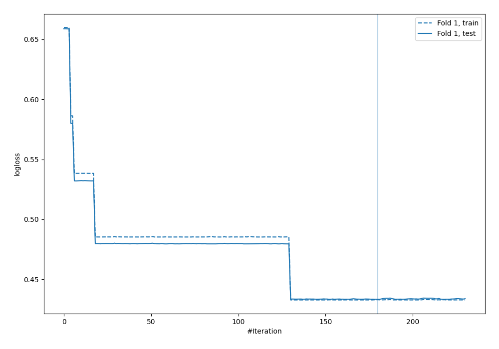
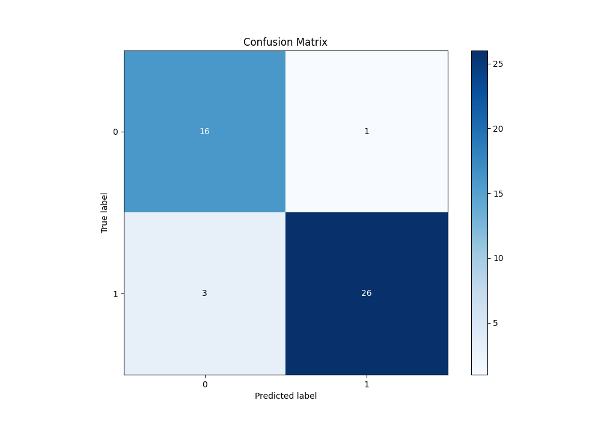
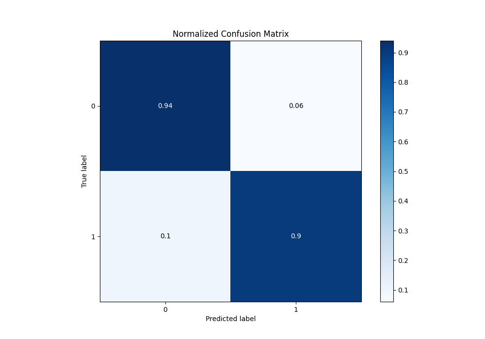
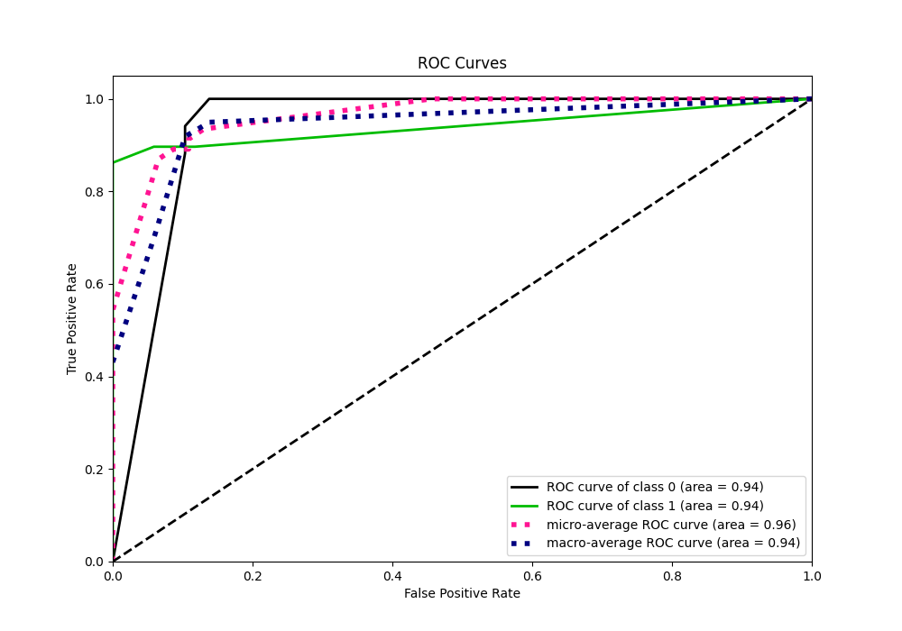
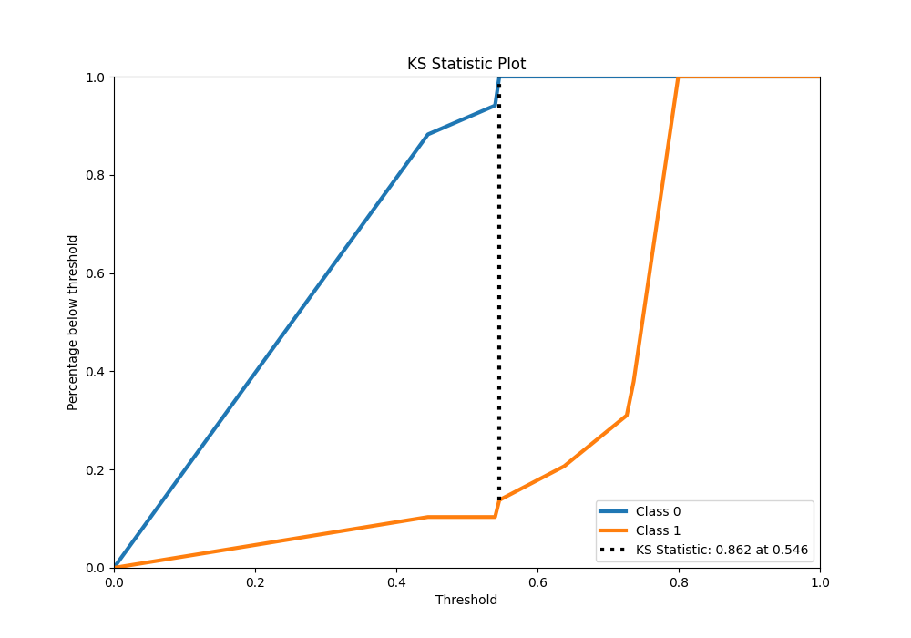
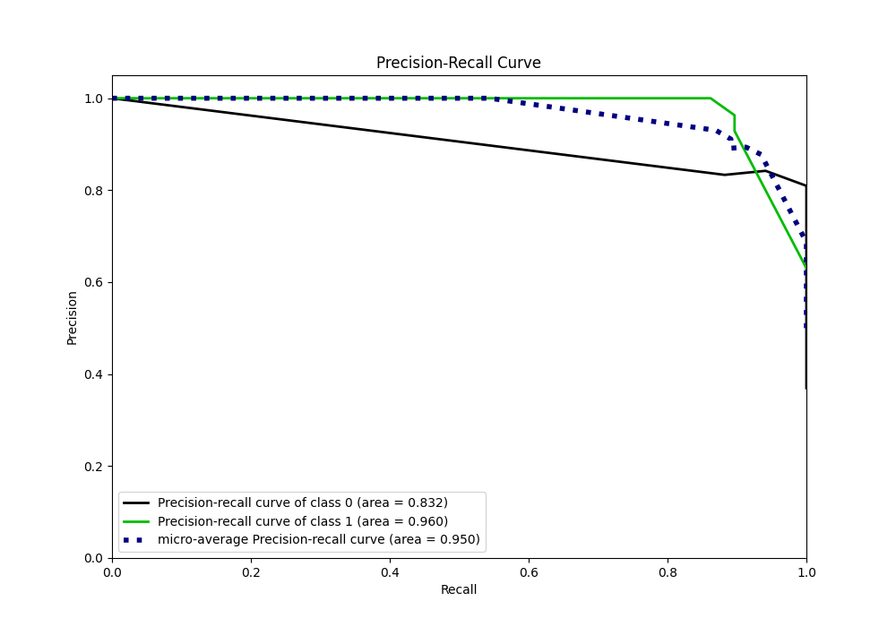
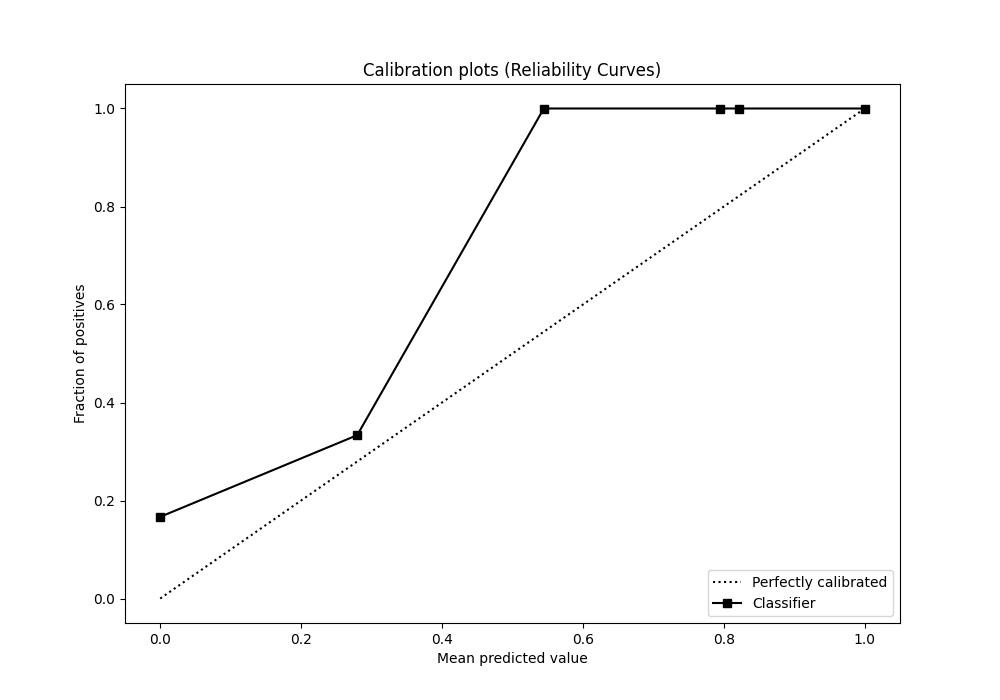
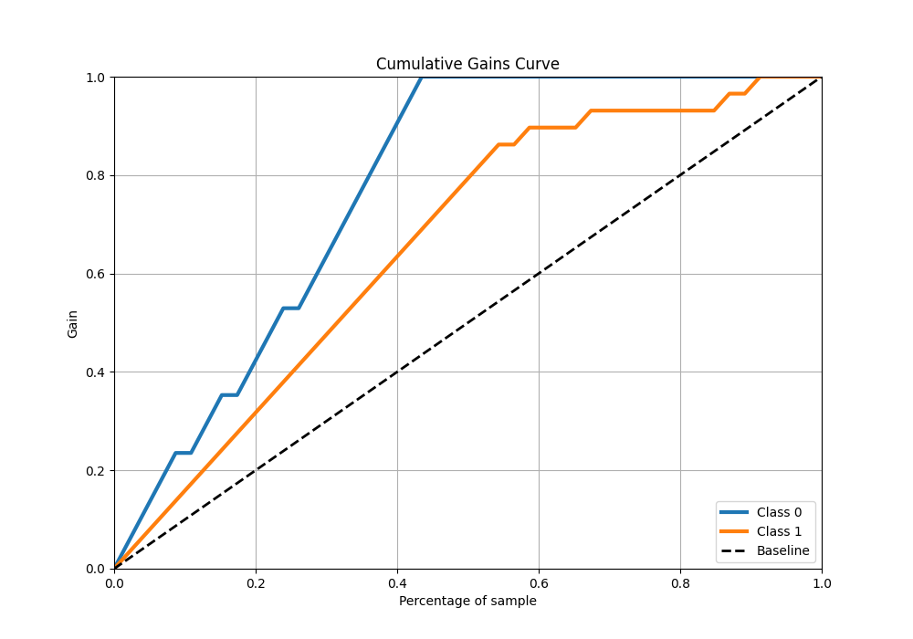
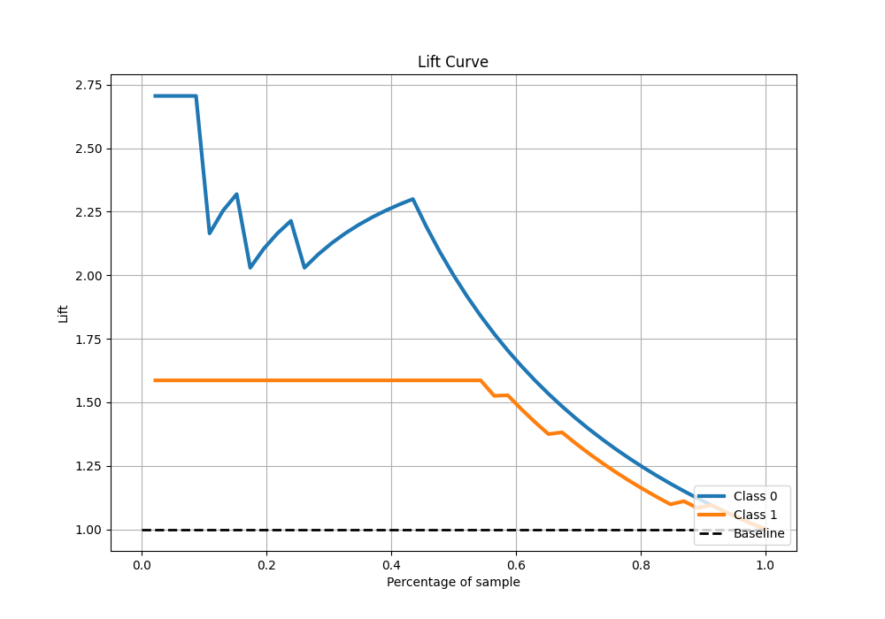

# Summary of 13_Xgboost

[<< Go back](../README.md)

## Extreme Gradient Boosting (Xgboost)
- **n_jobs**: -1
- **objective**: binary:logistic
- **eta**: 0.15
- **max_depth**: 6
- **min_child_weight**: 25
- **subsample**: 0.5
- **colsample_bytree**: 0.5
- **eval_metric**: logloss
- **explain_level**: 0

## Validation
 - **validation_type**: split
 - **train_ratio**: 0.9
 - **shuffle**: True
 - **stratify**: True

## Optimized metric
logloss

## Training time

0.9 seconds

## Metric details
|           |    score |   threshold |
|:----------|---------:|------------:|
| logloss   | 0.433272 |  nan        |
| auc       | 0.941176 |  nan        |
| f1        | 0.928571 |    0.542957 |
| accuracy  | 0.913043 |    0.542957 |
| precision | 1        |    0.545959 |
| recall    | 1        |    0.400351 |
| mcc       | 0.835383 |    0.545959 |

## Metric details with threshold from accuracy metric
|           |    score |   threshold |
|:----------|---------:|------------:|
| logloss   | 0.433272 |  nan        |
| auc       | 0.941176 |  nan        |
| f1        | 0.928571 |    0.542957 |
| accuracy  | 0.913043 |    0.542957 |
| precision | 0.962963 |    0.542957 |
| recall    | 0.896552 |    0.542957 |
| mcc       | 0.821236 |    0.542957 |

## Confusion matrix (at threshold=0.542957)
|              |   Predicted as 0 |   Predicted as 1 |
|:-------------|-----------------:|-----------------:|
| Labeled as 0 |               16 |                1 |
| Labeled as 1 |                3 |               26 |

## Learning curves

## Confusion Matrix

## Normalized Confusion Matrix

## ROC Curve

## Kolmogorov-Smirnov Statistic

## Precision-Recall Curve

## Calibration Curve

## Cumulative Gains Curve

## Lift Curve

[<< Go back](../README.md)
