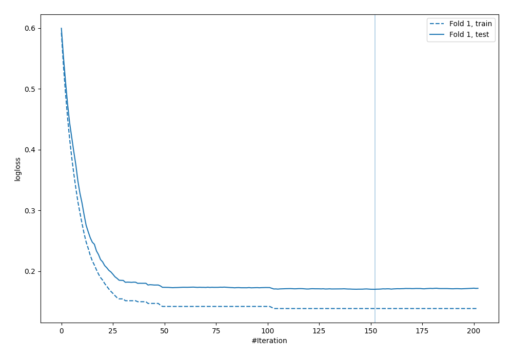
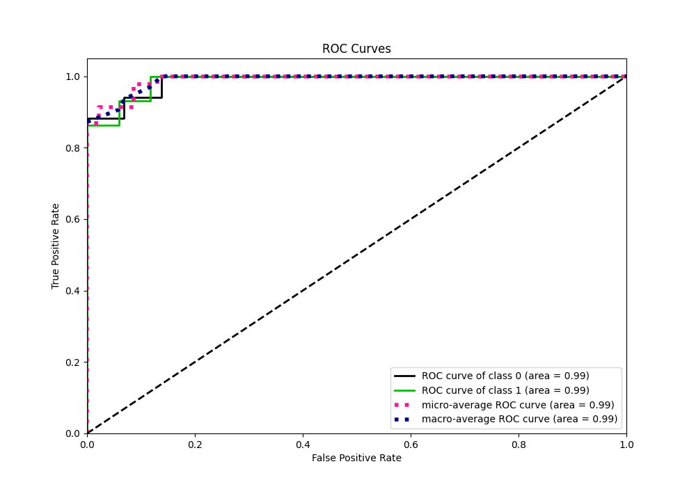
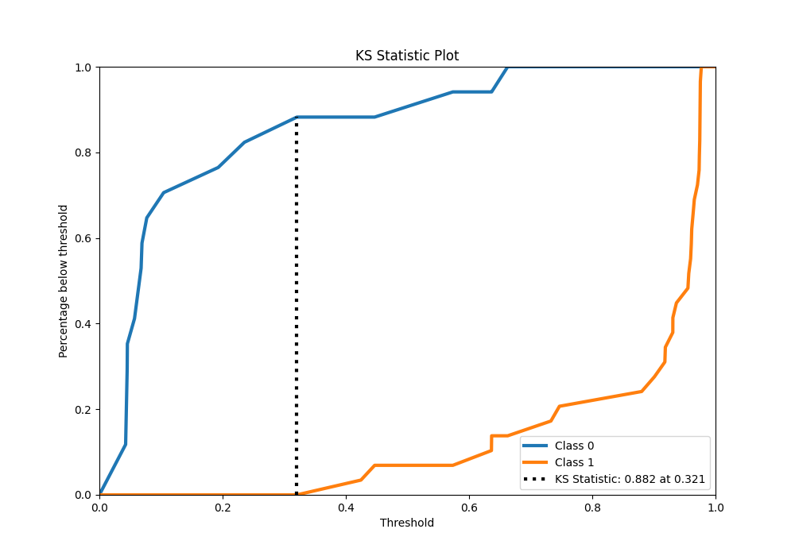
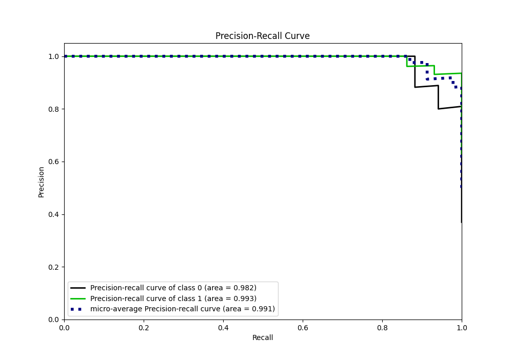
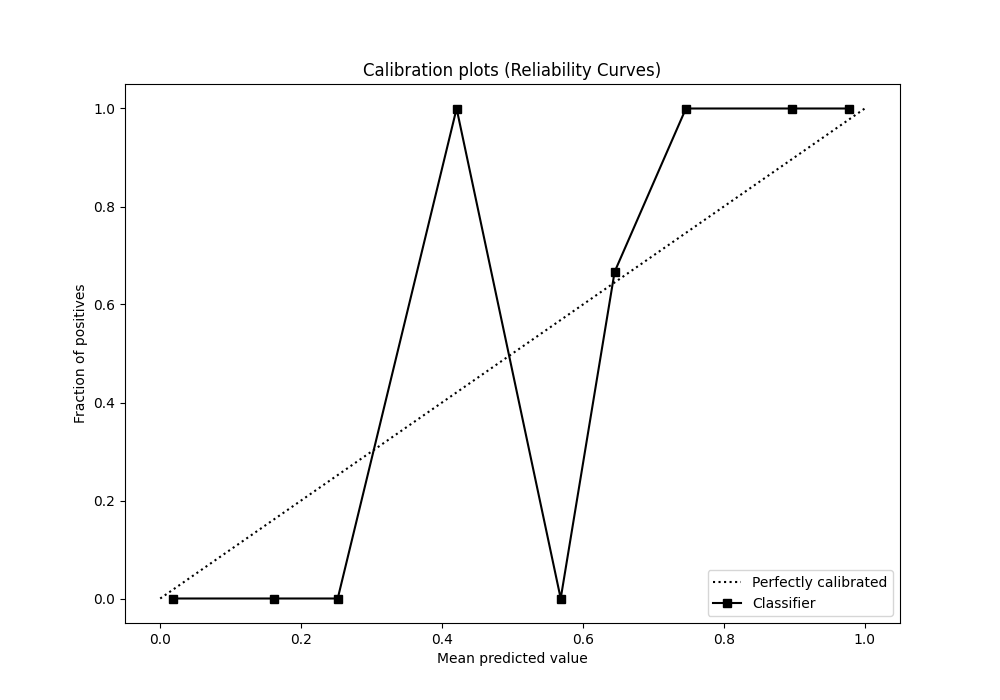
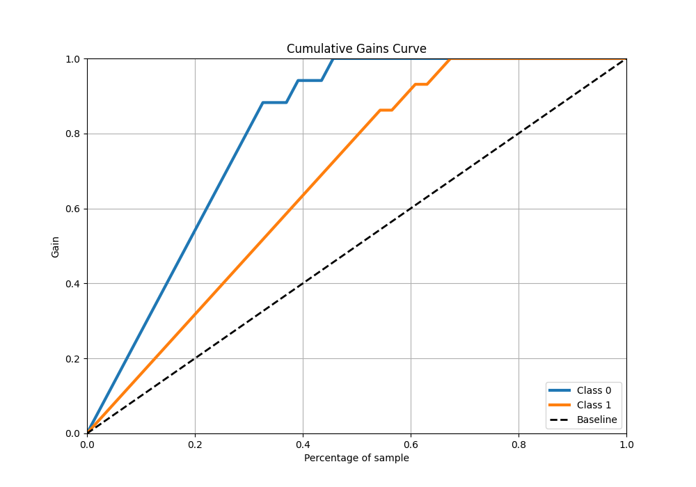
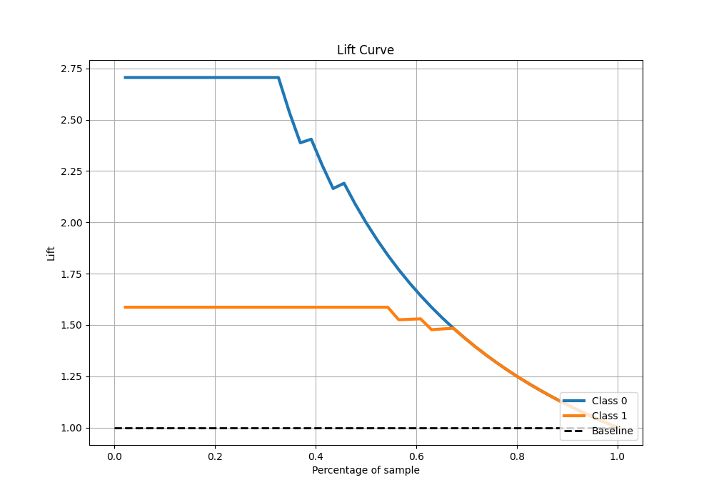

# Summary of 15_Xgboost

[<< Go back](../README.md)

## Extreme Gradient Boosting (Xgboost)
- **n_jobs**: -1
- **objective**: binary:logistic
- **eta**: 0.1
- **max_depth**: 4
- **min_child_weight**: 10
- **subsample**: 0.6
- **colsample_bytree**: 0.6
- **eval_metric**: logloss
- **explain_level**: 0

## Validation
 - **validation_type**: split
 - **train_ratio**: 0.9
 - **shuffle**: True
 - **stratify**: True

## Optimized metric
logloss

## Training time

1.1 seconds

## Metric details
|           |    score |   threshold |
|:----------|---------:|------------:|
| logloss   | 0.170373 | nan         |
| auc       | 0.98783  | nan         |
| f1        | 0.966667 |   0.372579  |
| accuracy  | 0.956522 |   0.372579  |
| precision | 1        |   0.697804  |
| recall    | 1        |   0.0383473 |
| mcc       | 0.90853  |   0.372579  |

## Metric details with threshold from accuracy metric
|           |    score |   threshold |
|:----------|---------:|------------:|
| logloss   | 0.170373 |  nan        |
| auc       | 0.98783  |  nan        |
| f1        | 0.966667 |    0.372579 |
| accuracy  | 0.956522 |    0.372579 |
| precision | 0.935484 |    0.372579 |
| recall    | 1        |    0.372579 |
| mcc       | 0.90853  |    0.372579 |

## Confusion matrix (at threshold=0.372579)
|              |   Predicted as 0 |   Predicted as 1 |
|:-------------|-----------------:|-----------------:|
| Labeled as 0 |               15 |                2 |
| Labeled as 1 |                0 |               29 |

## Learning curves

## Confusion Matrix

## Normalized Confusion Matrix

## ROC Curve

## Kolmogorov-Smirnov Statistic

## Precision-Recall Curve

## Calibration Curve

## Cumulative Gains Curve

## Lift Curve

[<< Go back](../README.md)
