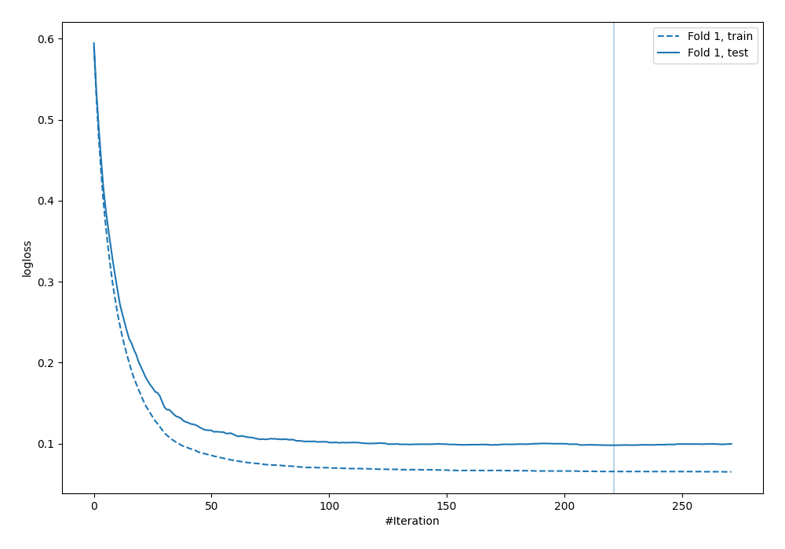
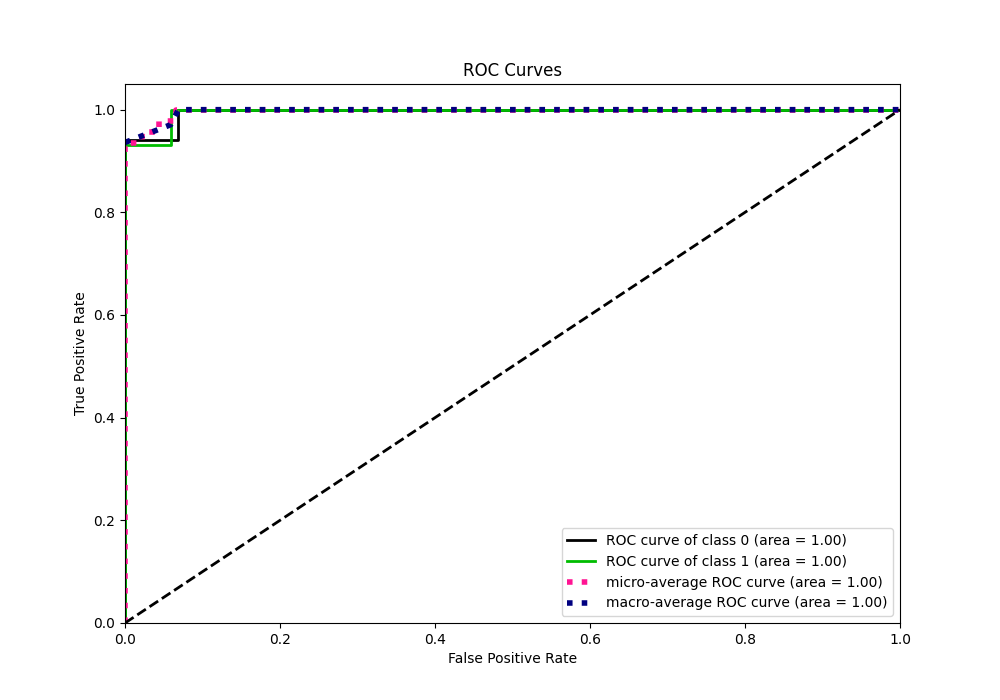
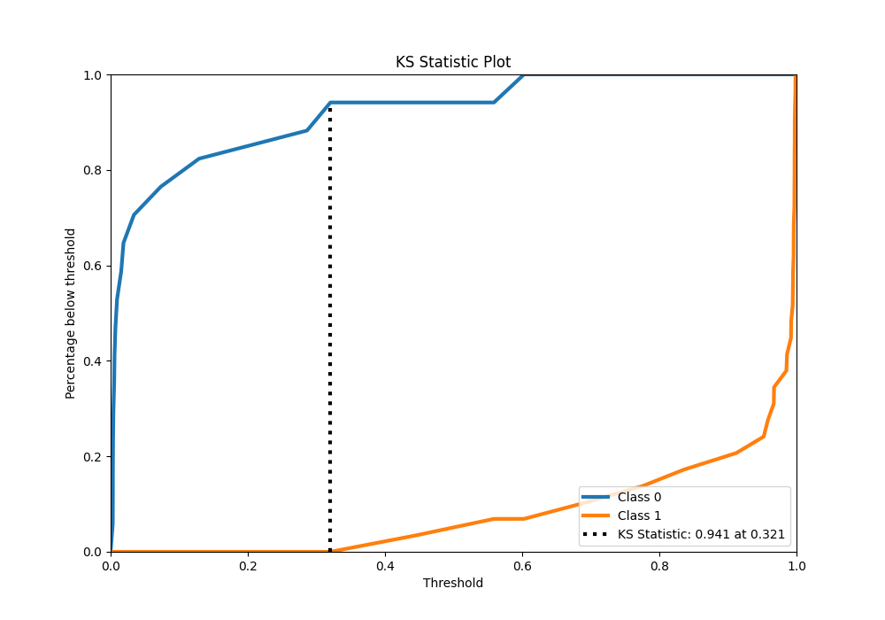
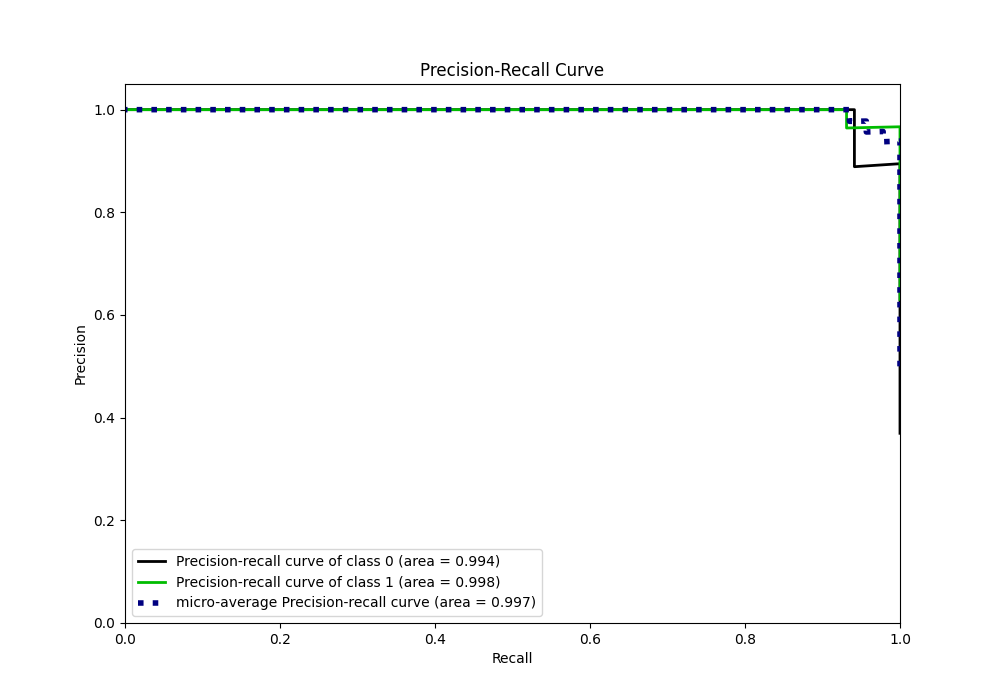
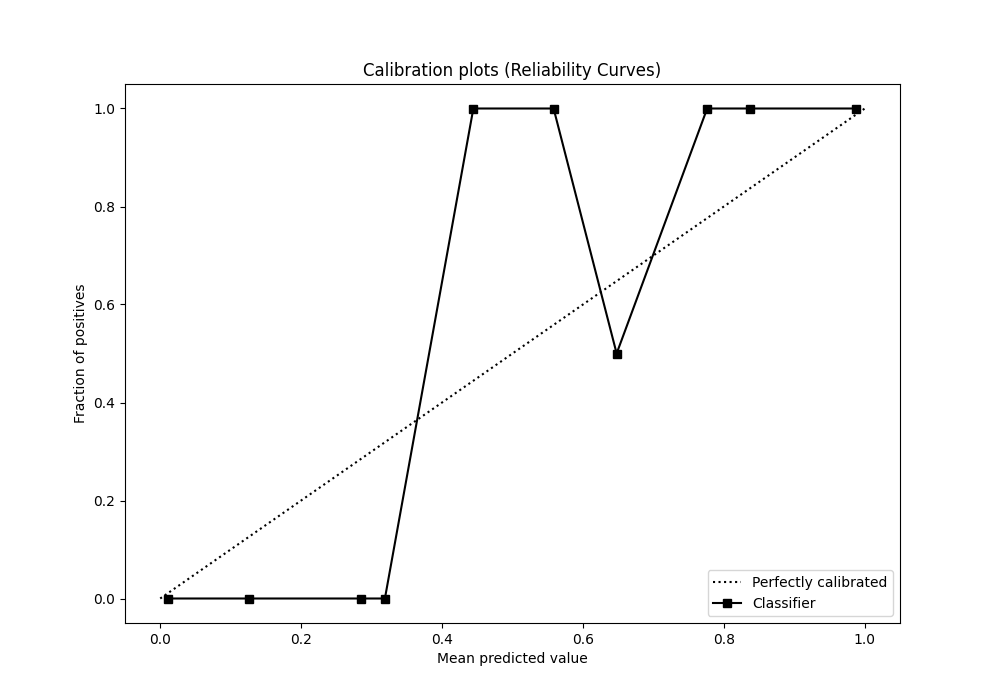
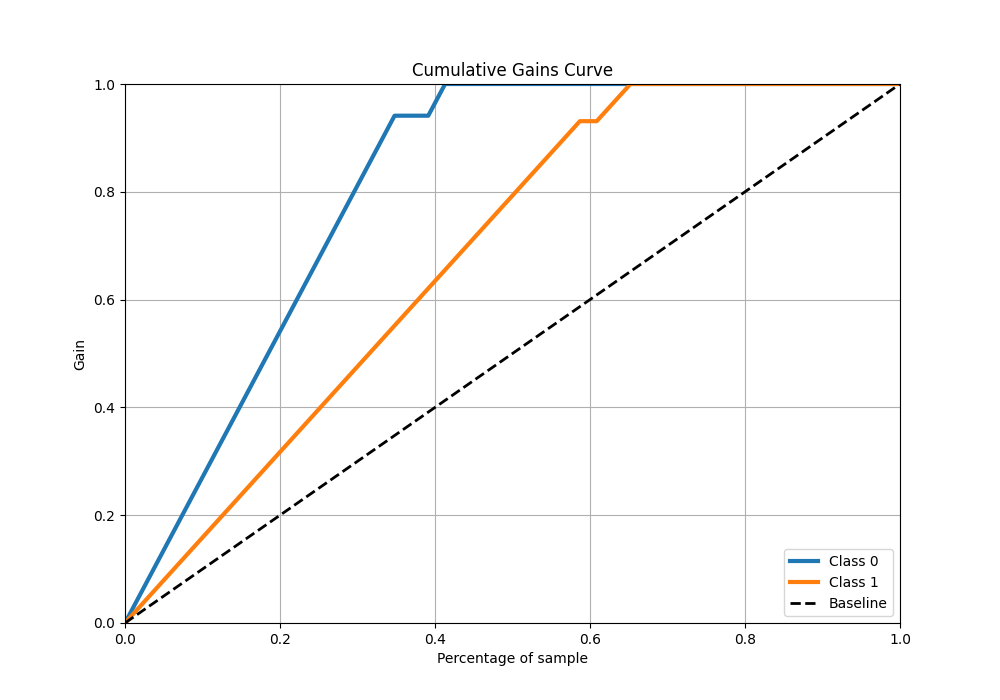

# Summary of 17_Xgboost

[<< Go back](../README.md)

## Extreme Gradient Boosting (Xgboost)
- **n_jobs**: -1
- **objective**: binary:logistic
- **eta**: 0.1
- **max_depth**: 5
- **min_child_weight**: 5
- **subsample**: 0.7
- **colsample_bytree**: 0.6
- **eval_metric**: logloss
- **explain_level**: 0

## Validation
 - **validation_type**: split
 - **train_ratio**: 0.9
 - **shuffle**: True
 - **stratify**: True

## Optimized metric
logloss

## Training time

1.3 seconds

## Metric details
|           |     score |    threshold |
|:----------|----------:|-------------:|
| logloss   | 0.0980426 | nan          |
| auc       | 0.995943  | nan          |
| f1        | 0.983051  |   0.382995   |
| accuracy  | 0.978261  |   0.382995   |
| precision | 1         |   0.647933   |
| recall    | 1         |   0.00277561 |
| mcc       | 0.953836  |   0.382995   |

## Metric details with threshold from accuracy metric
|           |     score |   threshold |
|:----------|----------:|------------:|
| logloss   | 0.0980426 |  nan        |
| auc       | 0.995943  |  nan        |
| f1        | 0.983051  |    0.382995 |
| accuracy  | 0.978261  |    0.382995 |
| precision | 0.966667  |    0.382995 |
| recall    | 1         |    0.382995 |
| mcc       | 0.953836  |    0.382995 |

## Confusion matrix (at threshold=0.382995)
|              |   Predicted as 0 |   Predicted as 1 |
|:-------------|-----------------:|-----------------:|
| Labeled as 0 |               16 |                1 |
| Labeled as 1 |                0 |               29 |

## Learning curves

## Confusion Matrix

## Normalized Confusion Matrix

## ROC Curve

## Kolmogorov-Smirnov Statistic

## Precision-Recall Curve

## Calibration Curve

## Cumulative Gains Curve

## Lift Curve

[<< Go back](../README.md)
