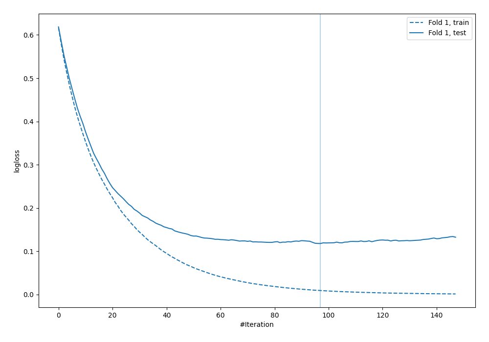
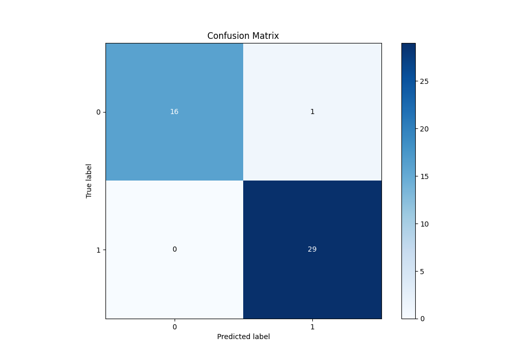
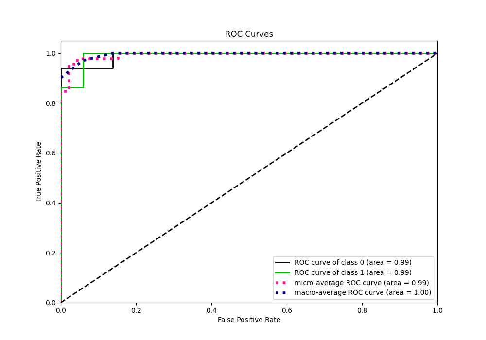
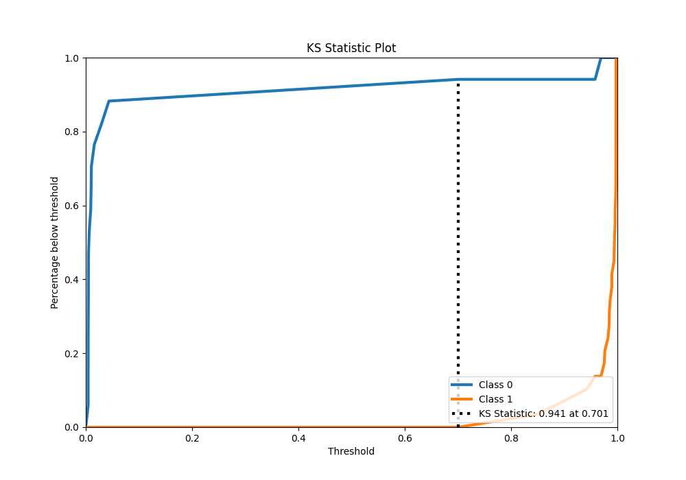
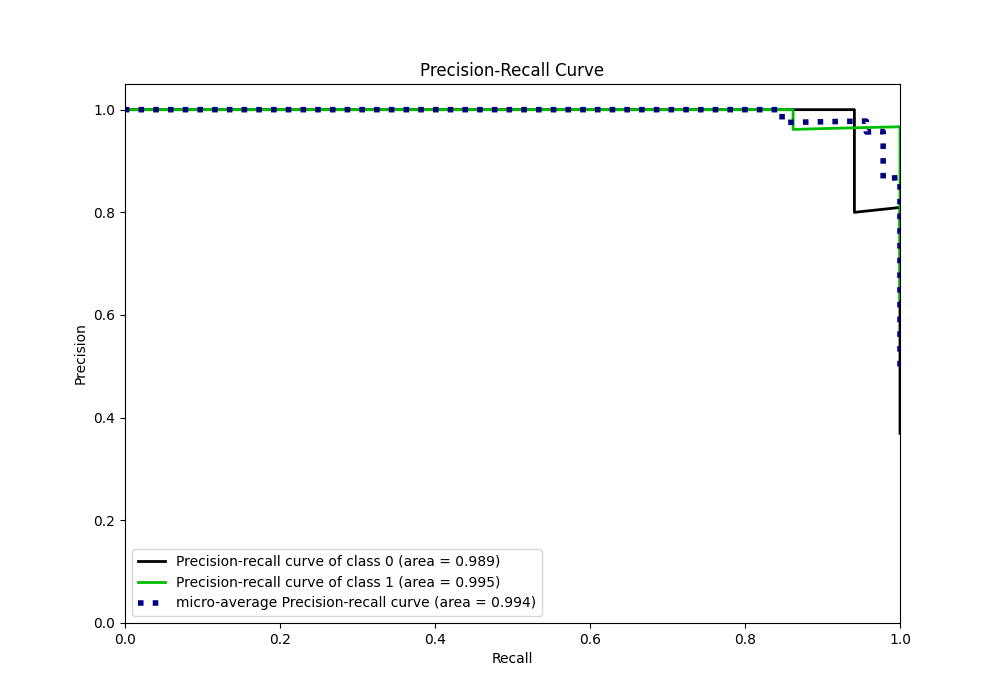
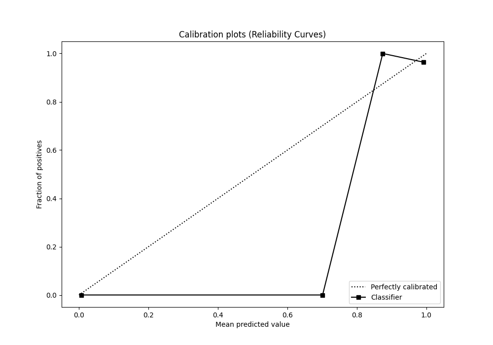

# Summary of 24_LightGBM

[<< Go back](../README.md)

## LightGBM
- **n_jobs**: -1
- **objective**: binary
- **num_leaves**: 95
- **learning_rate**: 0.05
- **feature_fraction**: 0.9
- **bagging_fraction**: 0.8
- **min_data_in_leaf**: 10
- **metric**: binary_logloss
- **custom_eval_metric_name**: None
- **explain_level**: 0

## Validation
 - **validation_type**: split
 - **train_ratio**: 0.9
 - **shuffle**: True
 - **stratify**: True

## Optimized metric
logloss

## Training time

2.0 seconds

## Metric details
|           |    score |    threshold |
|:----------|---------:|-------------:|
| logloss   | 0.117794 | nan          |
| auc       | 0.991886 | nan          |
| f1        | 0.983051 |   0.774765   |
| accuracy  | 0.978261 |   0.774765   |
| precision | 1        |   0.972144   |
| recall    | 1        |   0.00406128 |
| mcc       | 0.953836 |   0.774765   |

## Metric details with threshold from accuracy metric
|           |    score |   threshold |
|:----------|---------:|------------:|
| logloss   | 0.117794 |  nan        |
| auc       | 0.991886 |  nan        |
| f1        | 0.983051 |    0.774765 |
| accuracy  | 0.978261 |    0.774765 |
| precision | 0.966667 |    0.774765 |
| recall    | 1        |    0.774765 |
| mcc       | 0.953836 |    0.774765 |

## Confusion matrix (at threshold=0.774765)
|              |   Predicted as 0 |   Predicted as 1 |
|:-------------|-----------------:|-----------------:|
| Labeled as 0 |               16 |                1 |
| Labeled as 1 |                0 |               29 |

## Learning curves

## Confusion Matrix

## Normalized Confusion Matrix

## ROC Curve

## Kolmogorov-Smirnov Statistic

## Precision-Recall Curve

## Calibration Curve

## Cumulative Gains Curve

## Lift Curve

[<< Go back](../README.md)
