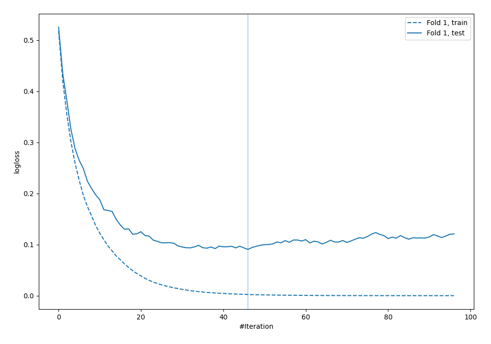
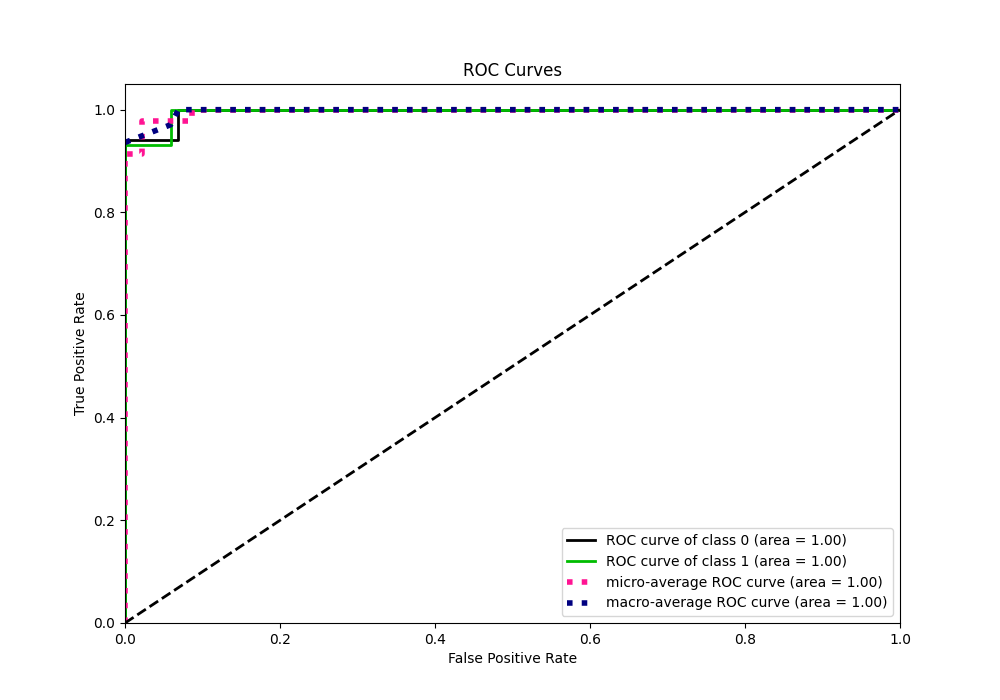
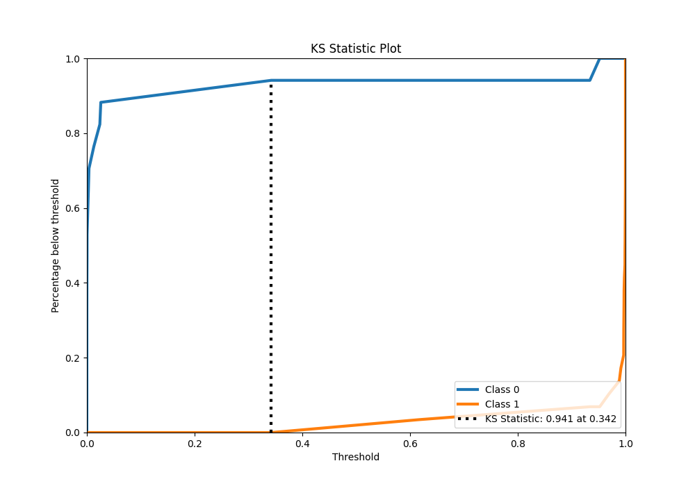
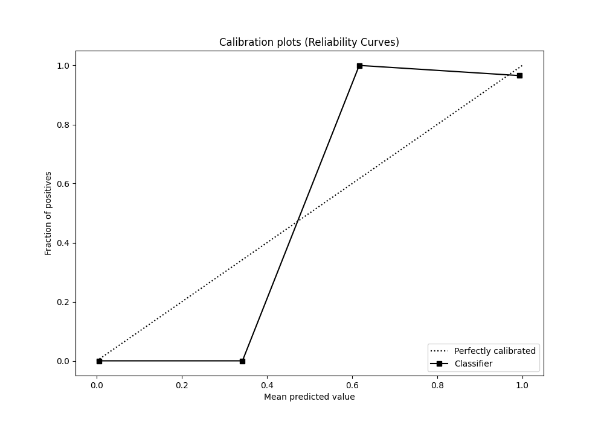
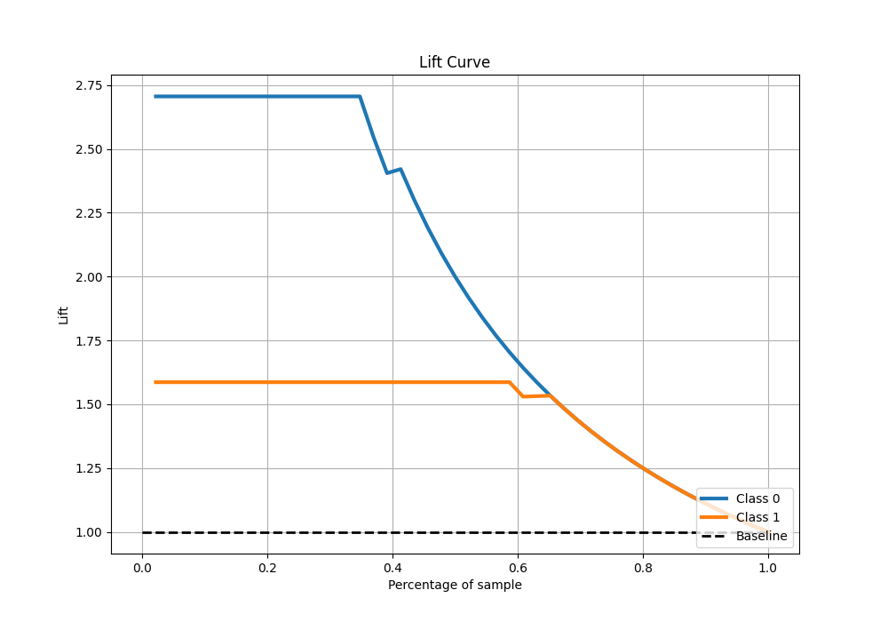

# Summary of 25_LightGBM

[<< Go back](../README.md)

## LightGBM
- **n_jobs**: -1
- **objective**: binary
- **num_leaves**: 63
- **learning_rate**: 0.2
- **feature_fraction**: 0.5
- **bagging_fraction**: 0.8
- **min_data_in_leaf**: 30
- **metric**: binary_logloss
- **custom_eval_metric_name**: None
- **explain_level**: 0

## Validation
 - **validation_type**: split
 - **train_ratio**: 0.9
 - **shuffle**: True
 - **stratify**: True

## Optimized metric
logloss

## Training time

1.3 seconds

## Metric details
|           |     score |     threshold |
|:----------|----------:|--------------:|
| logloss   | 0.0904575 | nan           |
| auc       | 0.995943  | nan           |
| f1        | 0.983051  |   0.479558    |
| accuracy  | 0.978261  |   0.479558    |
| precision | 1         |   0.960797    |
| recall    | 1         |   4.22603e-05 |
| mcc       | 0.953836  |   0.479558    |

## Metric details with threshold from accuracy metric
|           |     score |   threshold |
|:----------|----------:|------------:|
| logloss   | 0.0904575 |  nan        |
| auc       | 0.995943  |  nan        |
| f1        | 0.983051  |    0.479558 |
| accuracy  | 0.978261  |    0.479558 |
| precision | 0.966667  |    0.479558 |
| recall    | 1         |    0.479558 |
| mcc       | 0.953836  |    0.479558 |

## Confusion matrix (at threshold=0.479558)
|              |   Predicted as 0 |   Predicted as 1 |
|:-------------|-----------------:|-----------------:|
| Labeled as 0 |               16 |                1 |
| Labeled as 1 |                0 |               29 |

## Learning curves

## Confusion Matrix

## Normalized Confusion Matrix

## ROC Curve

## Kolmogorov-Smirnov Statistic

## Precision-Recall Curve

## Calibration Curve

## Cumulative Gains Curve

## Lift Curve

[<< Go back](../README.md)
