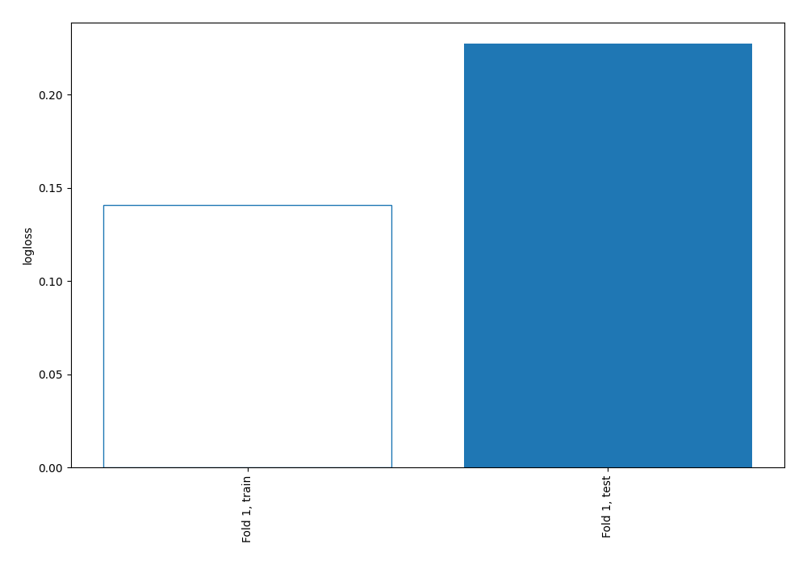
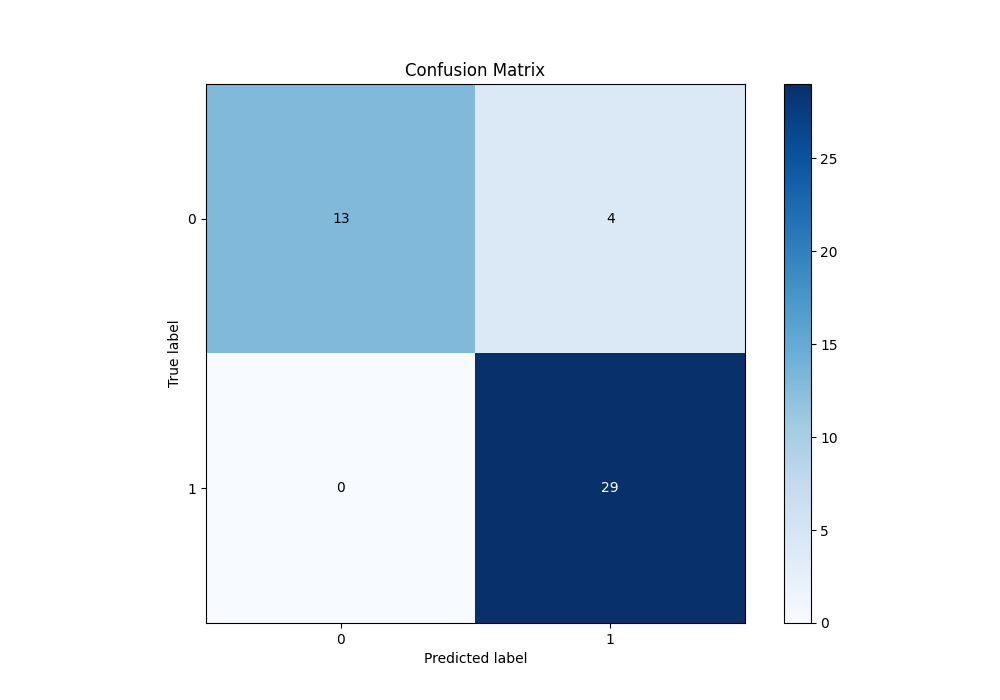
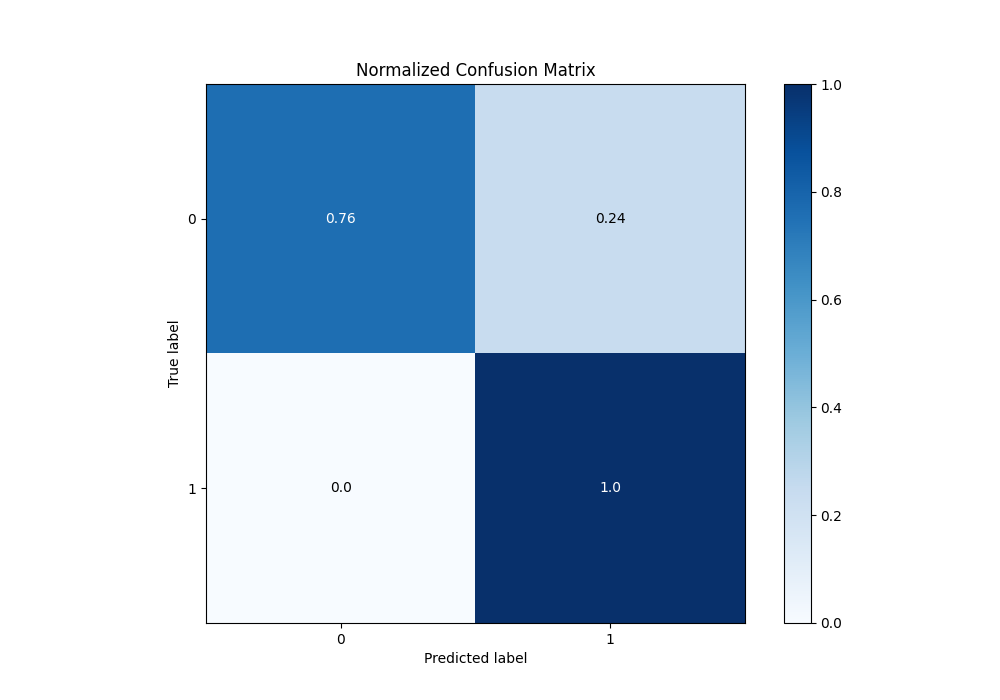
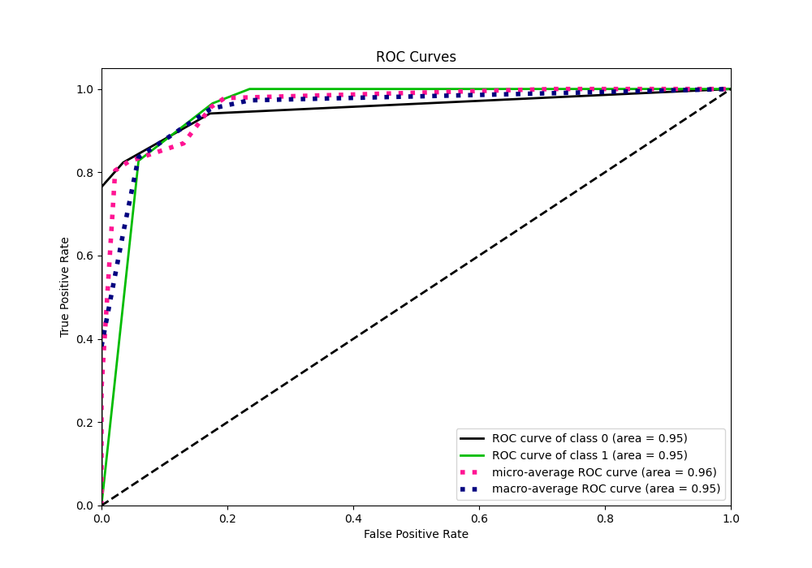
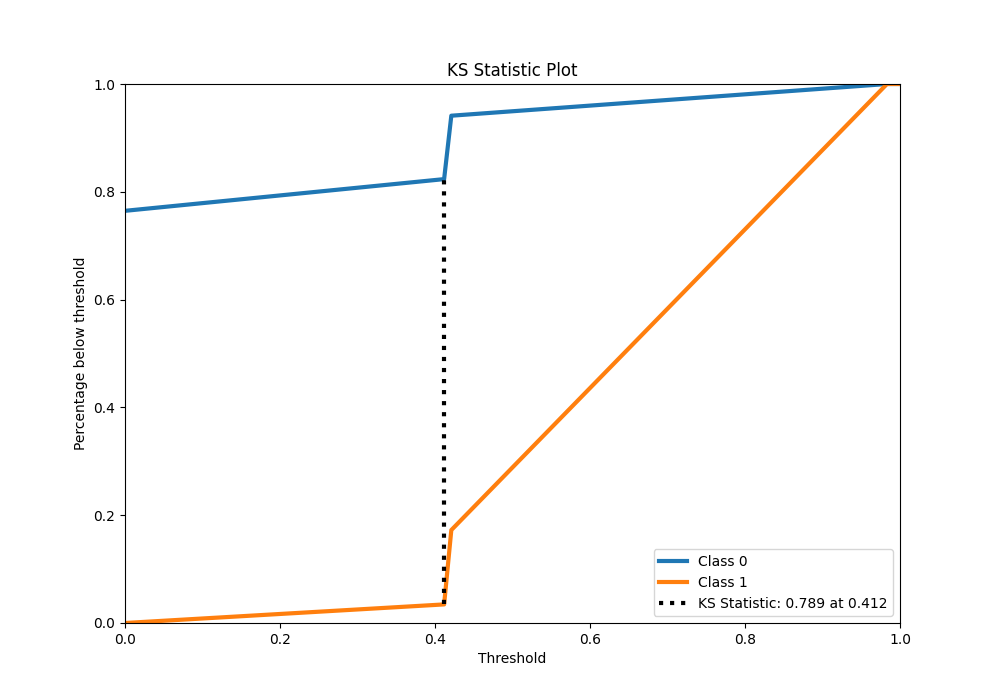
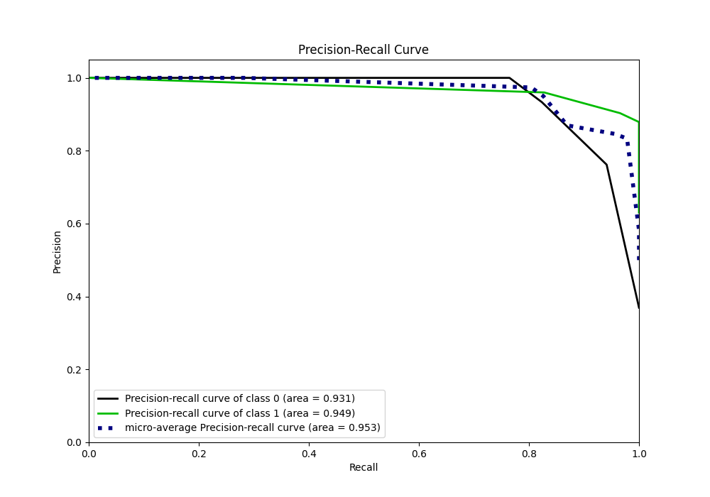
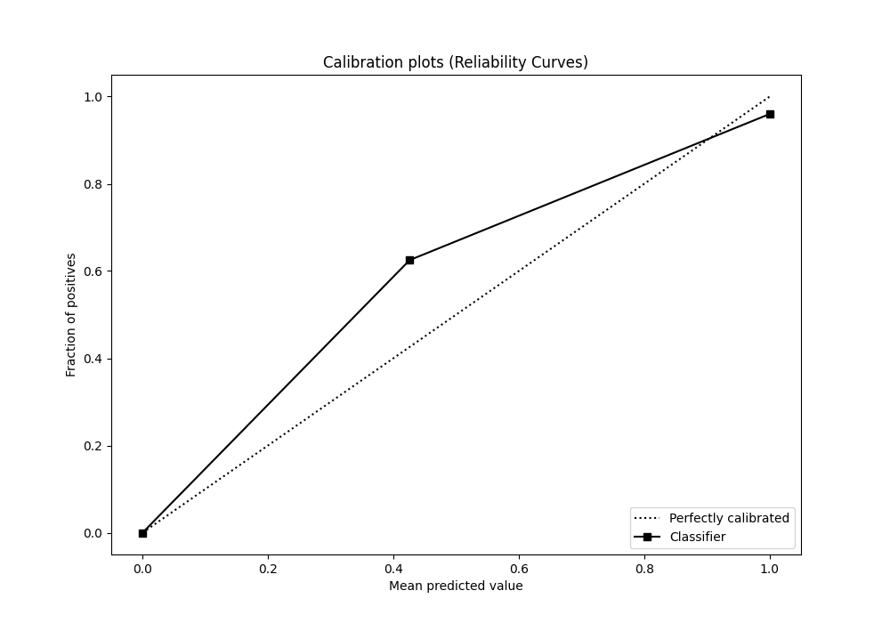
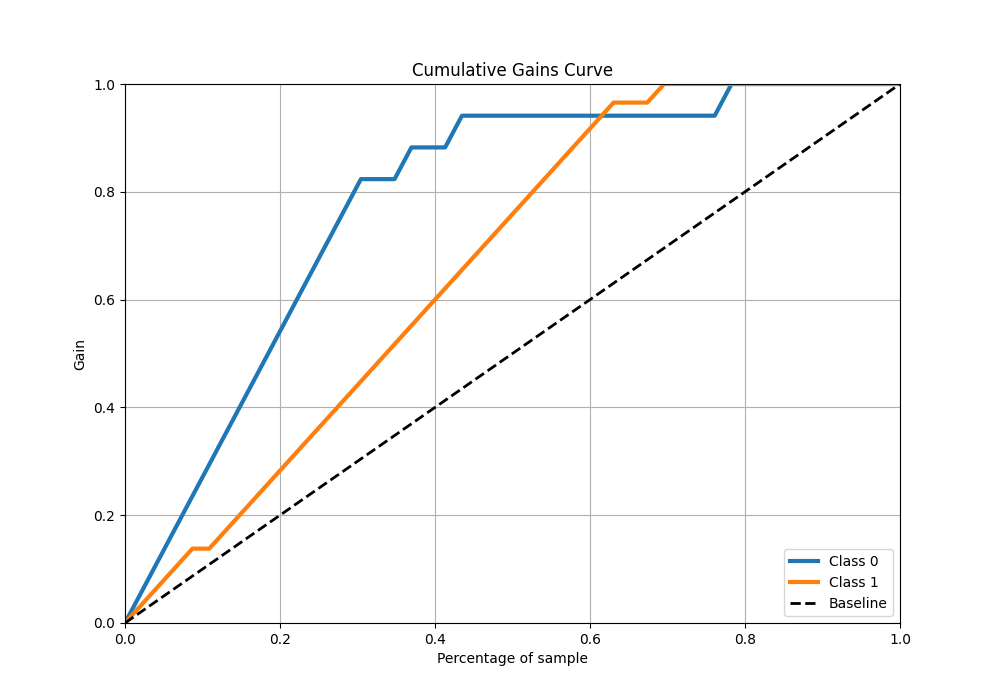
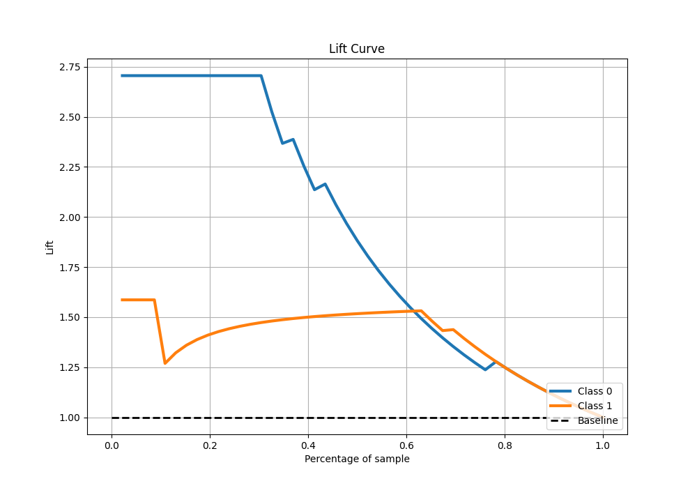

# Summary of 2_DecisionTree

[<< Go back](../README.md)

## Decision Tree
- **n_jobs**: -1
- **criterion**: entropy
- **max_depth**: 2
- **explain_level**: 0

## Validation
 - **validation_type**: split
 - **train_ratio**: 0.9
 - **shuffle**: True
 - **stratify**: True

## Optimized metric
logloss

## Training time

0.5 seconds

## Metric details
|           |    score |   threshold |
|:----------|---------:|------------:|
| logloss   | 0.227473 |  nan        |
| auc       | 0.952333 |  nan        |
| f1        | 0.935484 |    0        |
| accuracy  | 0.913043 |    0        |
| precision | 0.96     |    0.421053 |
| recall    | 1        |    0        |
| mcc       | 0.819765 |    0        |

## Metric details with threshold from accuracy metric
|           |    score |   threshold |
|:----------|---------:|------------:|
| logloss   | 0.227473 |         nan |
| auc       | 0.952333 |         nan |
| f1        | 0.935484 |           0 |
| accuracy  | 0.913043 |           0 |
| precision | 0.878788 |           0 |
| recall    | 1        |           0 |
| mcc       | 0.819765 |           0 |

## Confusion matrix (at threshold=0.0)
|              |   Predicted as 0 |   Predicted as 1 |
|:-------------|-----------------:|-----------------:|
| Labeled as 0 |               13 |                4 |
| Labeled as 1 |                0 |               29 |

## Learning curves

## Confusion Matrix

## Normalized Confusion Matrix

## ROC Curve

## Kolmogorov-Smirnov Statistic

## Precision-Recall Curve

## Calibration Curve

## Cumulative Gains Curve

## Lift Curve

[<< Go back](../README.md)
