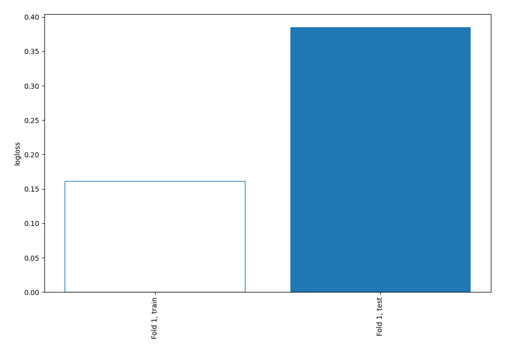
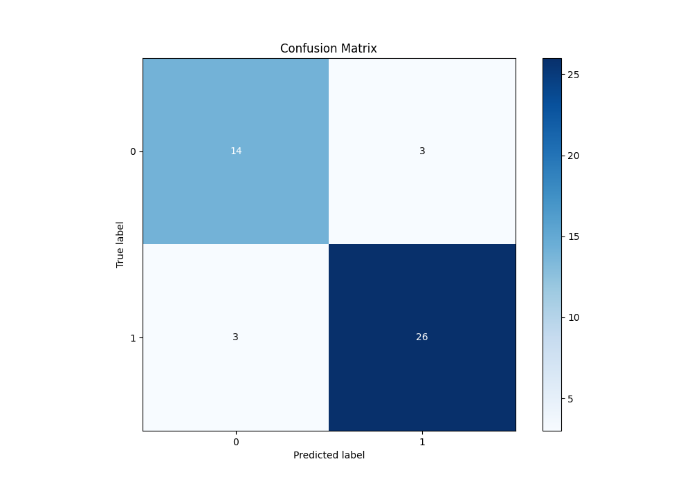
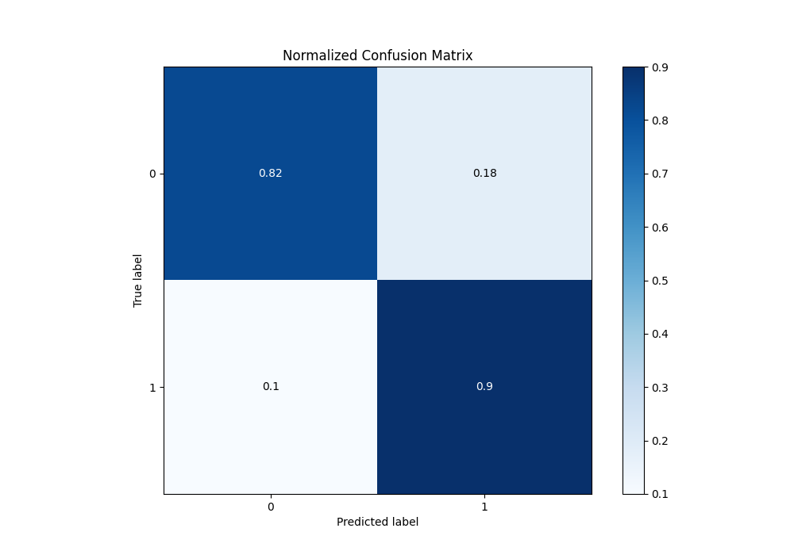
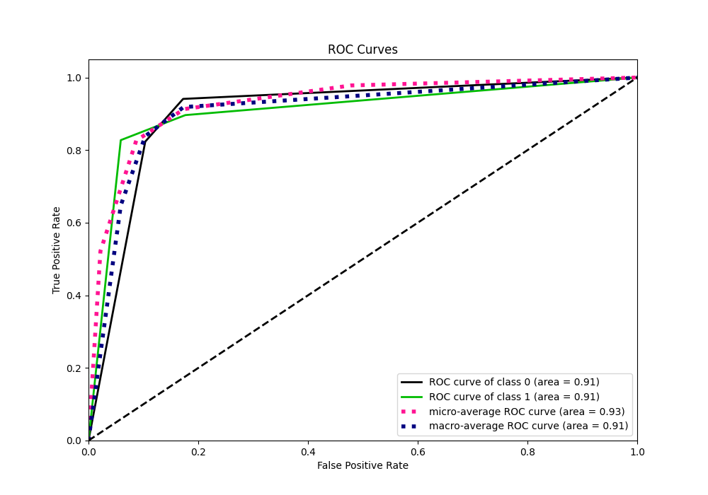
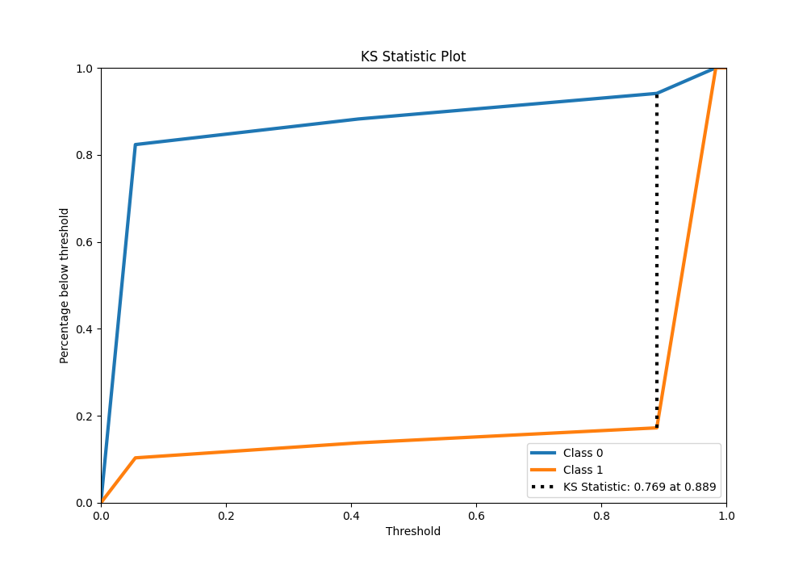
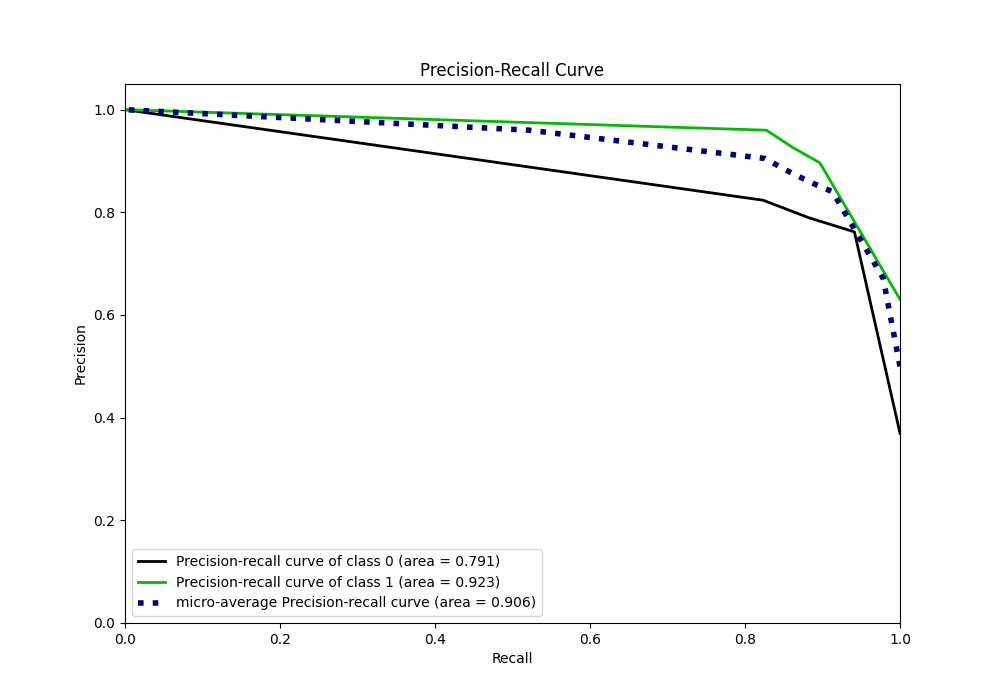
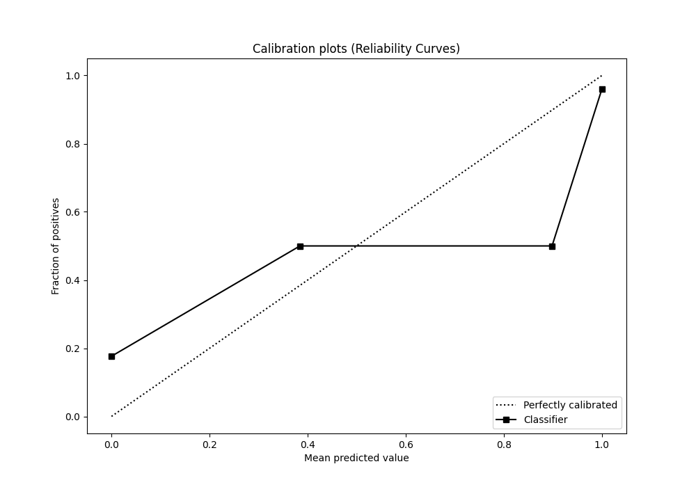
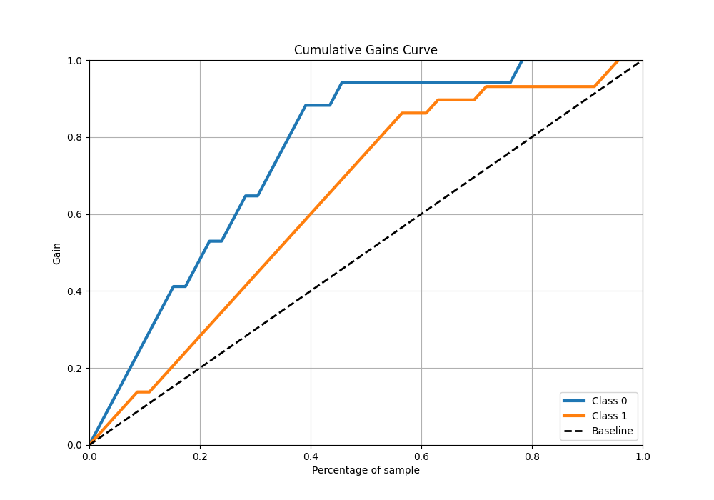
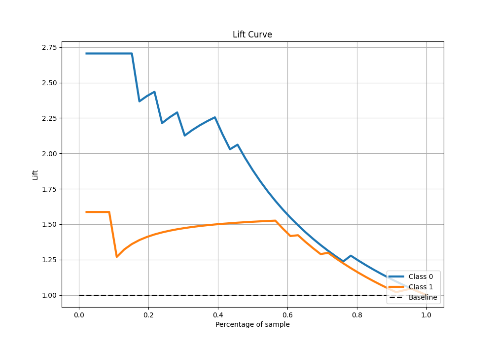

# Summary of 3_DecisionTree

[<< Go back](../README.md)

## Decision Tree
- **n_jobs**: -1
- **criterion**: gini
- **max_depth**: 2
- **explain_level**: 0

## Validation
 - **validation_type**: split
 - **train_ratio**: 0.9
 - **shuffle**: True
 - **stratify**: True

## Optimized metric
logloss

## Training time

0.6 seconds

## Metric details
|           |    score |   threshold |
|:----------|---------:|------------:|
| logloss   | 0.385046 | nan         |
| auc       | 0.906694 | nan         |
| f1        | 0.896552 |   0.0551724 |
| accuracy  | 0.869565 |   0.0551724 |
| precision | 0.96     |   0.888889  |
| recall    | 1        |   0.0496552 |
| mcc       | 0.744965 |   0.888889  |

## Metric details with threshold from accuracy metric
|           |    score |   threshold |
|:----------|---------:|------------:|
| logloss   | 0.385046 | nan         |
| auc       | 0.906694 | nan         |
| f1        | 0.896552 |   0.0551724 |
| accuracy  | 0.869565 |   0.0551724 |
| precision | 0.896552 |   0.0551724 |
| recall    | 0.896552 |   0.0551724 |
| mcc       | 0.720081 |   0.0551724 |

## Confusion matrix (at threshold=0.055172)
|              |   Predicted as 0 |   Predicted as 1 |
|:-------------|-----------------:|-----------------:|
| Labeled as 0 |               14 |                3 |
| Labeled as 1 |                3 |               26 |

## Learning curves

## Confusion Matrix

## Normalized Confusion Matrix

## ROC Curve

## Kolmogorov-Smirnov Statistic

## Precision-Recall Curve

## Calibration Curve

## Cumulative Gains Curve

## Lift Curve

[<< Go back](../README.md)
