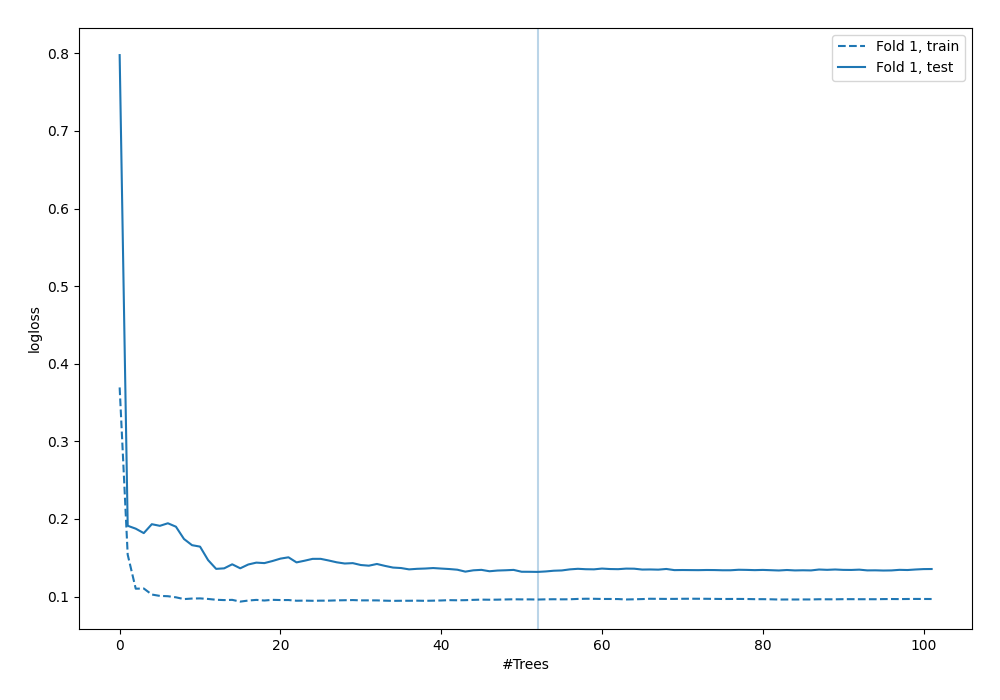
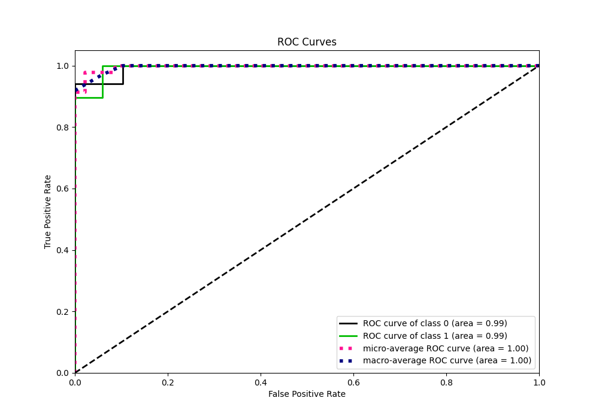
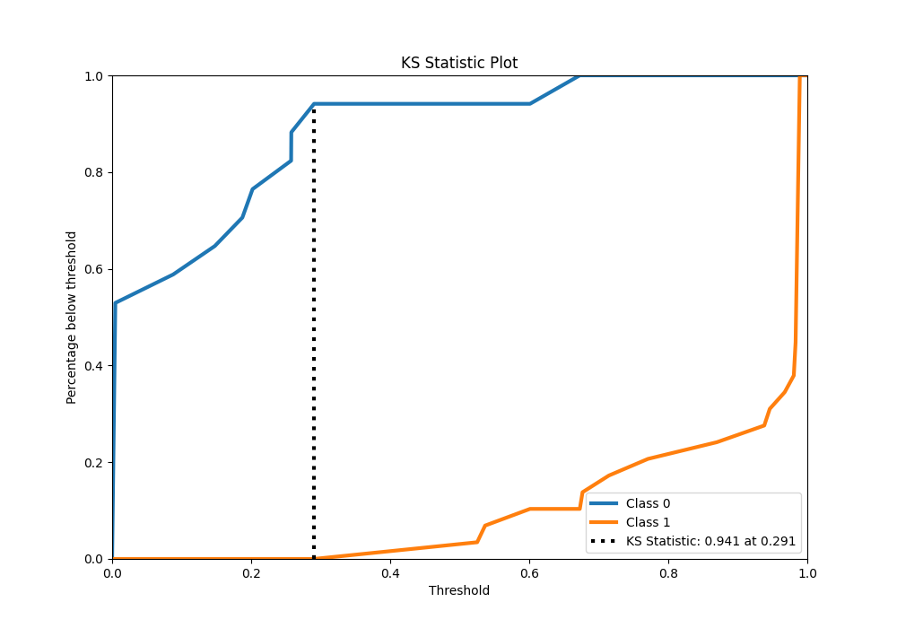
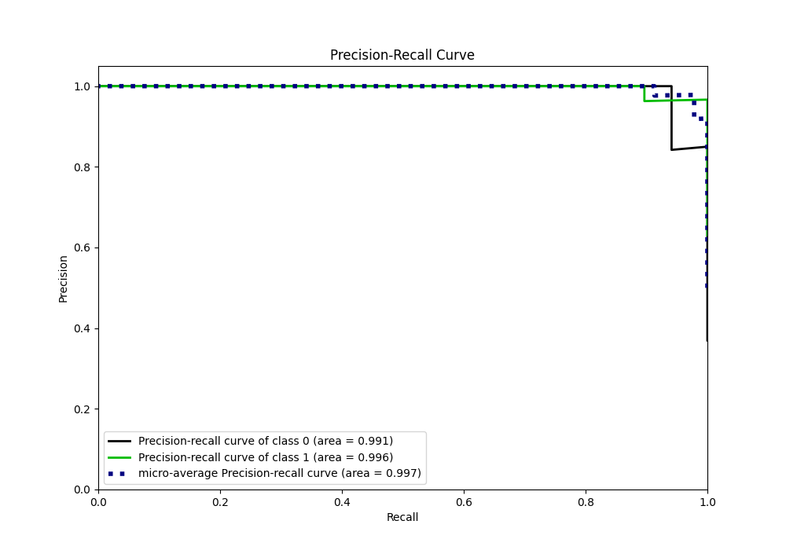
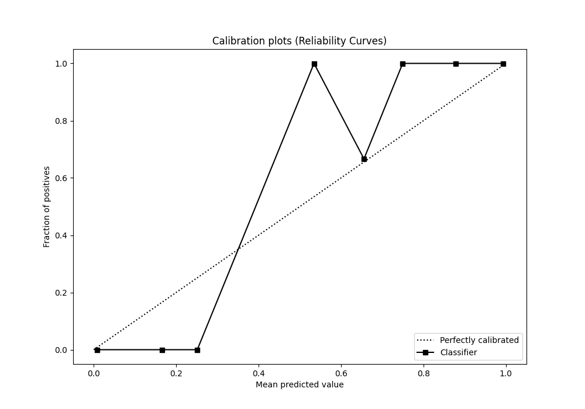
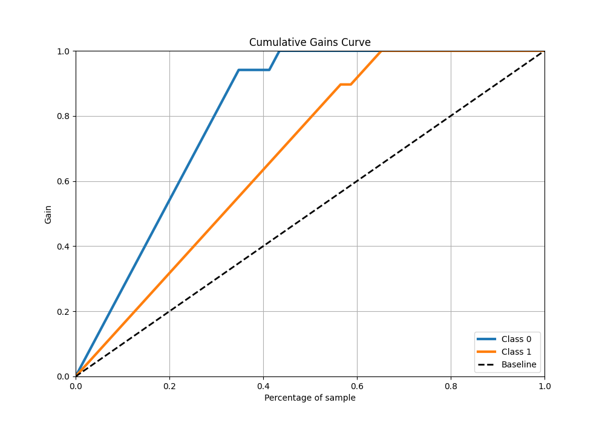
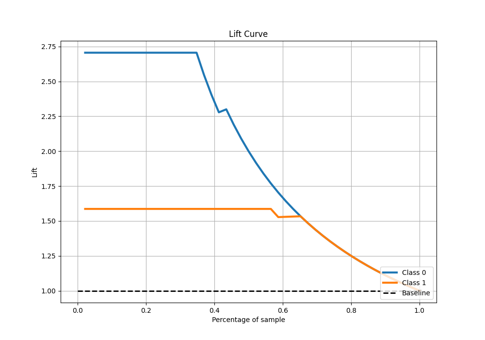

# Summary of 43_RandomForest

[<< Go back](../README.md)

## Random Forest
- **n_jobs**: -1
- **criterion**: gini
- **max_features**: 0.7
- **min_samples_split**: 50
- **max_depth**: 3
- **eval_metric_name**: logloss
- **explain_level**: 0

## Validation
 - **validation_type**: split
 - **train_ratio**: 0.9
 - **shuffle**: True
 - **stratify**: True

## Optimized metric
logloss

## Training time

1.3 seconds

## Metric details
|           |    score |    threshold |
|:----------|---------:|-------------:|
| logloss   | 0.131818 | nan          |
| auc       | 0.993915 | nan          |
| f1        | 0.983051 |   0.407825   |
| accuracy  | 0.978261 |   0.407825   |
| precision | 1        |   0.674714   |
| recall    | 1        |   0.00412703 |
| mcc       | 0.953836 |   0.407825   |

## Metric details with threshold from accuracy metric
|           |    score |   threshold |
|:----------|---------:|------------:|
| logloss   | 0.131818 |  nan        |
| auc       | 0.993915 |  nan        |
| f1        | 0.983051 |    0.407825 |
| accuracy  | 0.978261 |    0.407825 |
| precision | 0.966667 |    0.407825 |
| recall    | 1        |    0.407825 |
| mcc       | 0.953836 |    0.407825 |

## Confusion matrix (at threshold=0.407825)
|              |   Predicted as 0 |   Predicted as 1 |
|:-------------|-----------------:|-----------------:|
| Labeled as 0 |               16 |                1 |
| Labeled as 1 |                0 |               29 |

## Learning curves

## Confusion Matrix

## Normalized Confusion Matrix

## ROC Curve

## Kolmogorov-Smirnov Statistic

## Precision-Recall Curve

## Calibration Curve

## Cumulative Gains Curve

## Lift Curve

[<< Go back](../README.md)
