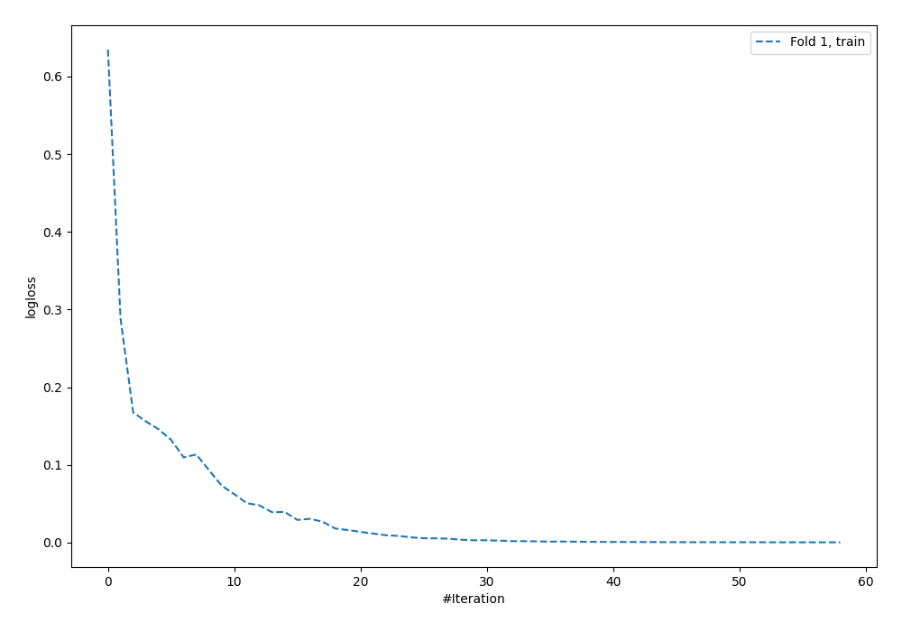
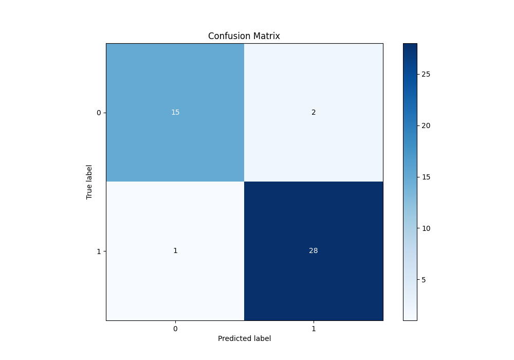
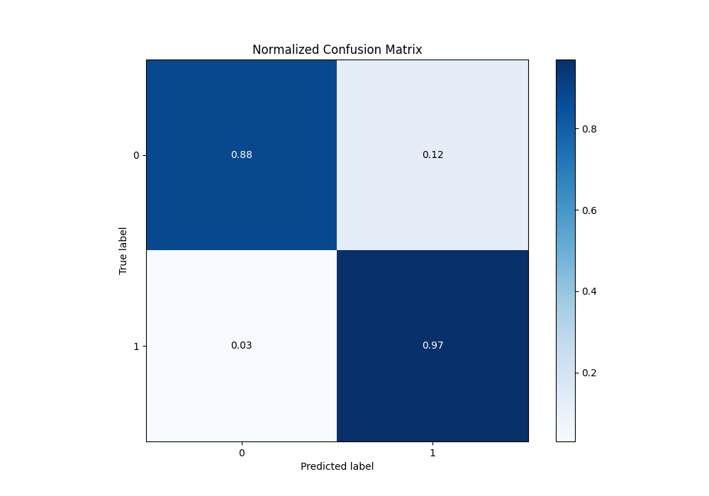
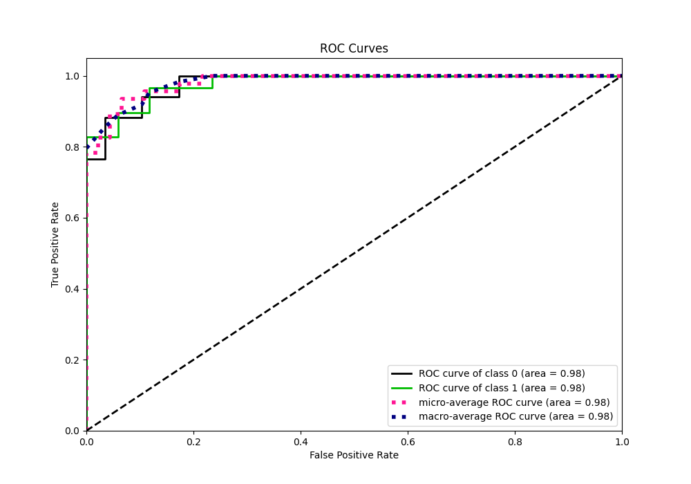
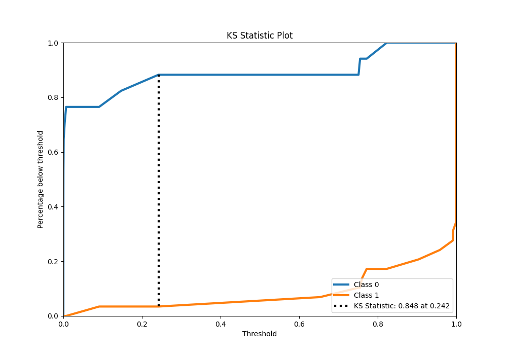
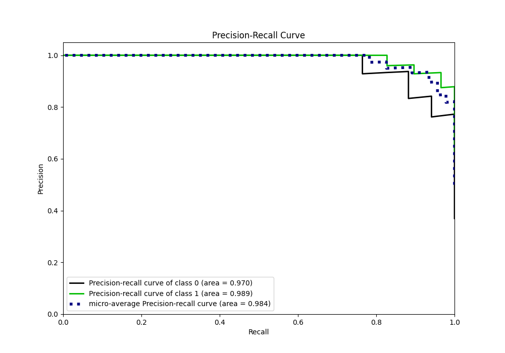
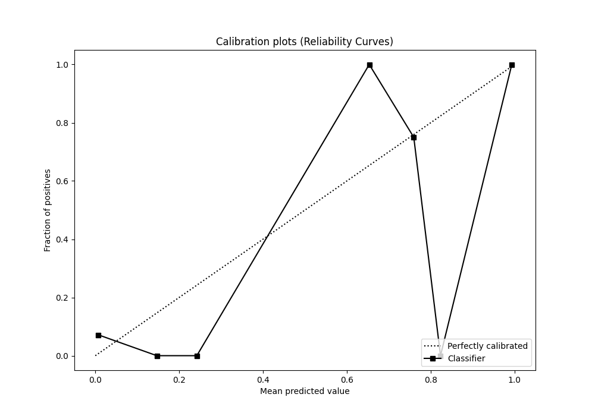
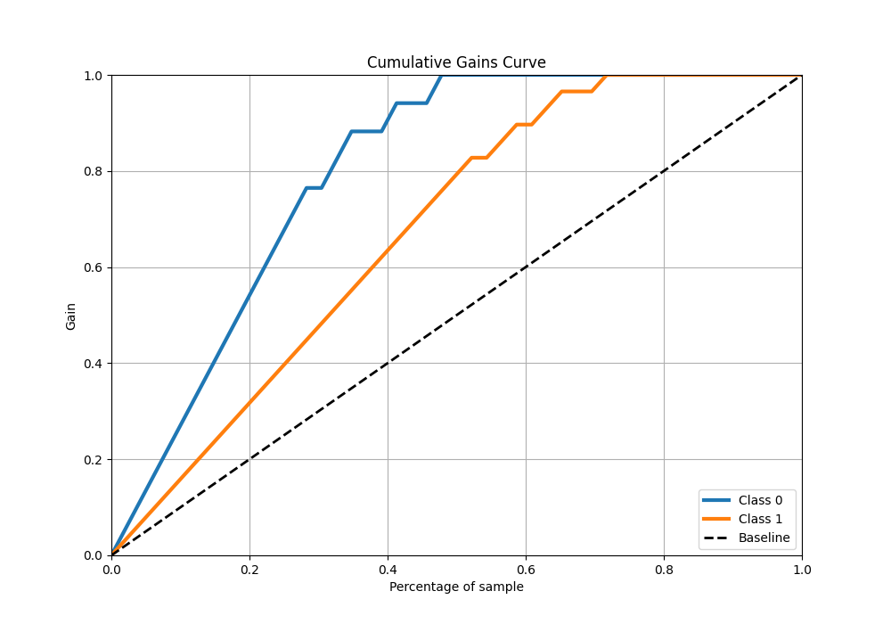
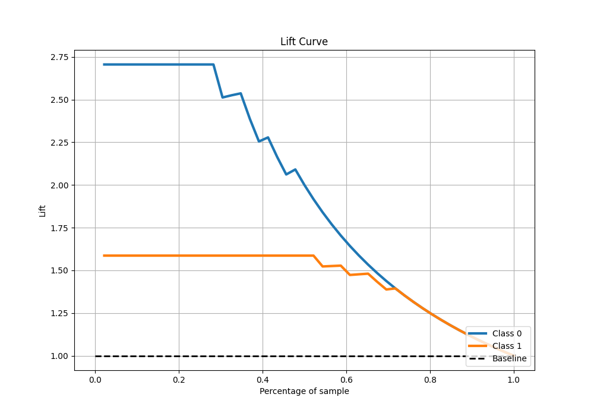

# Summary of 57_NeuralNetwork

[<< Go back](../README.md)

## Neural Network
- **n_jobs**: -1
- **dense_1_size**: 32
- **dense_2_size**: 4
- **learning_rate**: 0.1
- **explain_level**: 0

## Validation
 - **validation_type**: split
 - **train_ratio**: 0.9
 - **shuffle**: True
 - **stratify**: True

## Optimized metric
logloss

## Training time

0.9 seconds

## Metric details
|           |    score |     threshold |
|:----------|---------:|--------------:|
| logloss   | 0.160711 | nan           |
| auc       | 0.979716 | nan           |
| f1        | 0.949153 |   0.447742    |
| accuracy  | 0.934783 |   0.447742    |
| precision | 1        |   0.863689    |
| recall    | 1        |   7.90977e-17 |
| mcc       | 0.859275 |   0.447742    |

## Metric details with threshold from accuracy metric
|           |    score |   threshold |
|:----------|---------:|------------:|
| logloss   | 0.160711 |  nan        |
| auc       | 0.979716 |  nan        |
| f1        | 0.949153 |    0.447742 |
| accuracy  | 0.934783 |    0.447742 |
| precision | 0.933333 |    0.447742 |
| recall    | 0.965517 |    0.447742 |
| mcc       | 0.859275 |    0.447742 |

## Confusion matrix (at threshold=0.447742)
|              |   Predicted as 0 |   Predicted as 1 |
|:-------------|-----------------:|-----------------:|
| Labeled as 0 |               15 |                2 |
| Labeled as 1 |                1 |               28 |

## Learning curves

## Confusion Matrix

## Normalized Confusion Matrix

## ROC Curve

## Kolmogorov-Smirnov Statistic

## Precision-Recall Curve

## Calibration Curve

## Cumulative Gains Curve

## Lift Curve

[<< Go back](../README.md)
