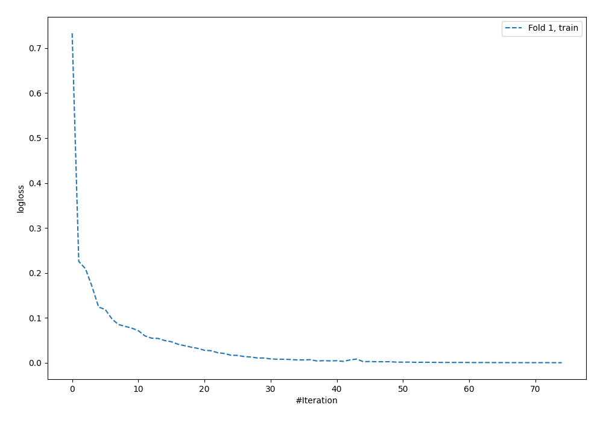
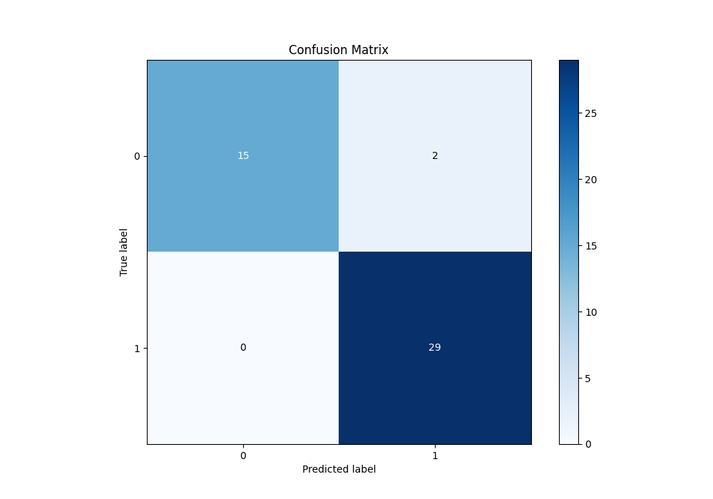
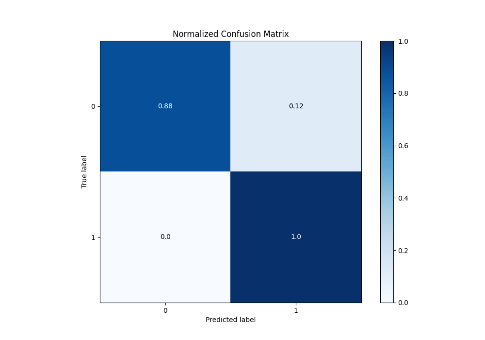
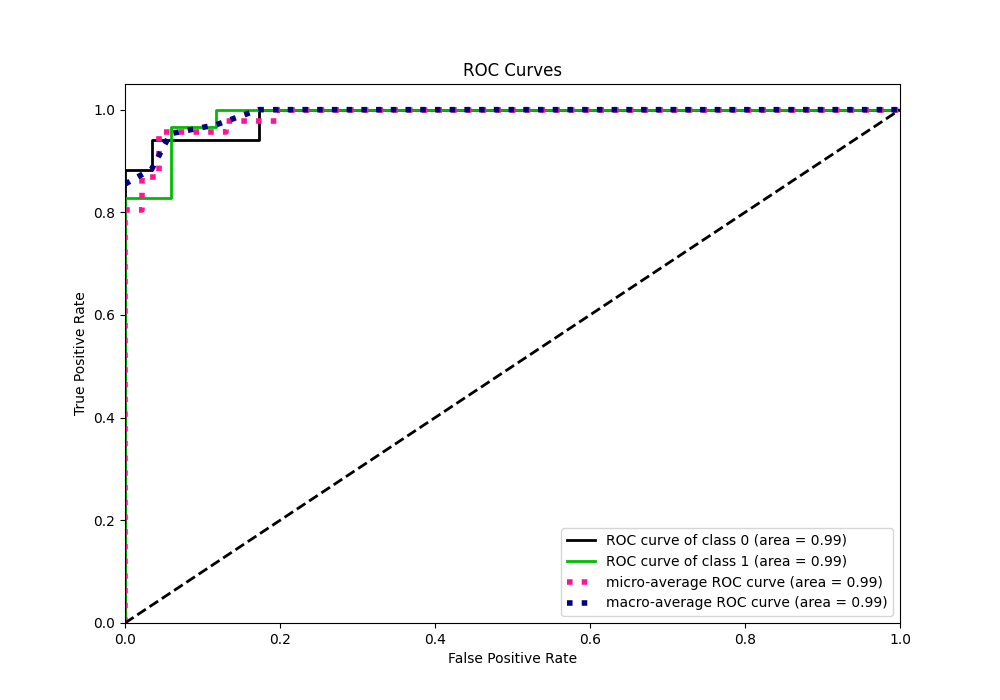
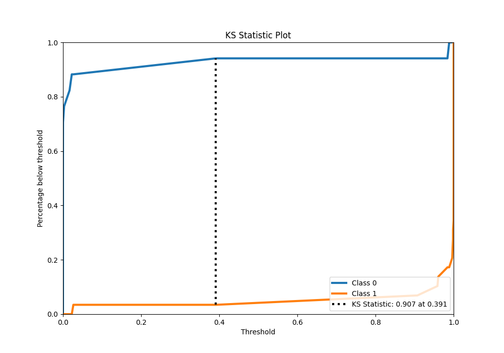
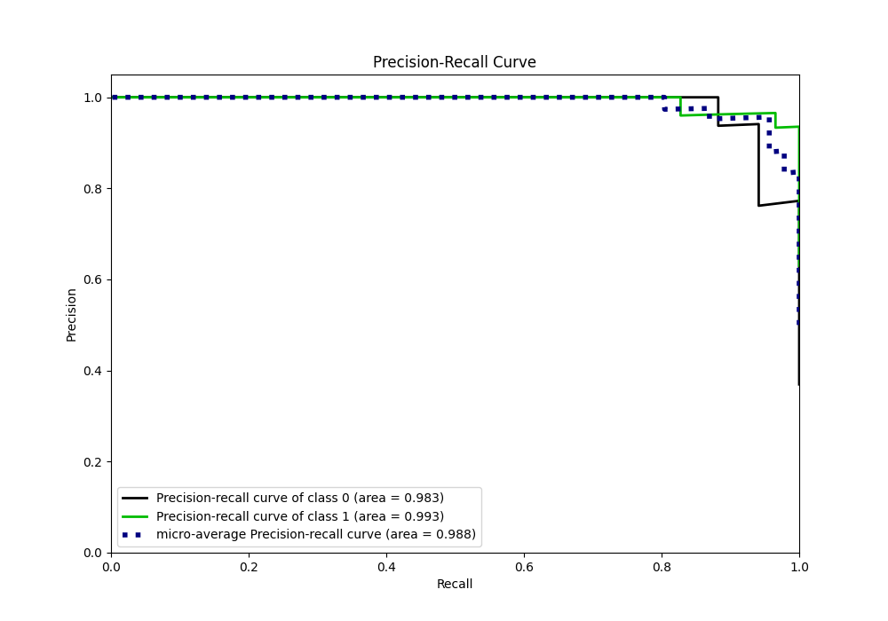
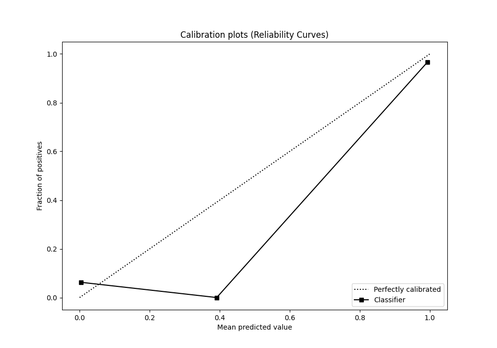
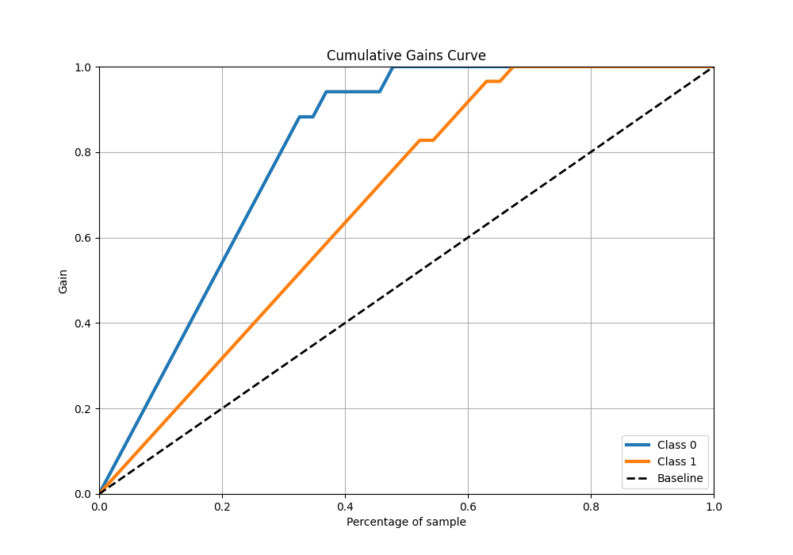
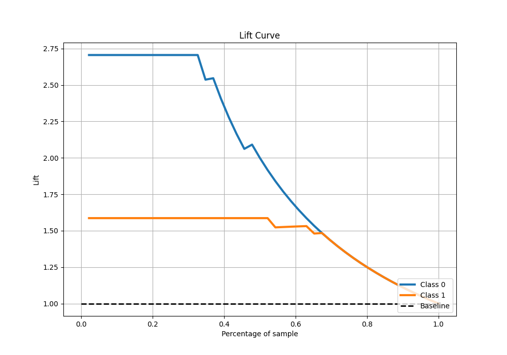

# Summary of 62_NeuralNetwork

[<< Go back](../README.md)

## Neural Network
- **n_jobs**: -1
- **dense_1_size**: 64
- **dense_2_size**: 16
- **learning_rate**: 0.05
- **explain_level**: 0

## Validation
 - **validation_type**: split
 - **train_ratio**: 0.9
 - **shuffle**: True
 - **stratify**: True

## Optimized metric
logloss

## Training time

1.2 seconds

## Metric details
|           |    score |     threshold |
|:----------|---------:|--------------:|
| logloss   | 0.192612 | nan           |
| auc       | 0.98783  | nan           |
| f1        | 0.966667 |   0.0244841   |
| accuracy  | 0.956522 |   0.0244841   |
| precision | 1        |   0.992635    |
| recall    | 1        |   6.10622e-24 |
| mcc       | 0.90853  |   0.0244841   |

## Metric details with threshold from accuracy metric
|           |    score |   threshold |
|:----------|---------:|------------:|
| logloss   | 0.192612 | nan         |
| auc       | 0.98783  | nan         |
| f1        | 0.966667 |   0.0244841 |
| accuracy  | 0.956522 |   0.0244841 |
| precision | 0.935484 |   0.0244841 |
| recall    | 1        |   0.0244841 |
| mcc       | 0.90853  |   0.0244841 |

## Confusion matrix (at threshold=0.024484)
|              |   Predicted as 0 |   Predicted as 1 |
|:-------------|-----------------:|-----------------:|
| Labeled as 0 |               15 |                2 |
| Labeled as 1 |                0 |               29 |

## Learning curves

## Confusion Matrix

## Normalized Confusion Matrix

## ROC Curve

## Kolmogorov-Smirnov Statistic

## Precision-Recall Curve

## Calibration Curve

## Cumulative Gains Curve

## Lift Curve

[<< Go back](../README.md)
