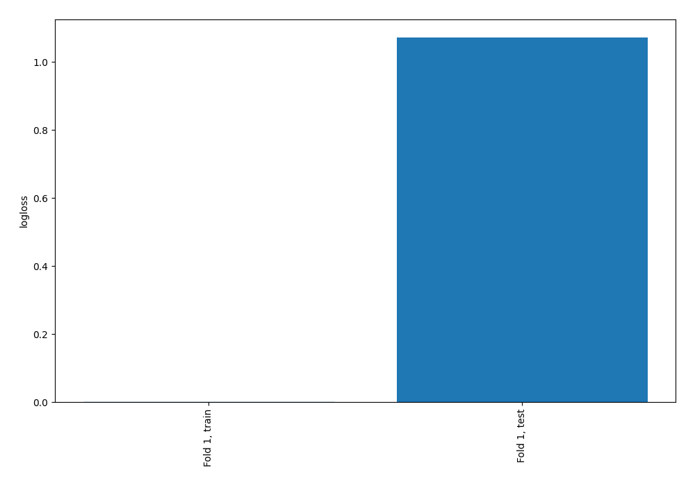
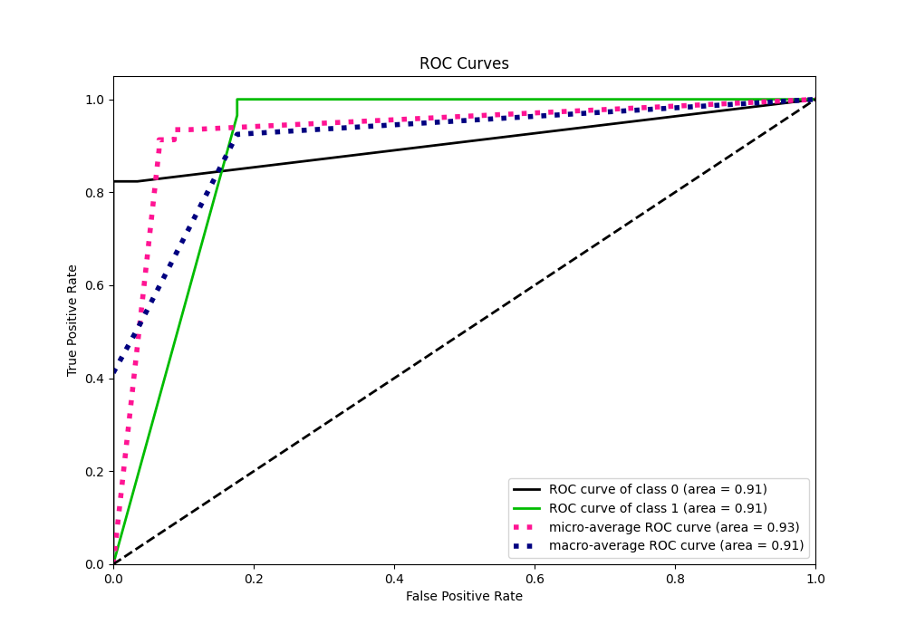
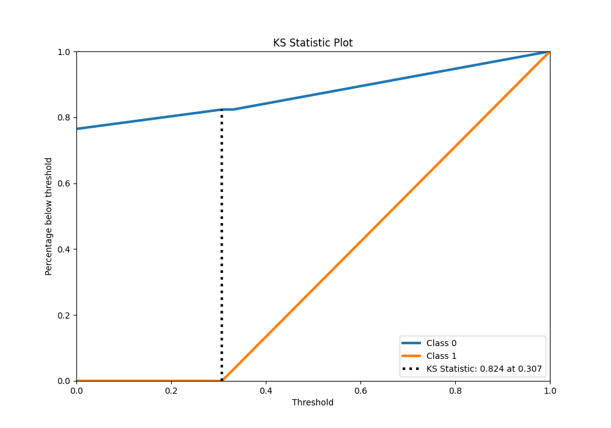
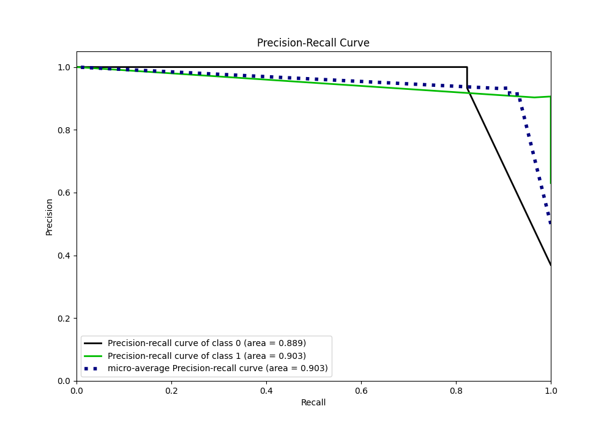
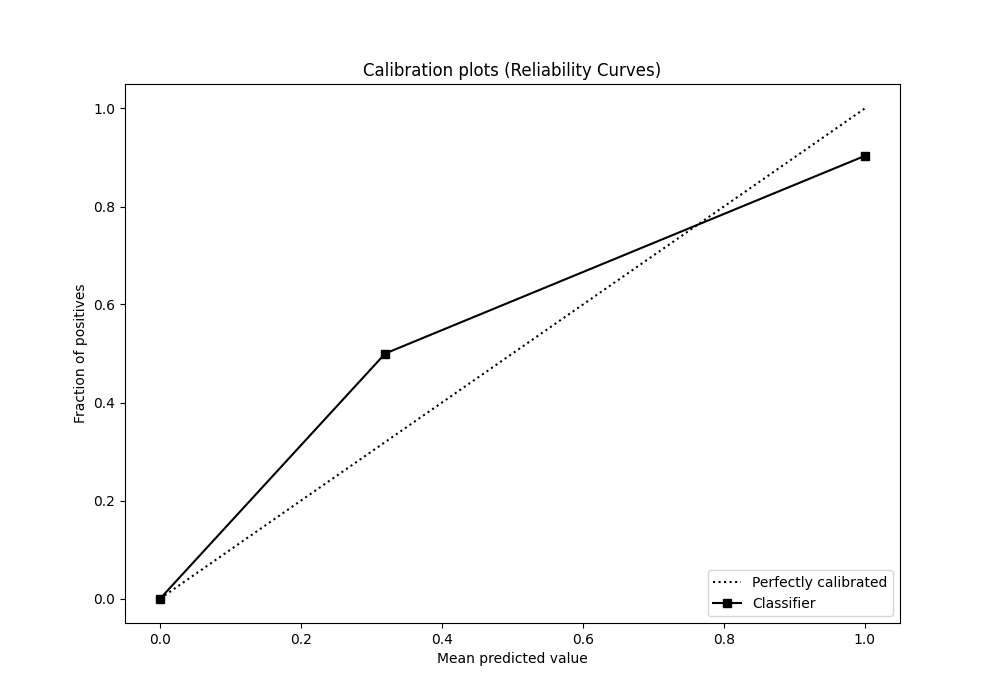
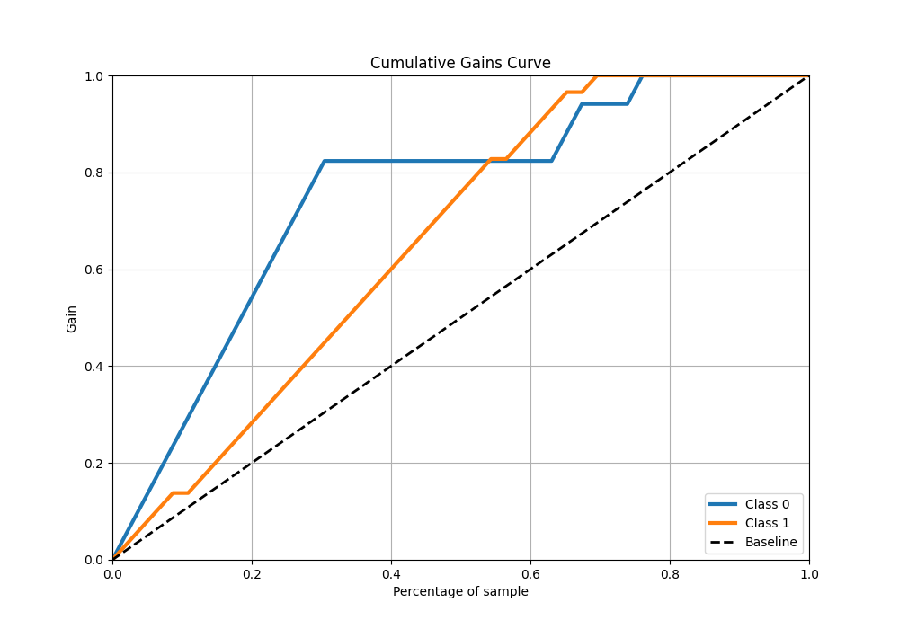
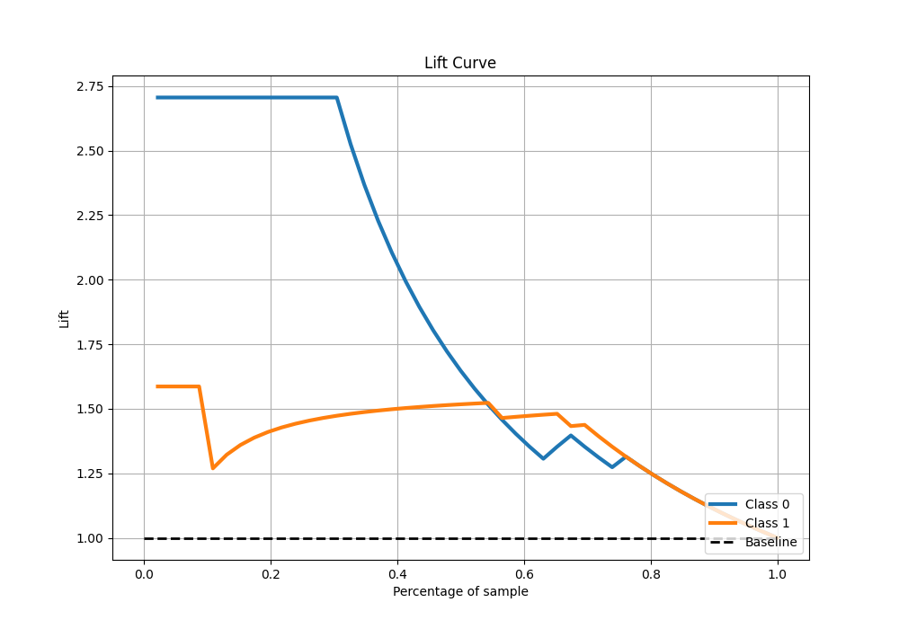

# Summary of 67_NearestNeighbors

[<< Go back](../README.md)

## k-Nearest Neighbors (Nearest Neighbors)
- **n_jobs**: -1
- **n_neighbors**: 3
- **weights**: distance
- **explain_level**: 0

## Validation
 - **validation_type**: split
 - **train_ratio**: 0.9
 - **shuffle**: True
 - **stratify**: True

## Optimized metric
logloss

## Training time

0.7 seconds

## Metric details
|           |    score |   threshold |
|:----------|---------:|------------:|
| logloss   | 1.07172  |  nan        |
| auc       | 0.908722 |  nan        |
| f1        | 0.95082  |    0.319367 |
| accuracy  | 0.934783 |    0.319367 |
| precision | 0.90625  |    0.319367 |
| recall    | 1        |    0        |
| mcc       | 0.8639   |    0.319367 |

## Metric details with threshold from accuracy metric
|           |    score |   threshold |
|:----------|---------:|------------:|
| logloss   | 1.07172  |  nan        |
| auc       | 0.908722 |  nan        |
| f1        | 0.95082  |    0.319367 |
| accuracy  | 0.934783 |    0.319367 |
| precision | 0.90625  |    0.319367 |
| recall    | 1        |    0.319367 |
| mcc       | 0.8639   |    0.319367 |

## Confusion matrix (at threshold=0.319367)
|              |   Predicted as 0 |   Predicted as 1 |
|:-------------|-----------------:|-----------------:|
| Labeled as 0 |               14 |                3 |
| Labeled as 1 |                0 |               29 |

## Learning curves

## Confusion Matrix

## Normalized Confusion Matrix

## ROC Curve

## Kolmogorov-Smirnov Statistic

## Precision-Recall Curve

## Calibration Curve

## Cumulative Gains Curve

## Lift Curve

[<< Go back](../README.md)
