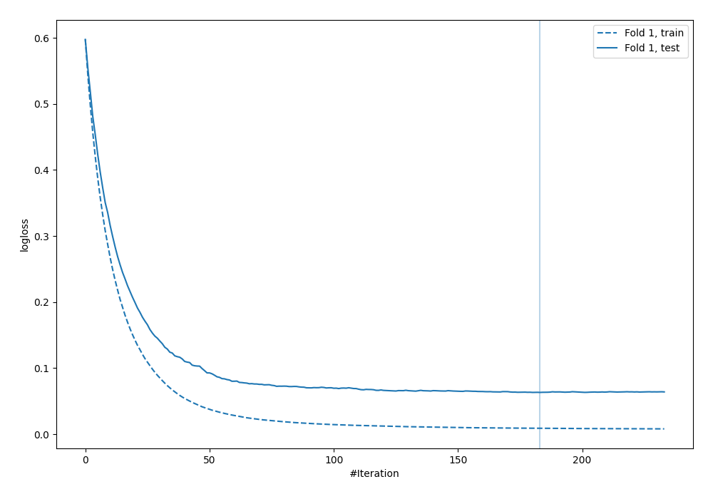
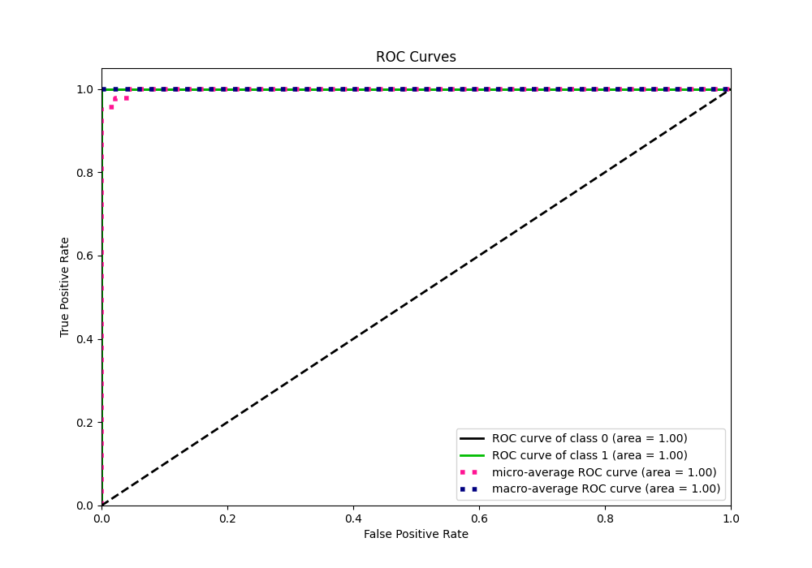
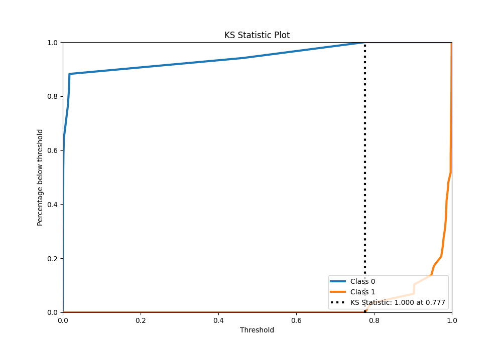
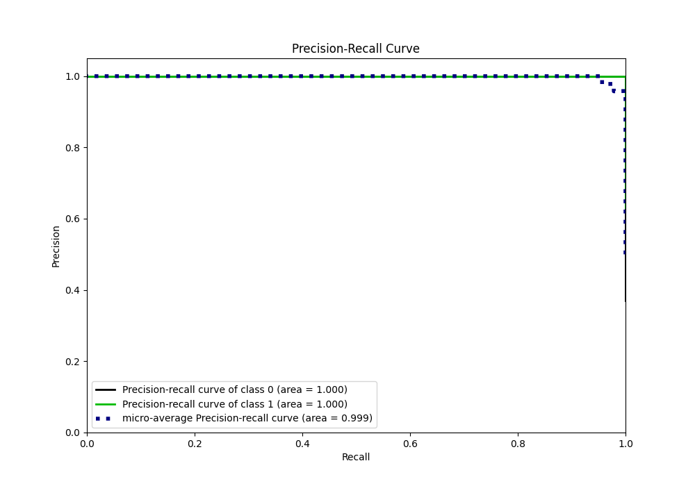
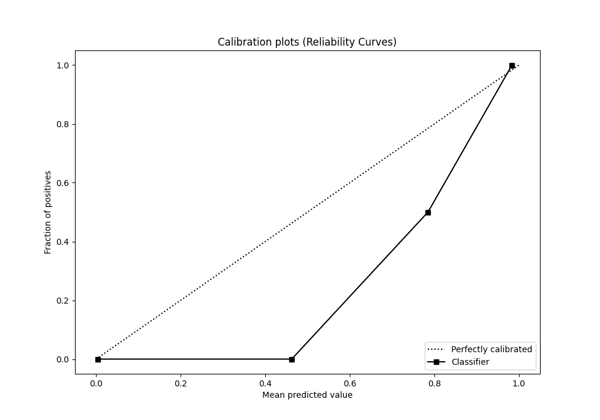
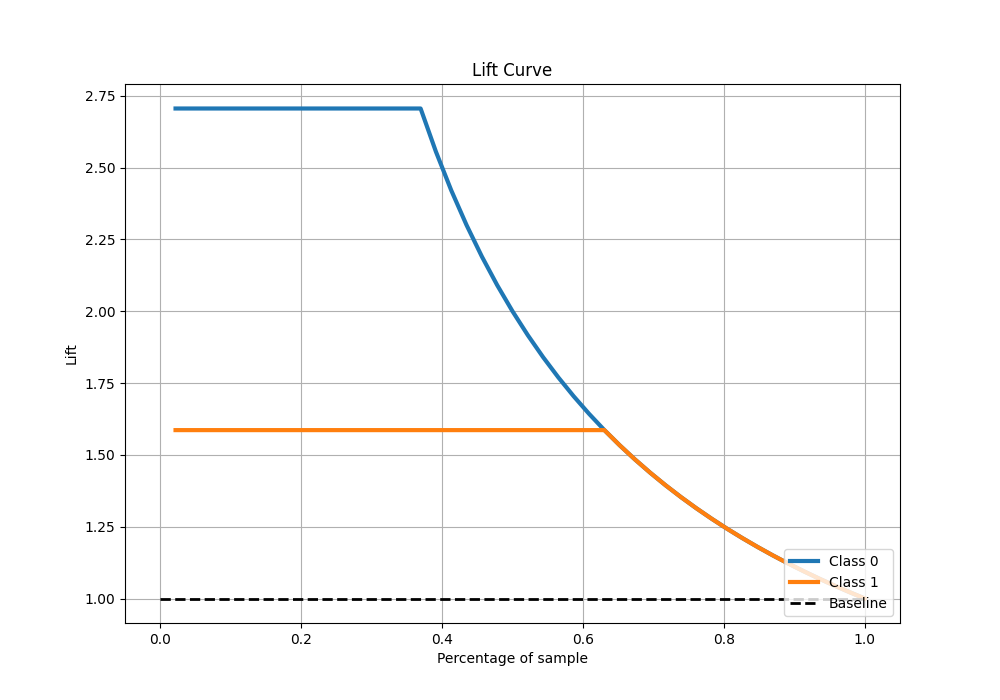

# Summary of 6_Default_Xgboost_SelectedFeatures

[<< Go back](../README.md)

## Extreme Gradient Boosting (Xgboost)
- **n_jobs**: -1
- **objective**: binary:logistic
- **eta**: 0.075
- **max_depth**: 6
- **min_child_weight**: 1
- **subsample**: 1.0
- **colsample_bytree**: 1.0
- **eval_metric**: logloss
- **explain_level**: 0

## Validation
 - **validation_type**: split
 - **train_ratio**: 0.9
 - **shuffle**: True
 - **stratify**: True

## Optimized metric
logloss

## Training time

1.5 seconds

## Metric details
|           |     score |     threshold |
|:----------|----------:|--------------:|
| logloss   | 0.0631913 | nan           |
| auc       | 1         | nan           |
| f1        | 1         |   0.784727    |
| accuracy  | 1         |   0.784727    |
| precision | 1         |   0.784727    |
| recall    | 1         |   0.000469792 |
| mcc       | 1         |   0.784727    |

## Metric details with threshold from accuracy metric
|           |     score |   threshold |
|:----------|----------:|------------:|
| logloss   | 0.0631913 |  nan        |
| auc       | 1         |  nan        |
| f1        | 1         |    0.784727 |
| accuracy  | 1         |    0.784727 |
| precision | 1         |    0.784727 |
| recall    | 1         |    0.784727 |
| mcc       | 1         |    0.784727 |

## Confusion matrix (at threshold=0.784727)
|              |   Predicted as 0 |   Predicted as 1 |
|:-------------|-----------------:|-----------------:|
| Labeled as 0 |               17 |                0 |
| Labeled as 1 |                0 |               29 |

## Learning curves

## Confusion Matrix

## Normalized Confusion Matrix

## ROC Curve

## Kolmogorov-Smirnov Statistic

## Precision-Recall Curve

## Calibration Curve

## Cumulative Gains Curve

## Lift Curve

[<< Go back](../README.md)
