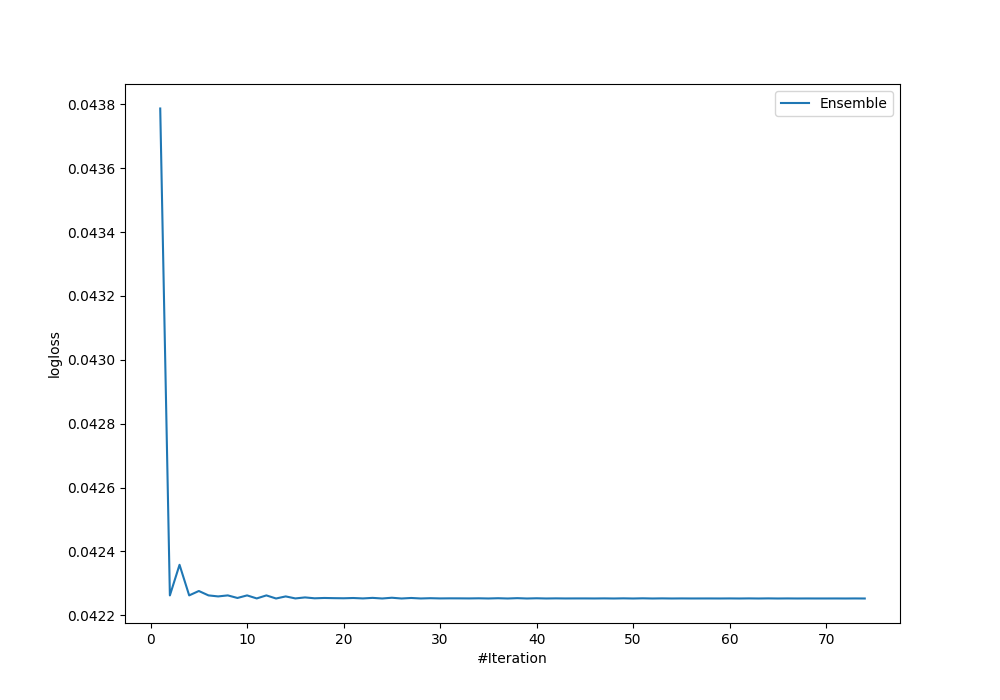
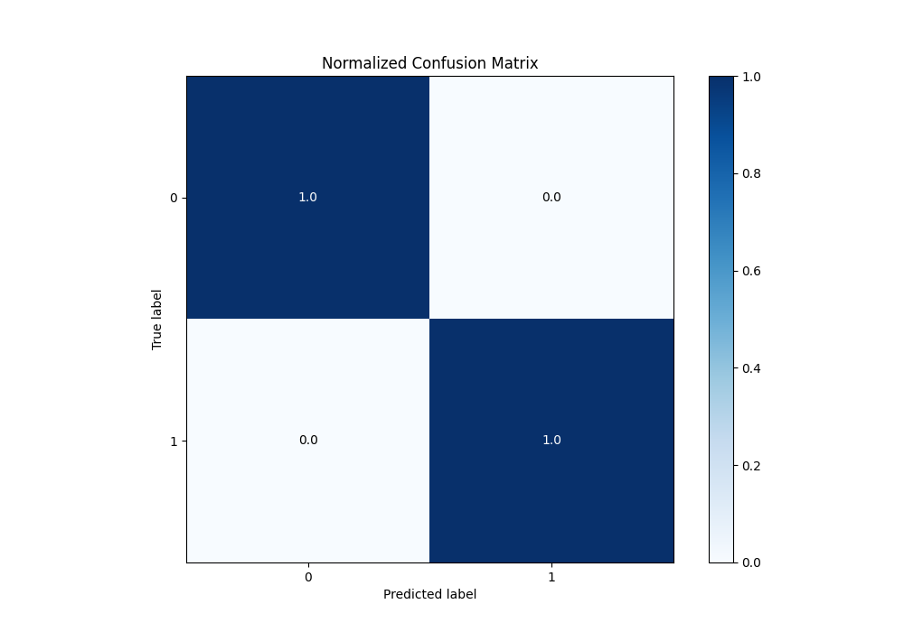
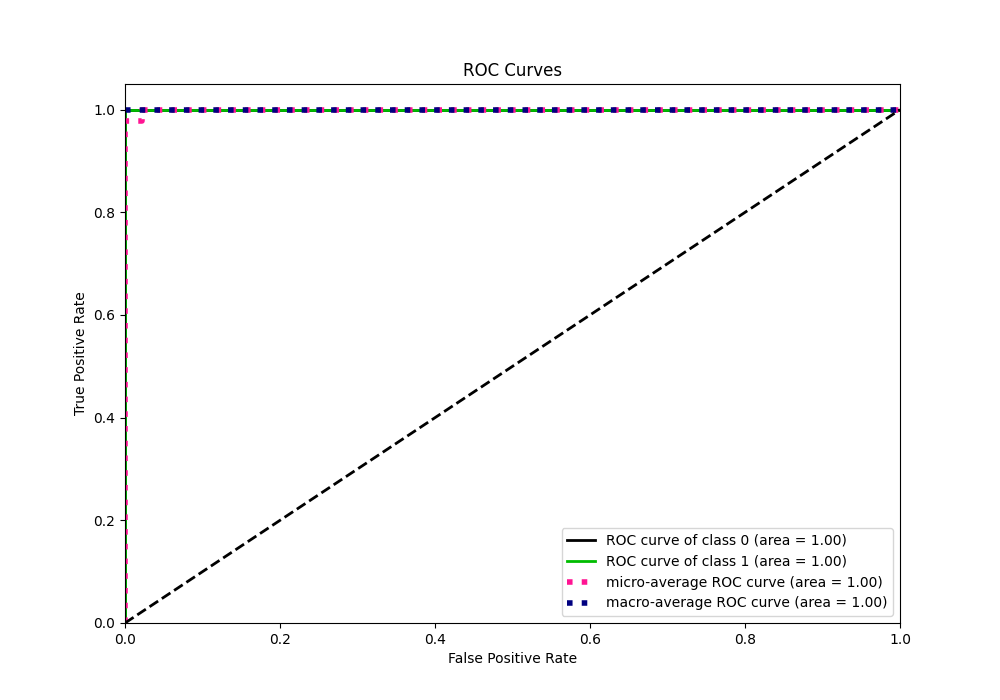
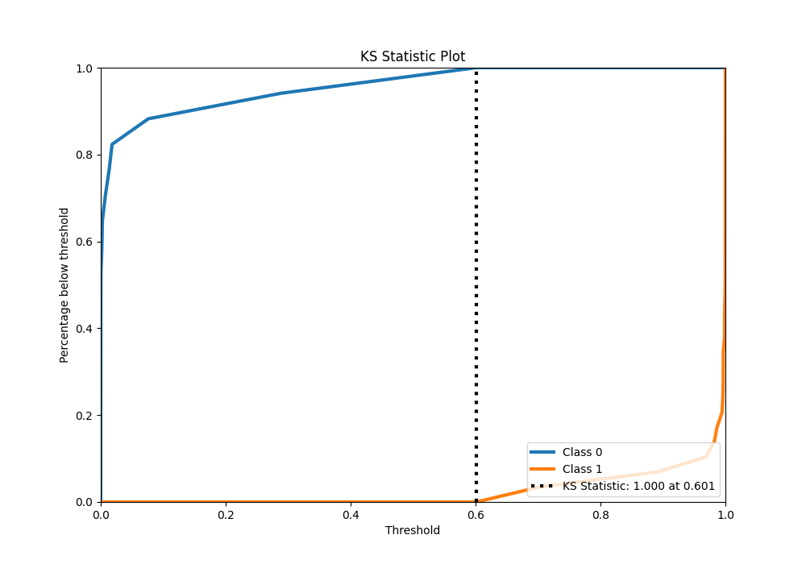
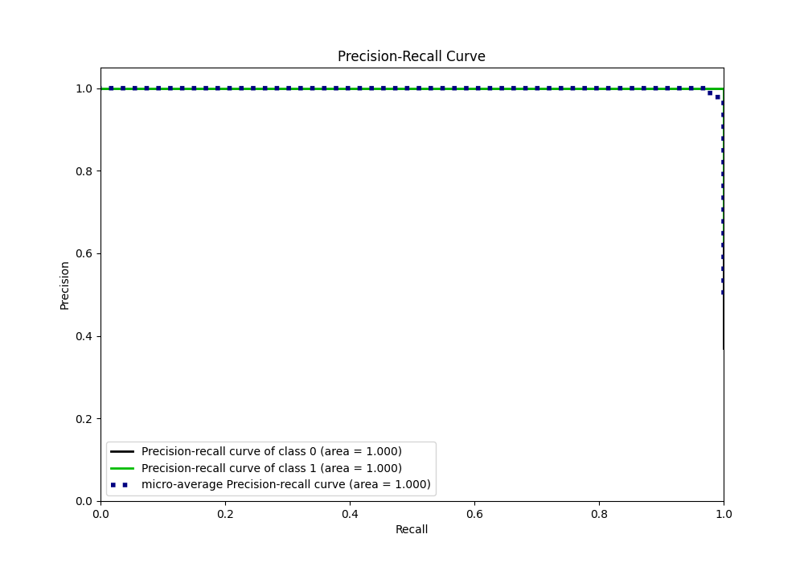
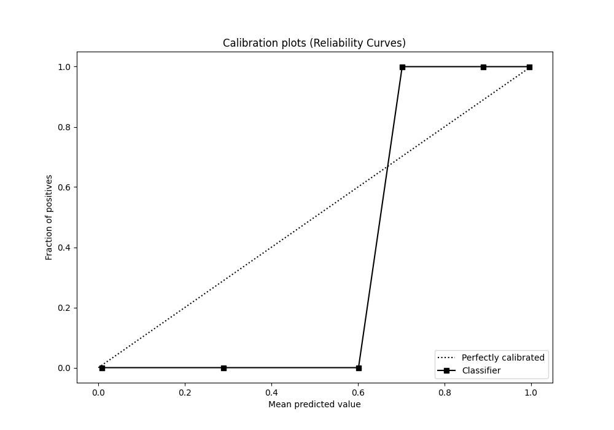
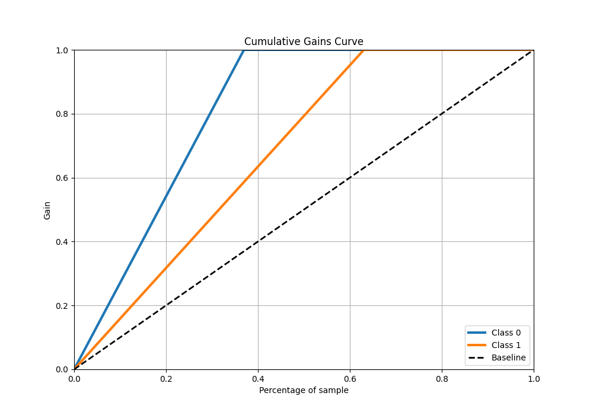

# Summary of Ensemble

[<< Go back](../README.md)

## Ensemble structure
| Model                        |   Weight |
|:-----------------------------|---------:|
| 21_LightGBM_SelectedFeatures |       27 |
| 32_CatBoost                  |       23 |

## Metric details
|           |     score |     threshold |
|:----------|----------:|--------------:|
| logloss   | 0.0422526 | nan           |
| auc       | 1         | nan           |
| f1        | 1         |   0.651791    |
| accuracy  | 1         |   0.651791    |
| precision | 1         |   0.651791    |
| recall    | 1         |   2.89103e-05 |
| mcc       | 1         |   0.651791    |

## Metric details with threshold from accuracy metric
|           |     score |   threshold |
|:----------|----------:|------------:|
| logloss   | 0.0422526 |  nan        |
| auc       | 1         |  nan        |
| f1        | 1         |    0.651791 |
| accuracy  | 1         |    0.651791 |
| precision | 1         |    0.651791 |
| recall    | 1         |    0.651791 |
| mcc       | 1         |    0.651791 |

## Confusion matrix (at threshold=0.651791)
|              |   Predicted as 0 |   Predicted as 1 |
|:-------------|-----------------:|-----------------:|
| Labeled as 0 |               17 |                0 |
| Labeled as 1 |                0 |               29 |

## Learning curves

## Confusion Matrix

## Normalized Confusion Matrix

## ROC Curve

## Kolmogorov-Smirnov Statistic

## Precision-Recall Curve

## Calibration Curve

## Cumulative Gains Curve

## Lift Curve

[<< Go back](../README.md)
