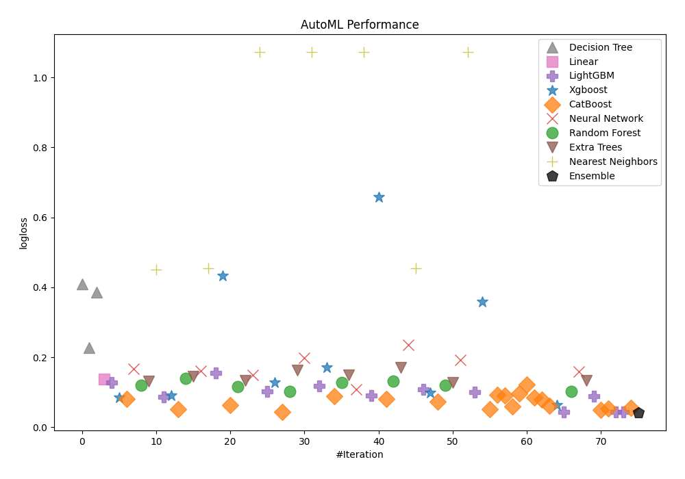
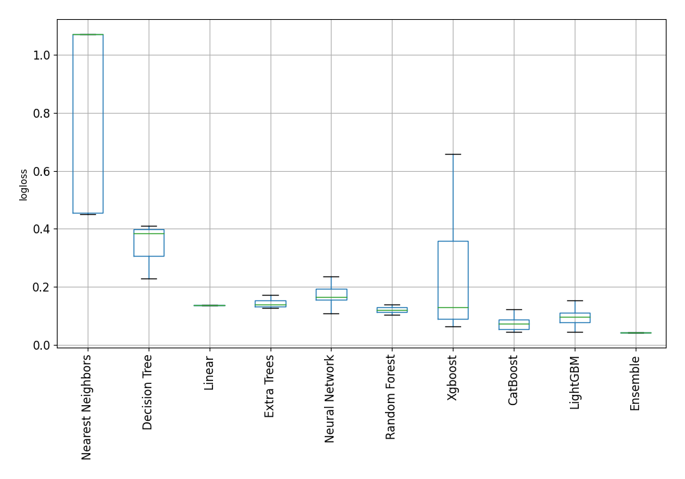
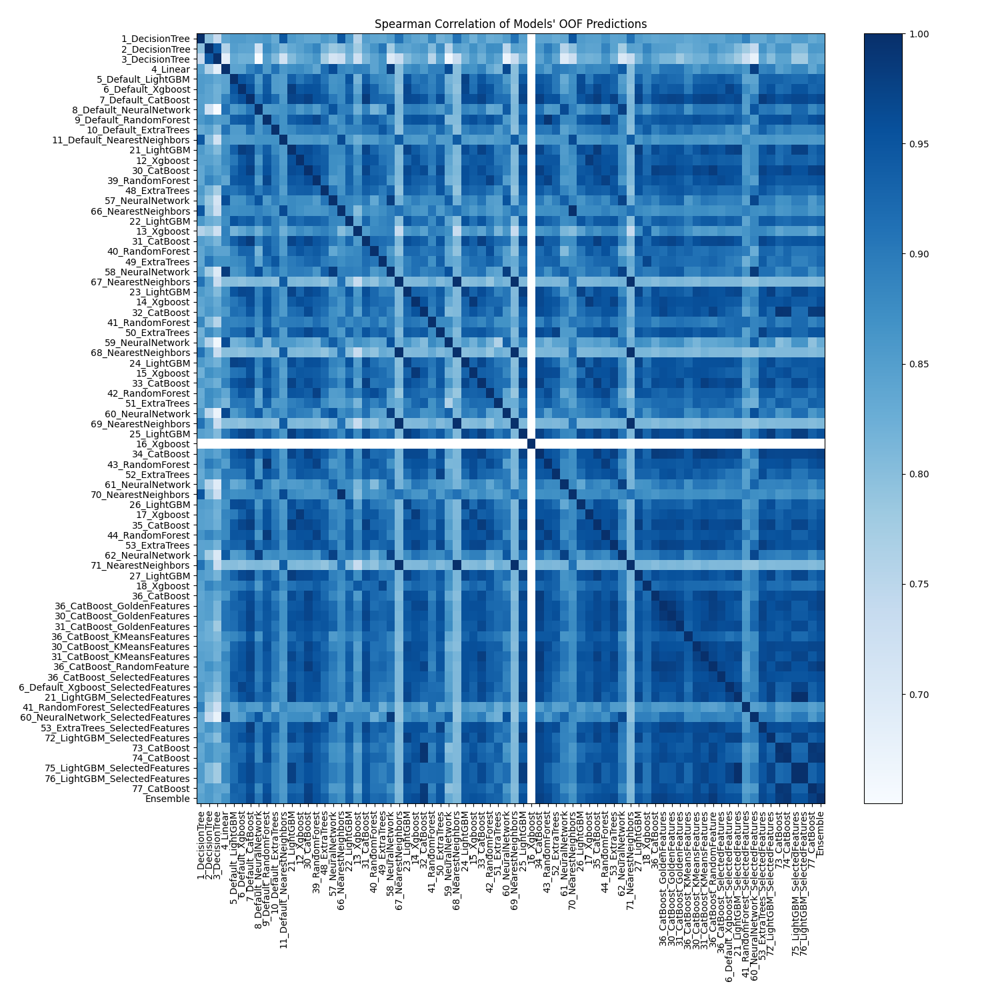

# AutoML Leaderboard

| Best model   | name                                                                               | model_type        | metric_type   |   metric_value |   train_time |
|:-------------|:-----------------------------------------------------------------------------------|:------------------|:--------------|---------------:|-------------:|
|              | [1_DecisionTree](1_DecisionTree/README.md)                                         | Decision Tree     | logloss       |      0.409653  |         0.82 |
|              | [2_DecisionTree](2_DecisionTree/README.md)                                         | Decision Tree     | logloss       |      0.227473  |         0.83 |
|              | [3_DecisionTree](3_DecisionTree/README.md)                                         | Decision Tree     | logloss       |      0.385046  |         0.92 |
|              | [4_Linear](4_Linear/README.md)                                                     | Linear            | logloss       |      0.137404  |         1.17 |
|              | [5_Default_LightGBM](5_Default_LightGBM/README.md)                                 | LightGBM          | logloss       |      0.12768   |         1.82 |
|              | [6_Default_Xgboost](6_Default_Xgboost/README.md)                                   | Xgboost           | logloss       |      0.0848805 |         1.29 |
|              | [7_Default_CatBoost](7_Default_CatBoost/README.md)                                 | CatBoost          | logloss       |      0.0804599 |         1.16 |
|              | [8_Default_NeuralNetwork](8_Default_NeuralNetwork/README.md)                       | Neural Network    | logloss       |      0.167633  |         1.11 |
|              | [9_Default_RandomForest](9_Default_RandomForest/README.md)                         | Random Forest     | logloss       |      0.119777  |         1.2  |
|              | [10_Default_ExtraTrees](10_Default_ExtraTrees/README.md)                           | Extra Trees       | logloss       |      0.13097   |         1.22 |
|              | [11_Default_NearestNeighbors](11_Default_NearestNeighbors/README.md)               | Nearest Neighbors | logloss       |      0.451021  |         0.87 |
|              | [21_LightGBM](21_LightGBM/README.md)                                               | LightGBM          | logloss       |      0.0873496 |         1.35 |
|              | [12_Xgboost](12_Xgboost/README.md)                                                 | Xgboost           | logloss       |      0.0901437 |         1.37 |
|              | [30_CatBoost](30_CatBoost/README.md)                                               | CatBoost          | logloss       |      0.0521339 |         1.58 |
|              | [39_RandomForest](39_RandomForest/README.md)                                       | Random Forest     | logloss       |      0.138731  |         1.26 |
|              | [48_ExtraTrees](48_ExtraTrees/README.md)                                           | Extra Trees       | logloss       |      0.144617  |         1.2  |
|              | [57_NeuralNetwork](57_NeuralNetwork/README.md)                                     | Neural Network    | logloss       |      0.160711  |         1.22 |
|              | [66_NearestNeighbors](66_NearestNeighbors/README.md)                               | Nearest Neighbors | logloss       |      0.454636  |         0.95 |
|              | [22_LightGBM](22_LightGBM/README.md)                                               | LightGBM          | logloss       |      0.154057  |         1.42 |
|              | [13_Xgboost](13_Xgboost/README.md)                                                 | Xgboost           | logloss       |      0.433272  |         1.19 |
|              | [31_CatBoost](31_CatBoost/README.md)                                               | CatBoost          | logloss       |      0.0631785 |         1.31 |
|              | [40_RandomForest](40_RandomForest/README.md)                                       | Random Forest     | logloss       |      0.116736  |         1.42 |
|              | [49_ExtraTrees](49_ExtraTrees/README.md)                                           | Extra Trees       | logloss       |      0.132561  |         1.21 |
|              | [58_NeuralNetwork](58_NeuralNetwork/README.md)                                     | Neural Network    | logloss       |      0.149778  |         1.54 |
|              | [67_NearestNeighbors](67_NearestNeighbors/README.md)                               | Nearest Neighbors | logloss       |      1.07172   |         1    |
|              | [23_LightGBM](23_LightGBM/README.md)                                               | LightGBM          | logloss       |      0.1014    |         1.96 |
|              | [14_Xgboost](14_Xgboost/README.md)                                                 | Xgboost           | logloss       |      0.128273  |         2.04 |
|              | [32_CatBoost](32_CatBoost/README.md)                                               | CatBoost          | logloss       |      0.0439069 |        27.33 |
|              | [41_RandomForest](41_RandomForest/README.md)                                       | Random Forest     | logloss       |      0.102838  |         1.55 |
|              | [50_ExtraTrees](50_ExtraTrees/README.md)                                           | Extra Trees       | logloss       |      0.162883  |         1.55 |
|              | [59_NeuralNetwork](59_NeuralNetwork/README.md)                                     | Neural Network    | logloss       |      0.198715  |         1.41 |
|              | [68_NearestNeighbors](68_NearestNeighbors/README.md)                               | Nearest Neighbors | logloss       |      1.07172   |         1.03 |
|              | [24_LightGBM](24_LightGBM/README.md)                                               | LightGBM          | logloss       |      0.117794  |         2.29 |
|              | [15_Xgboost](15_Xgboost/README.md)                                                 | Xgboost           | logloss       |      0.170373  |         1.4  |
|              | [33_CatBoost](33_CatBoost/README.md)                                               | CatBoost          | logloss       |      0.0890452 |         1.55 |
|              | [42_RandomForest](42_RandomForest/README.md)                                       | Random Forest     | logloss       |      0.127394  |         1.45 |
|              | [51_ExtraTrees](51_ExtraTrees/README.md)                                           | Extra Trees       | logloss       |      0.148672  |         1.38 |
|              | [60_NeuralNetwork](60_NeuralNetwork/README.md)                                     | Neural Network    | logloss       |      0.107737  |         1.32 |
|              | [69_NearestNeighbors](69_NearestNeighbors/README.md)                               | Nearest Neighbors | logloss       |      1.07172   |         1.06 |
|              | [25_LightGBM](25_LightGBM/README.md)                                               | LightGBM          | logloss       |      0.0904575 |         1.59 |
|              | [16_Xgboost](16_Xgboost/README.md)                                                 | Xgboost           | logloss       |      0.658726  |         0.98 |
|              | [34_CatBoost](34_CatBoost/README.md)                                               | CatBoost          | logloss       |      0.0797705 |         1.82 |
|              | [43_RandomForest](43_RandomForest/README.md)                                       | Random Forest     | logloss       |      0.131818  |         1.56 |
|              | [52_ExtraTrees](52_ExtraTrees/README.md)                                           | Extra Trees       | logloss       |      0.171009  |         1.4  |
|              | [61_NeuralNetwork](61_NeuralNetwork/README.md)                                     | Neural Network    | logloss       |      0.23533   |         1.29 |
|              | [70_NearestNeighbors](70_NearestNeighbors/README.md)                               | Nearest Neighbors | logloss       |      0.454636  |         1.13 |
|              | [26_LightGBM](26_LightGBM/README.md)                                               | LightGBM          | logloss       |      0.107669  |         1.82 |
|              | [17_Xgboost](17_Xgboost/README.md)                                                 | Xgboost           | logloss       |      0.0980426 |         1.59 |
|              | [35_CatBoost](35_CatBoost/README.md)                                               | CatBoost          | logloss       |      0.0732021 |         1.48 |
|              | [44_RandomForest](44_RandomForest/README.md)                                       | Random Forest     | logloss       |      0.120231  |         1.47 |
|              | [53_ExtraTrees](53_ExtraTrees/README.md)                                           | Extra Trees       | logloss       |      0.128148  |         1.79 |
|              | [62_NeuralNetwork](62_NeuralNetwork/README.md)                                     | Neural Network    | logloss       |      0.192612  |         1.47 |
|              | [71_NearestNeighbors](71_NearestNeighbors/README.md)                               | Nearest Neighbors | logloss       |      1.07172   |         1.18 |
|              | [27_LightGBM](27_LightGBM/README.md)                                               | LightGBM          | logloss       |      0.100725  |         1.53 |
|              | [18_Xgboost](18_Xgboost/README.md)                                                 | Xgboost           | logloss       |      0.358068  |         1.41 |
|              | [36_CatBoost](36_CatBoost/README.md)                                               | CatBoost          | logloss       |      0.0511761 |         1.6  |
|              | [36_CatBoost_GoldenFeatures](36_CatBoost_GoldenFeatures/README.md)                 | CatBoost          | logloss       |      0.0916011 |         2.07 |
|              | [30_CatBoost_GoldenFeatures](30_CatBoost_GoldenFeatures/README.md)                 | CatBoost          | logloss       |      0.0912517 |         1.74 |
|              | [31_CatBoost_GoldenFeatures](31_CatBoost_GoldenFeatures/README.md)                 | CatBoost          | logloss       |      0.0599322 |         1.59 |
|              | [36_CatBoost_KMeansFeatures](36_CatBoost_KMeansFeatures/README.md)                 | CatBoost          | logloss       |      0.09641   |         2.03 |
|              | [30_CatBoost_KMeansFeatures](30_CatBoost_KMeansFeatures/README.md)                 | CatBoost          | logloss       |      0.122008  |         2.51 |
|              | [31_CatBoost_KMeansFeatures](31_CatBoost_KMeansFeatures/README.md)                 | CatBoost          | logloss       |      0.084062  |         1.83 |
|              | [36_CatBoost_RandomFeature](36_CatBoost_RandomFeature/README.md)                   | CatBoost          | logloss       |      0.0781743 |         1.78 |
|              | [36_CatBoost_SelectedFeatures](36_CatBoost_SelectedFeatures/README.md)             | CatBoost          | logloss       |      0.0608642 |         1.61 |
|              | [6_Default_Xgboost_SelectedFeatures](6_Default_Xgboost_SelectedFeatures/README.md) | Xgboost           | logloss       |      0.0631913 |         1.78 |
|              | [21_LightGBM_SelectedFeatures](21_LightGBM_SelectedFeatures/README.md)             | LightGBM          | logloss       |      0.0437868 |         1.73 |
|              | [41_RandomForest_SelectedFeatures](41_RandomForest_SelectedFeatures/README.md)     | Random Forest     | logloss       |      0.102904  |         1.65 |
|              | [60_NeuralNetwork_SelectedFeatures](60_NeuralNetwork_SelectedFeatures/README.md)   | Neural Network    | logloss       |      0.158374  |         1.43 |
|              | [53_ExtraTrees_SelectedFeatures](53_ExtraTrees_SelectedFeatures/README.md)         | Extra Trees       | logloss       |      0.133657  |         1.77 |
|              | [72_LightGBM_SelectedFeatures](72_LightGBM_SelectedFeatures/README.md)             | LightGBM          | logloss       |      0.088914  |         1.74 |
|              | [73_CatBoost](73_CatBoost/README.md)                                               | CatBoost          | logloss       |      0.049674  |        22.94 |
|              | [74_CatBoost](74_CatBoost/README.md)                                               | CatBoost          | logloss       |      0.0541916 |         7.74 |
|              | [75_LightGBM_SelectedFeatures](75_LightGBM_SelectedFeatures/README.md)             | LightGBM          | logloss       |      0.0437868 |         3.4  |
|              | [76_LightGBM_SelectedFeatures](76_LightGBM_SelectedFeatures/README.md)             | LightGBM          | logloss       |      0.0437868 |         3.41 |
|              | [77_CatBoost](77_CatBoost/README.md)                                               | CatBoost          | logloss       |      0.0559024 |        38.34 |
| **the best** | [Ensemble](Ensemble/README.md)                                                     | Ensemble          | logloss       |      0.0422526 |        17.47 |

### AutoML Performance

### AutoML Performance Boxplot

### Spearman Correlation of Models

