# Summary of 2_DecisionTree

[<< Go back](../README.md)

## Decision Tree
- **n_jobs**: -1
- **criterion**: entropy
- **max_depth**: 4
- **explain_level**: 2

## Validation
 - **validation_type**: split
 - **train_ratio**: 0.75
 - **shuffle**: True
 - **stratify**: True

## Optimized metric
logloss

## Training time

5.1 seconds

## Metric details
|           |    score |   threshold |
|:----------|---------:|------------:|
| logloss   | 0.624198 |      nan    |
| auc       | 0.954696 |      nan    |
| f1        | 0.945946 |        0.25 |
| accuracy  | 0.929825 |        0.25 |
| precision | 0.970149 |        0.5  |
| recall    | 0.972222 |        0    |
| mcc       | 0.848668 |        0.25 |

## Metric details with threshold from accuracy metric
|           |    score |   threshold |
|:----------|---------:|------------:|
| logloss   | 0.624198 |      nan    |
| auc       | 0.954696 |      nan    |
| f1        | 0.945946 |        0.25 |
| accuracy  | 0.929825 |        0.25 |
| precision | 0.921053 |        0.25 |
| recall    | 0.972222 |        0.25 |
| mcc       | 0.848668 |        0.25 |

## Confusion matrix (at threshold=0.25)
|              |   Predicted as 0 |   Predicted as 1 |
|:-------------|-----------------:|-----------------:|
| Labeled as 0 |               36 |                6 |
| Labeled as 1 |                2 |               70 |

## Learning curves
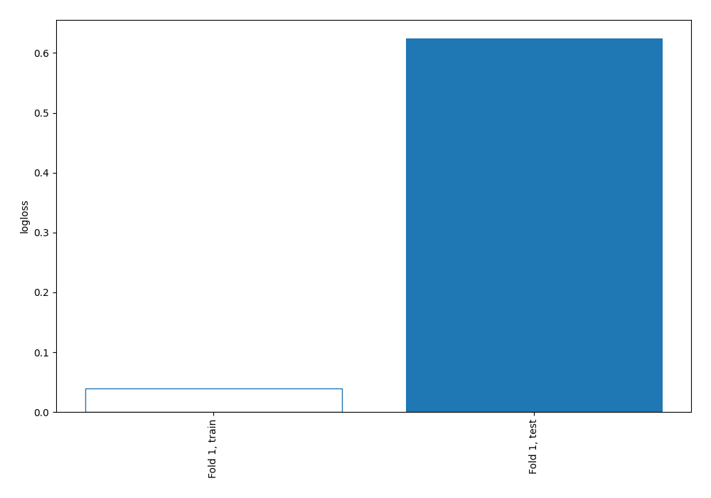

## Decision Tree 

### Tree #1
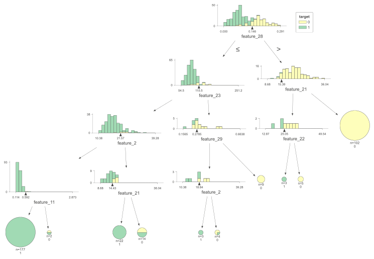

### Rules

if (feature_28 <= 0.146) and (feature_23 <= 115.45) and (feature_2 <= 21.575) and (feature_11 <= 0.592) then class: 1 (proba: 100.0%) | based on 177 samples

if (feature_28 > 0.146) and (feature_21 > 15.385) then class: 0 (proba: 100.0%) | based on 102 samples

if (feature_28 <= 0.146) and (feature_23 <= 115.45) and (feature_2 > 21.575) and (feature_21 <= 14.43) then class: 1 (proba: 100.0%) | based on 22 samples

if (feature_28 <= 0.146) and (feature_23 <= 115.45) and (feature_2 > 21.575) and (feature_21 > 14.43) then class: 0 (proba: 50.0%) | based on 14 samples

if (feature_28 <= 0.146) and (feature_23 > 115.45) and (feature_29 > 0.278) then class: 0 (proba: 100.0%) | based on 9 samples

if (feature_28 > 0.146) and (feature_21 <= 15.385) and (feature_22 > 25.055) then class: 0 (proba: 100.0%) | based on 5 samples

if (feature_28 <= 0.146) and (feature_23 > 115.45) and (feature_29 <= 0.278) and (feature_2 > 18.835) then class: 0 (proba: 75.0%) | based on 4 samples

if (feature_28 > 0.146) and (feature_21 <= 15.385) and (feature_22 <= 25.055) then class: 1 (proba: 100.0%) | based on 3 samples

if (feature_28 <= 0.146) and (feature_23 > 115.45) and (feature_29 <= 0.278) and (feature_2 <= 18.835) then class: 1 (proba: 100.0%) | based on 3 samples

if (feature_28 <= 0.146) and (feature_23 <= 115.45) and (feature_2 <= 21.575) and (feature_11 > 0.592) then class: 0 (proba: 50.0%) | based on 2 samples

## Permutation-based Importance
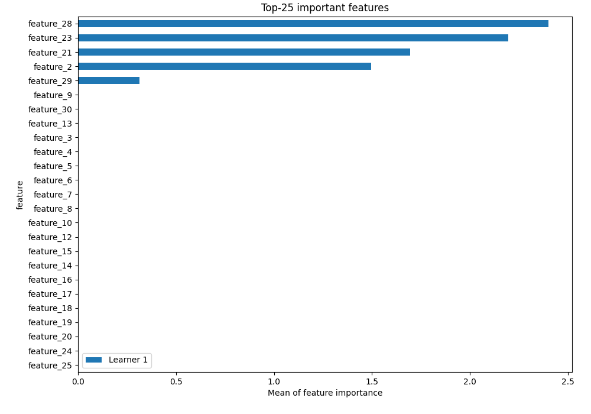
## Confusion Matrix

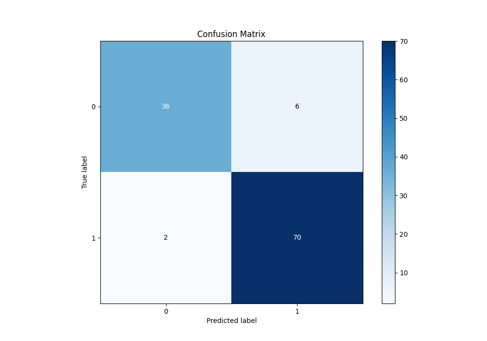

## Normalized Confusion Matrix

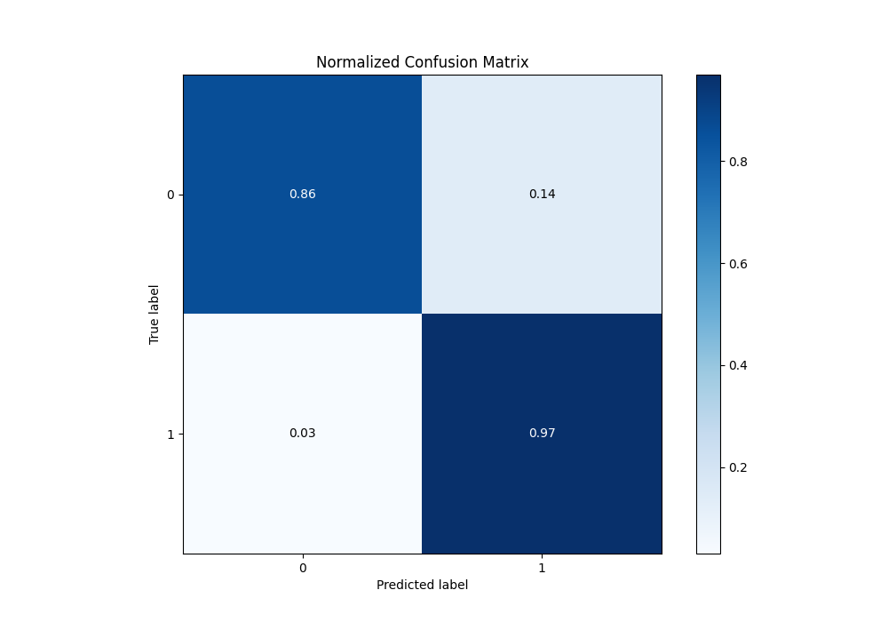

## ROC Curve

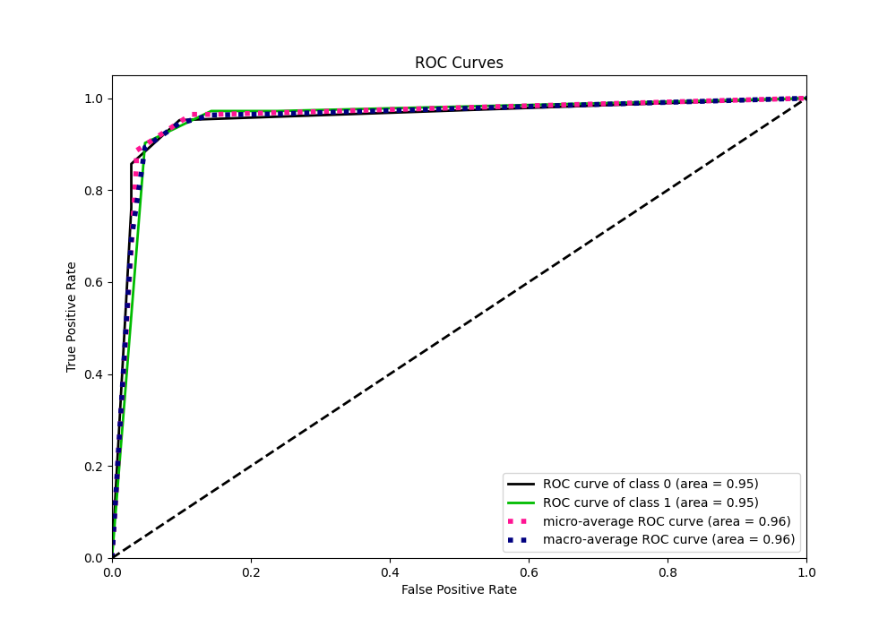

## Kolmogorov-Smirnov Statistic

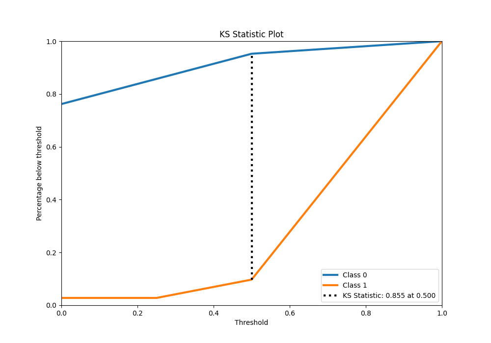

## Precision-Recall Curve

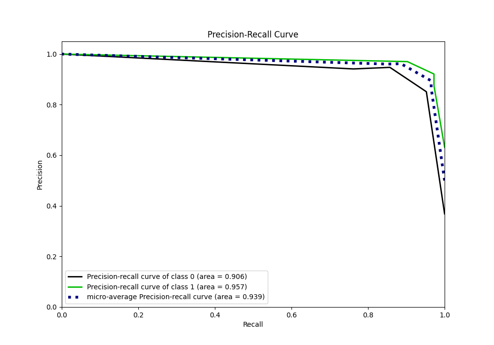

## Calibration Curve

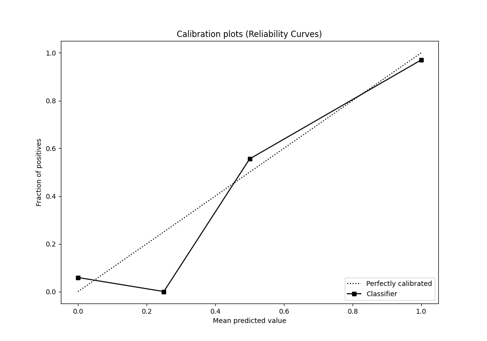

## Cumulative Gains Curve

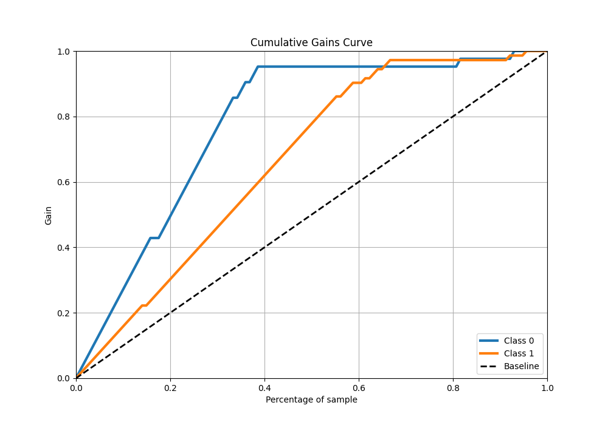

## Lift Curve

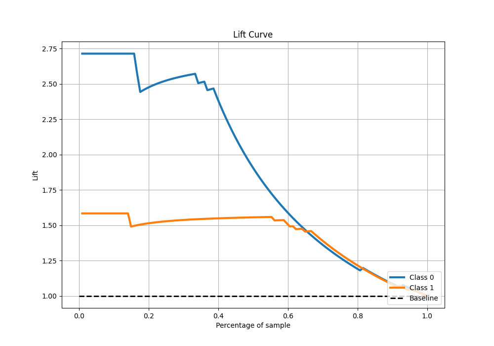

[<< Go back](../README.md)
