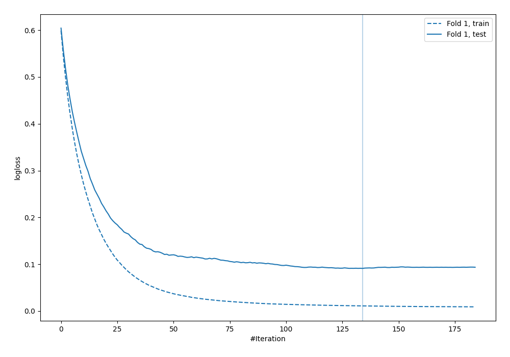
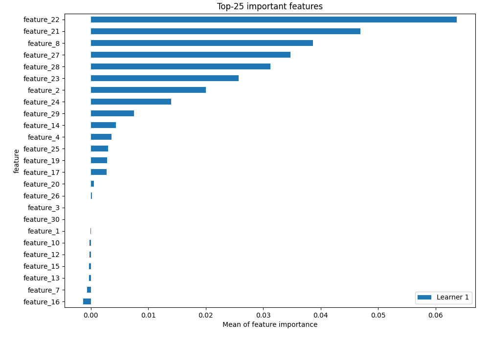
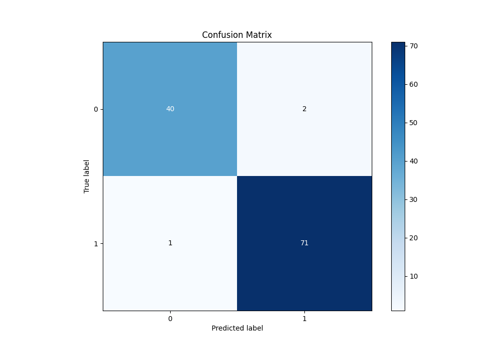
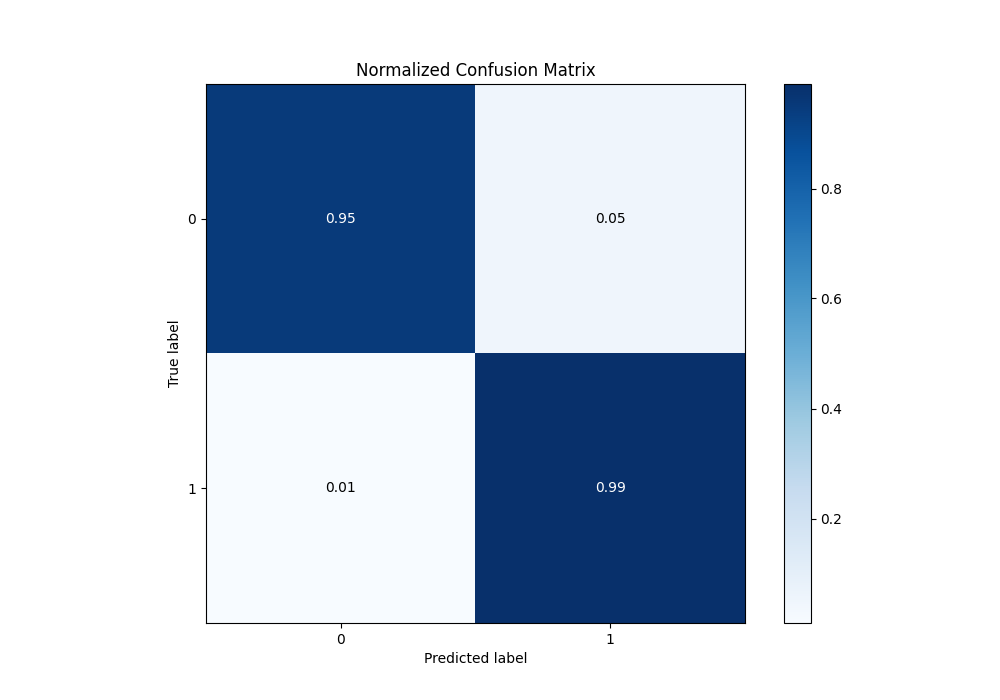
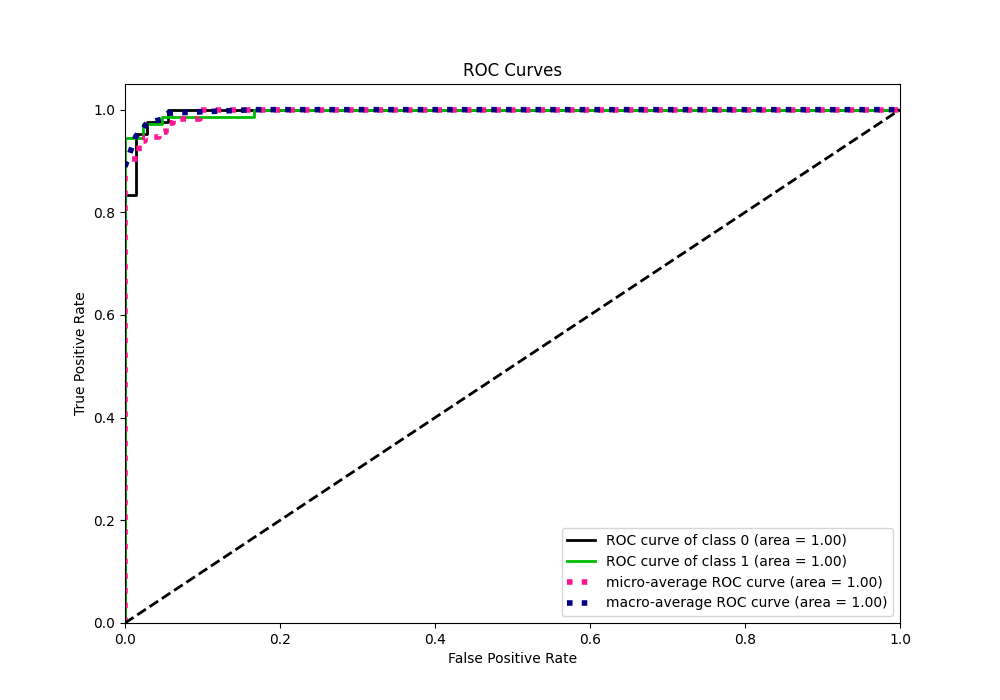
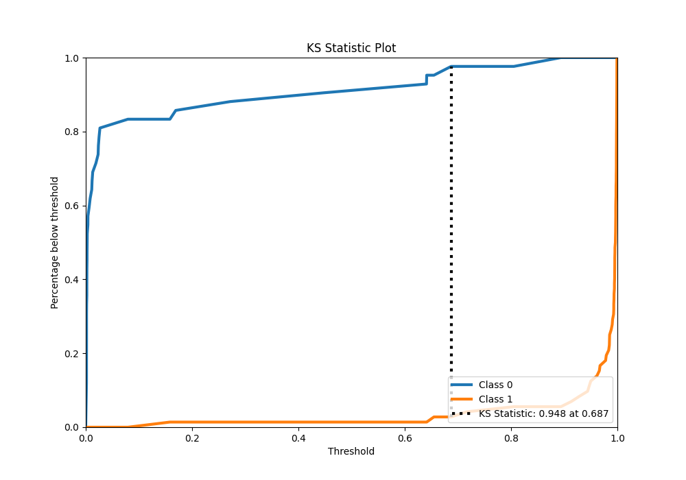
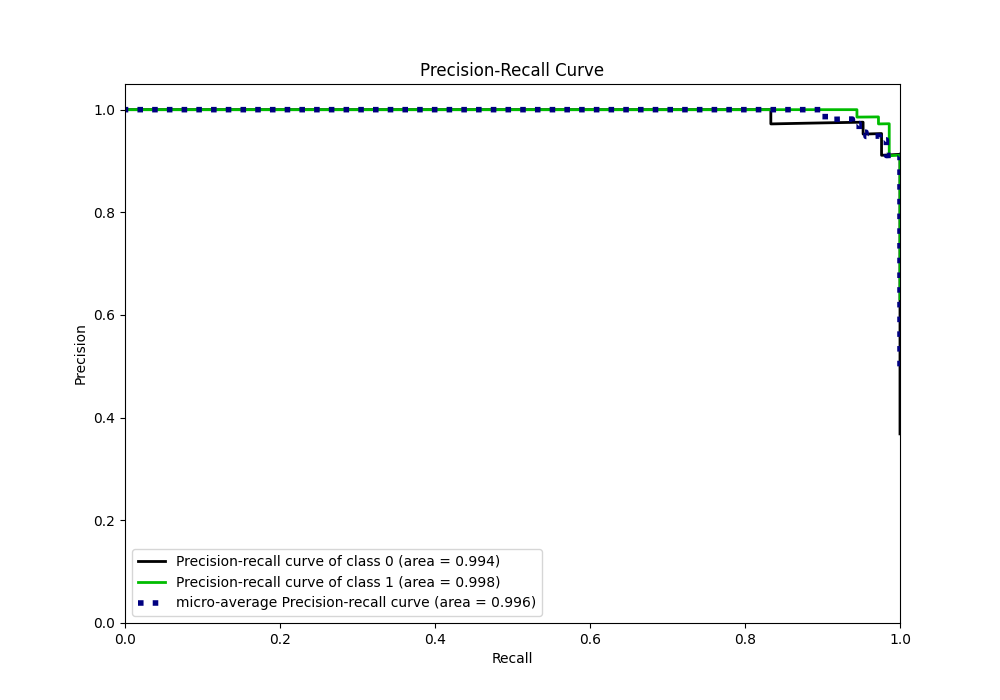
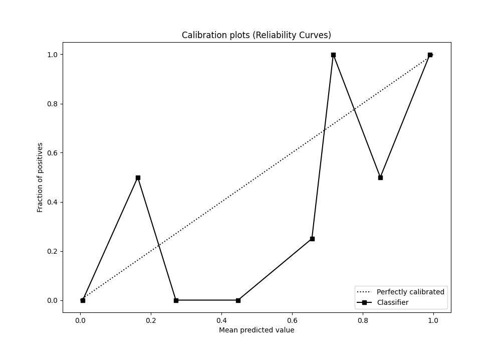
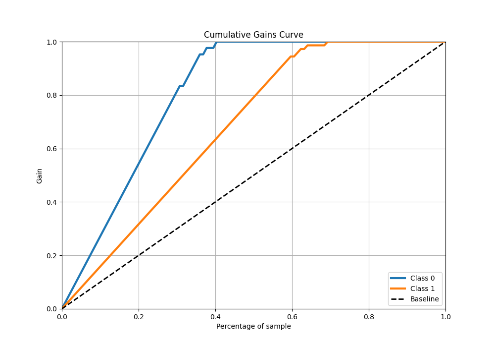
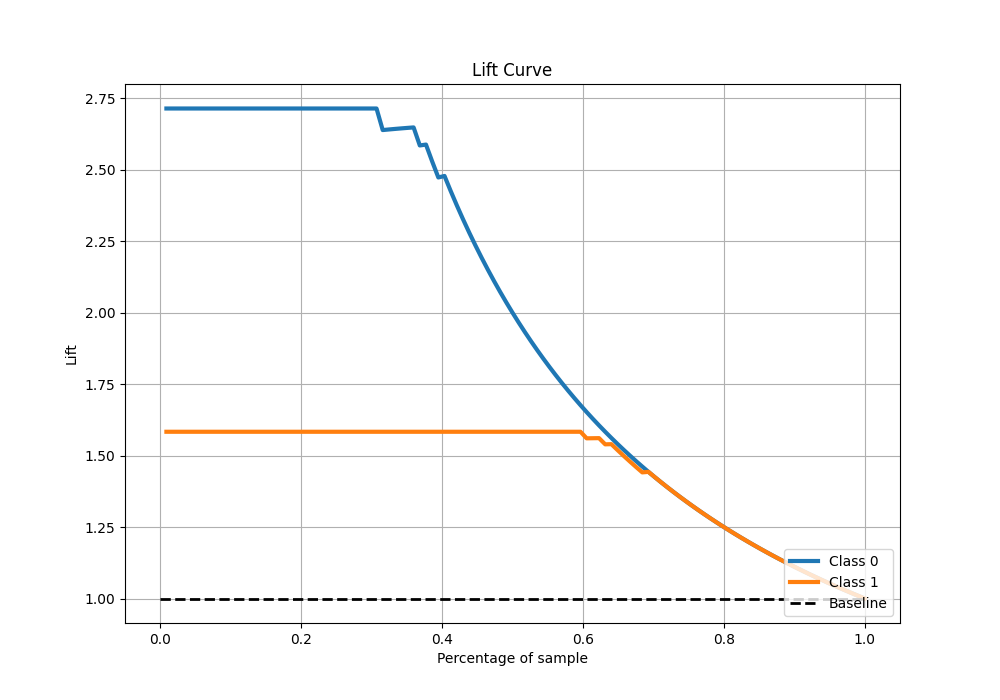

# Summary of 4_Default_Xgboost

[<< Go back](../README.md)

## Extreme Gradient Boosting (Xgboost)
- **n_jobs**: -1
- **objective**: binary:logistic
- **eta**: 0.075
- **max_depth**: 6
- **min_child_weight**: 1
- **subsample**: 1.0
- **colsample_bytree**: 1.0
- **eval_metric**: logloss
- **explain_level**: 2

## Validation
 - **validation_type**: split
 - **train_ratio**: 0.75
 - **shuffle**: True
 - **stratify**: True

## Optimized metric
logloss

## Training time

1.3 seconds

## Metric details
|           |     score |    threshold |
|:----------|----------:|-------------:|
| logloss   | 0.0911501 | nan          |
| auc       | 0.996362  | nan          |
| f1        | 0.97931   |   0.648111   |
| accuracy  | 0.973684  |   0.648111   |
| precision | 1         |   0.903527   |
| recall    | 1         |   0.00121475 |
| mcc       | 0.943898  |   0.701887   |

## Metric details with threshold from accuracy metric
|           |     score |   threshold |
|:----------|----------:|------------:|
| logloss   | 0.0911501 |  nan        |
| auc       | 0.996362  |  nan        |
| f1        | 0.97931   |    0.648111 |
| accuracy  | 0.973684  |    0.648111 |
| precision | 0.972603  |    0.648111 |
| recall    | 0.986111  |    0.648111 |
| mcc       | 0.94334   |    0.648111 |

## Confusion matrix (at threshold=0.648111)
|              |   Predicted as 0 |   Predicted as 1 |
|:-------------|-----------------:|-----------------:|
| Labeled as 0 |               40 |                2 |
| Labeled as 1 |                1 |               71 |

## Learning curves

## Permutation-based Importance

## Confusion Matrix

## Normalized Confusion Matrix

## ROC Curve

## Kolmogorov-Smirnov Statistic

## Precision-Recall Curve

## Calibration Curve

## Cumulative Gains Curve

## Lift Curve

[<< Go back](../README.md)
