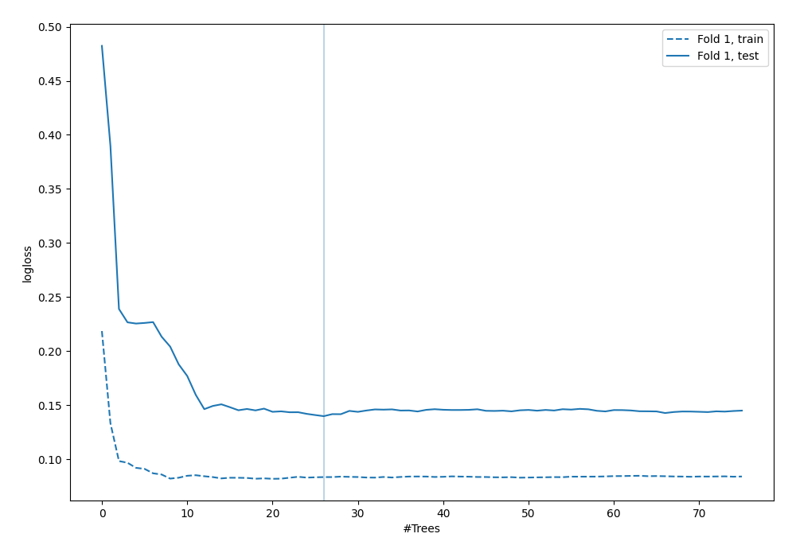
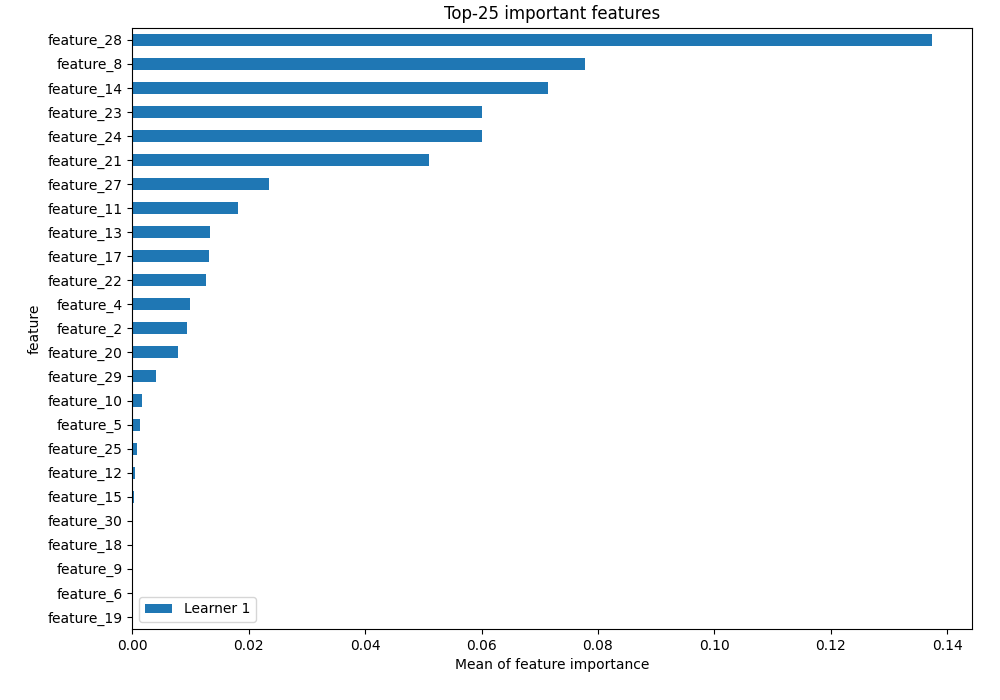
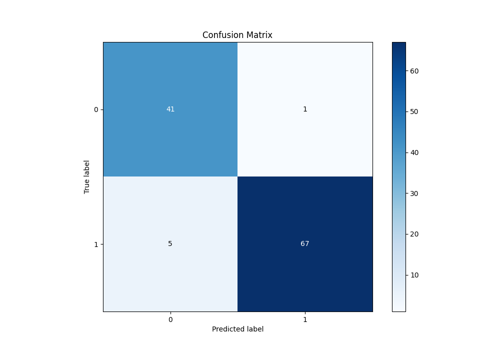
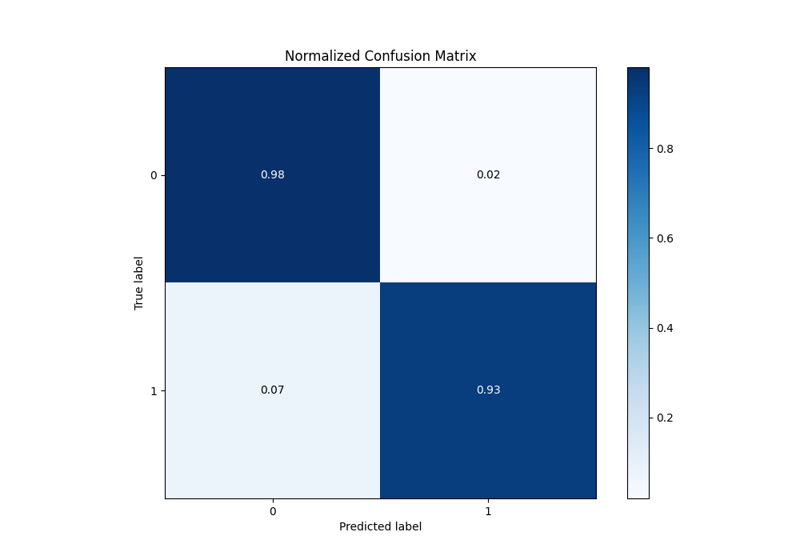
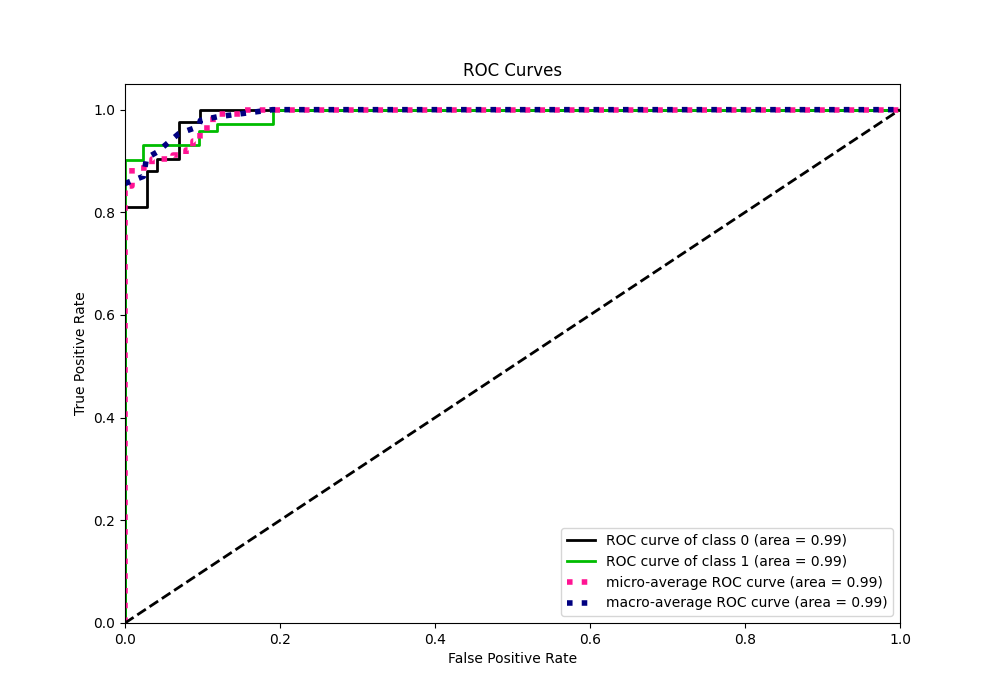
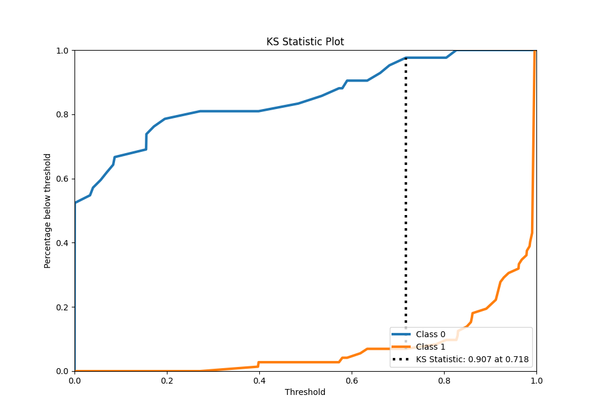
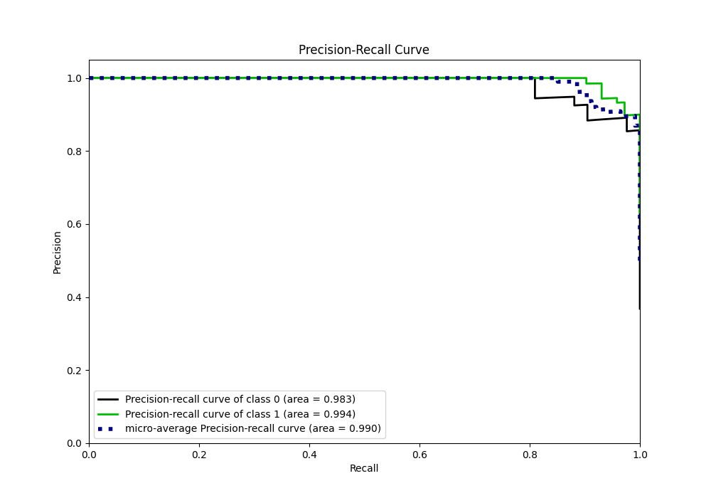
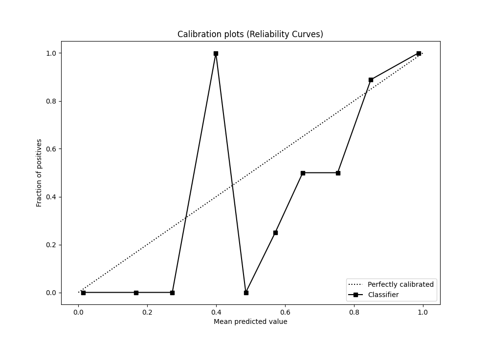
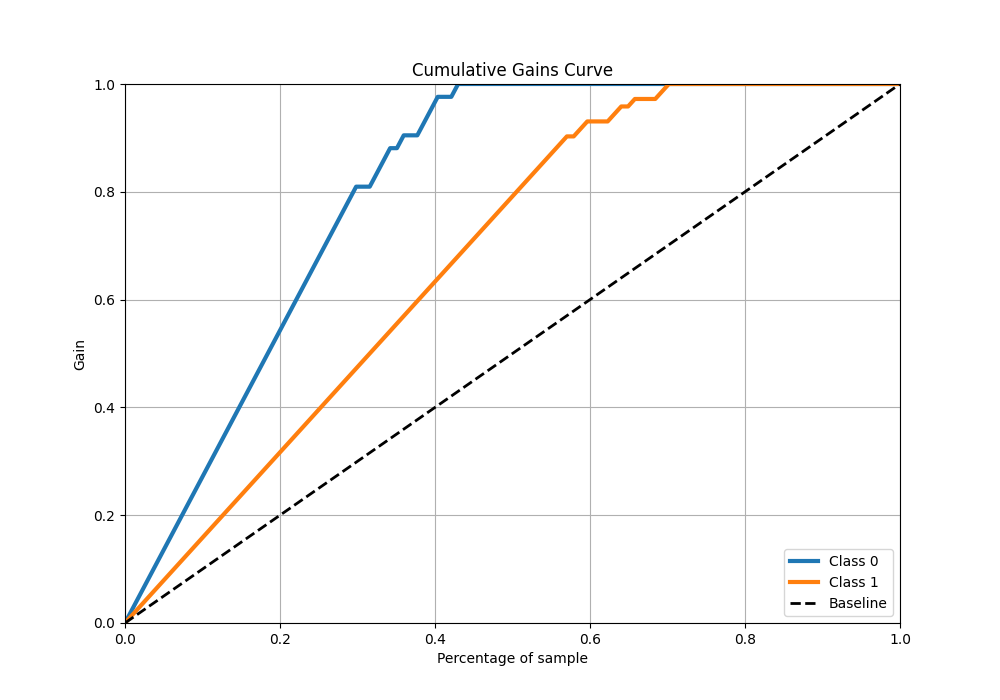
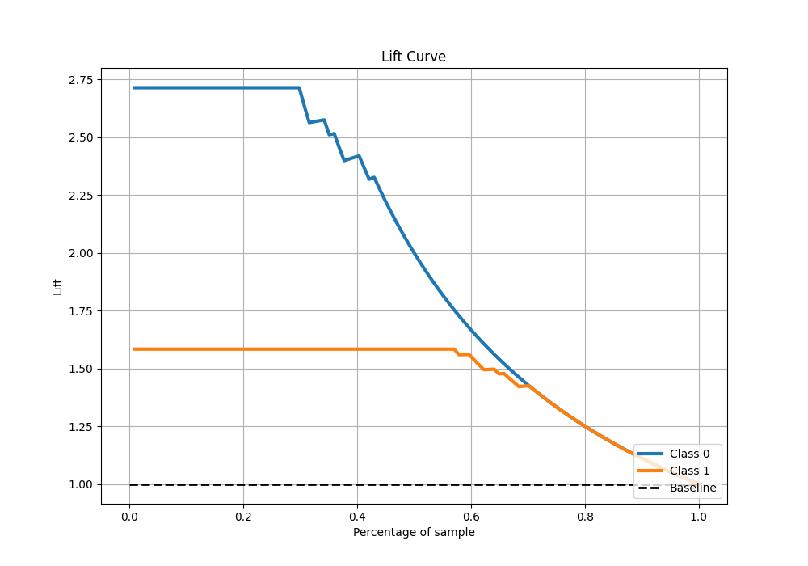

# Summary of 6_Default_RandomForest

[<< Go back](../README.md)

## Random Forest
- **n_jobs**: -1
- **criterion**: gini
- **max_features**: 0.9
- **min_samples_split**: 30
- **max_depth**: 4
- **eval_metric_name**: logloss
- **explain_level**: 2

## Validation
 - **validation_type**: split
 - **train_ratio**: 0.75
 - **shuffle**: True
 - **stratify**: True

## Optimized metric
logloss

## Training time

1.4 seconds

## Metric details
|           |    score |     threshold |
|:----------|---------:|--------------:|
| logloss   | 0.139796 | nan           |
| auc       | 0.989749 | nan           |
| f1        | 0.957143 |   0.749857    |
| accuracy  | 0.947368 |   0.749857    |
| precision | 1        |   0.828133    |
| recall    | 1        |   0.000517293 |
| mcc       | 0.891545 |   0.749857    |

## Metric details with threshold from accuracy metric
|           |    score |   threshold |
|:----------|---------:|------------:|
| logloss   | 0.139796 |  nan        |
| auc       | 0.989749 |  nan        |
| f1        | 0.957143 |    0.749857 |
| accuracy  | 0.947368 |    0.749857 |
| precision | 0.985294 |    0.749857 |
| recall    | 0.930556 |    0.749857 |
| mcc       | 0.891545 |    0.749857 |

## Confusion matrix (at threshold=0.749857)
|              |   Predicted as 0 |   Predicted as 1 |
|:-------------|-----------------:|-----------------:|
| Labeled as 0 |               41 |                1 |
| Labeled as 1 |                5 |               67 |

## Learning curves

## Permutation-based Importance

## Confusion Matrix

## Normalized Confusion Matrix

## ROC Curve

## Kolmogorov-Smirnov Statistic

## Precision-Recall Curve

## Calibration Curve

## Cumulative Gains Curve

## Lift Curve

[<< Go back](../README.md)
