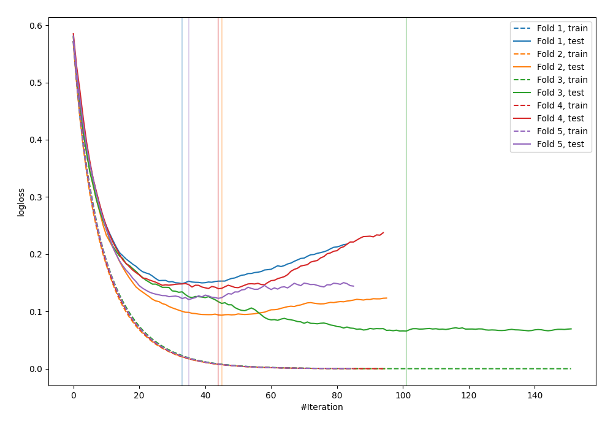
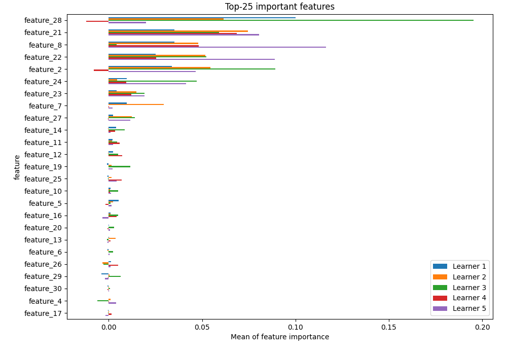
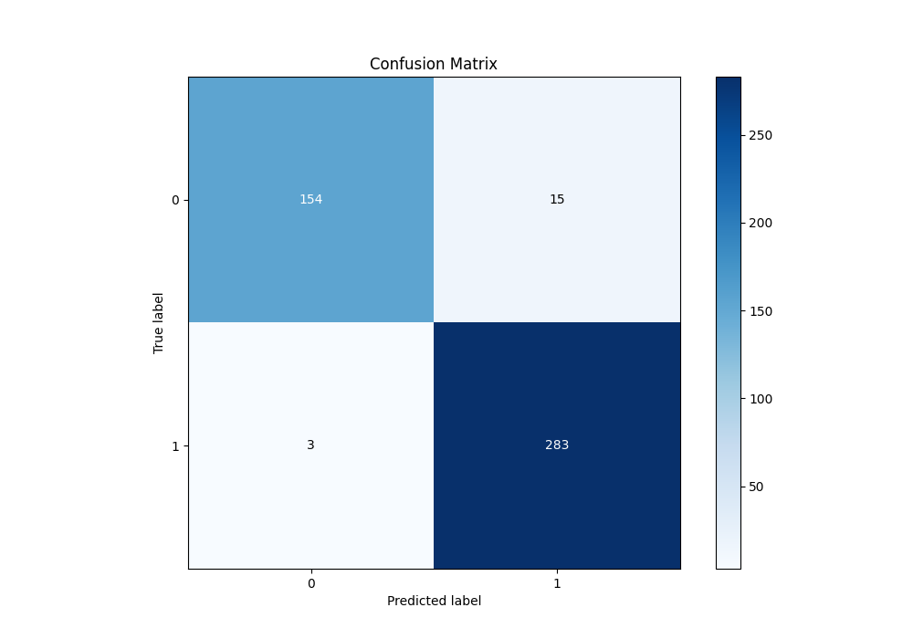
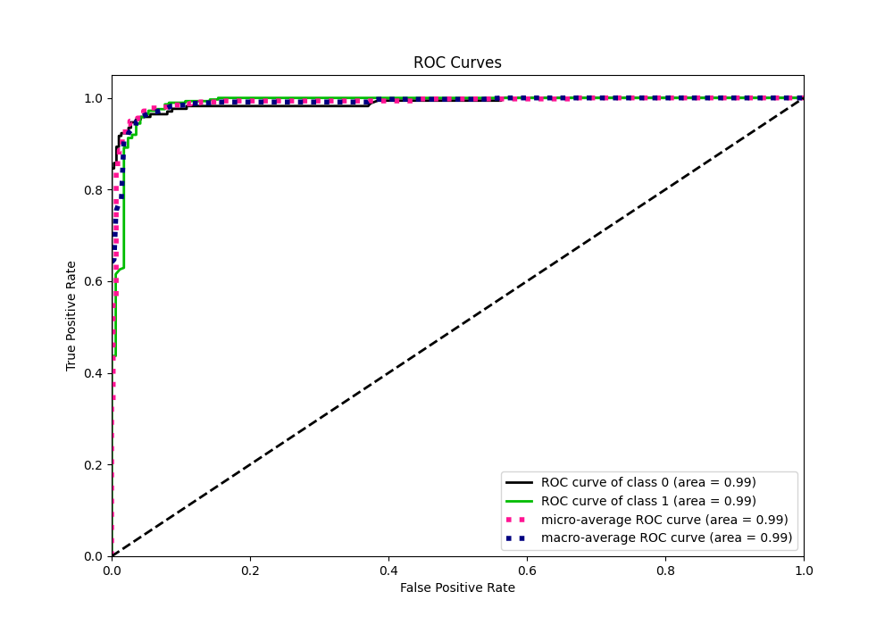
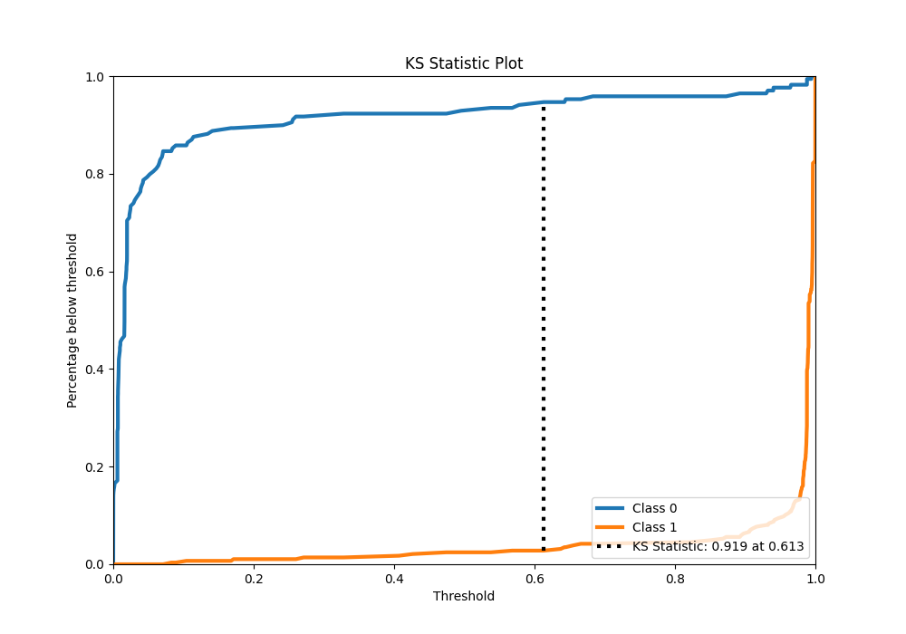
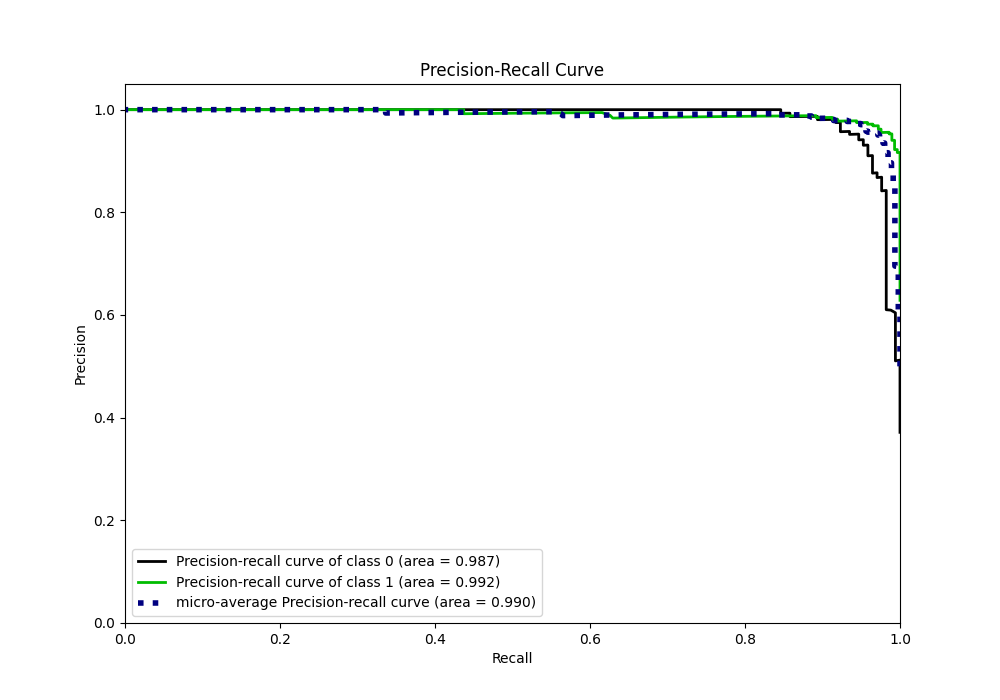
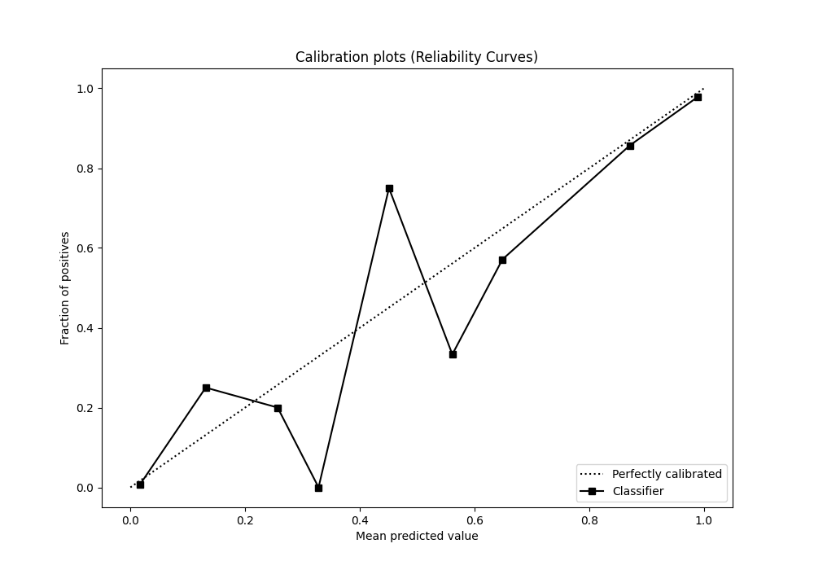
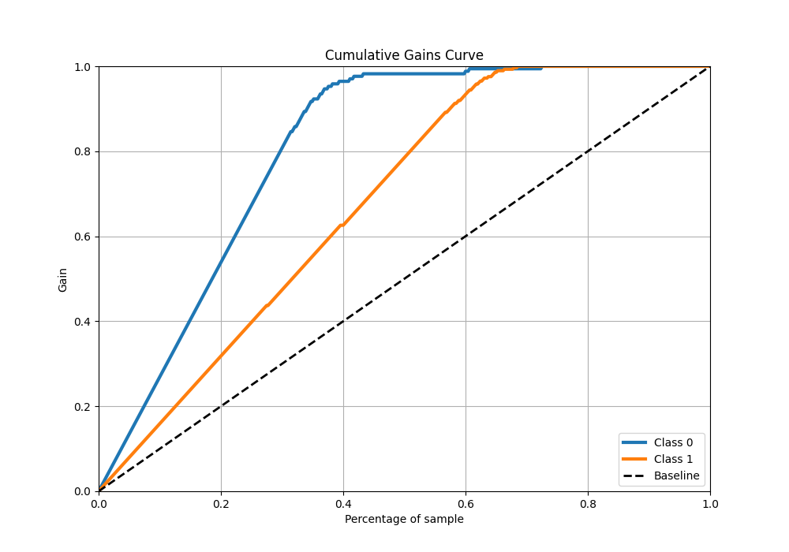
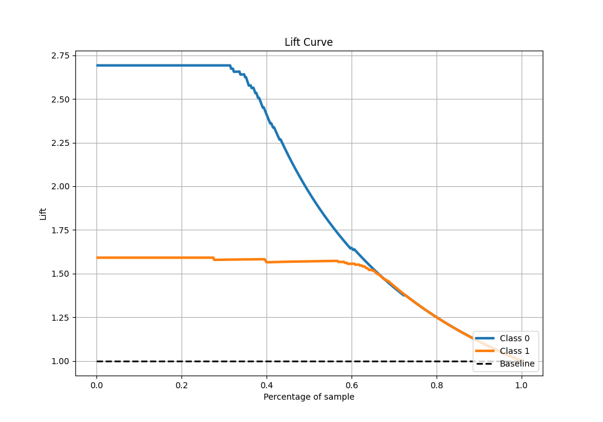

# Summary of 10_LightGBM

[<< Go back](../README.md)

## LightGBM
- **n_jobs**: -1
- **objective**: binary
- **num_leaves**: 15
- **learning_rate**: 0.1
- **feature_fraction**: 0.8
- **bagging_fraction**: 0.5
- **min_data_in_leaf**: 5
- **metric**: binary_logloss
- **custom_eval_metric_name**: None
- **explain_level**: 1

## Validation
 - **validation_type**: kfold
 - **k_folds**: 5
 - **shuffle**: True
 - **stratify**: True

## Optimized metric
logloss

## Training time

3.1 seconds

## Metric details
|           |    score |    threshold |
|:----------|---------:|-------------:|
| logloss   | 0.11365  | nan          |
| auc       | 0.988559 | nan          |
| f1        | 0.969178 |   0.25802    |
| accuracy  | 0.96044  |   0.25802    |
| precision | 1        |   0.995001   |
| recall    | 1        |   1.8333e-05 |
| mcc       | 0.915533 |   0.25802    |

## Metric details with threshold from accuracy metric
|           |    score |   threshold |
|:----------|---------:|------------:|
| logloss   | 0.11365  |   nan       |
| auc       | 0.988559 |   nan       |
| f1        | 0.969178 |     0.25802 |
| accuracy  | 0.96044  |     0.25802 |
| precision | 0.949664 |     0.25802 |
| recall    | 0.98951  |     0.25802 |
| mcc       | 0.915533 |     0.25802 |

## Confusion matrix (at threshold=0.25802)
|              |   Predicted as 0 |   Predicted as 1 |
|:-------------|-----------------:|-----------------:|
| Labeled as 0 |              154 |               15 |
| Labeled as 1 |                3 |              283 |

## Learning curves

## Permutation-based Importance

## Confusion Matrix

## Normalized Confusion Matrix

## ROC Curve

## Kolmogorov-Smirnov Statistic

## Precision-Recall Curve

## Calibration Curve

## Cumulative Gains Curve

## Lift Curve

[<< Go back](../README.md)
