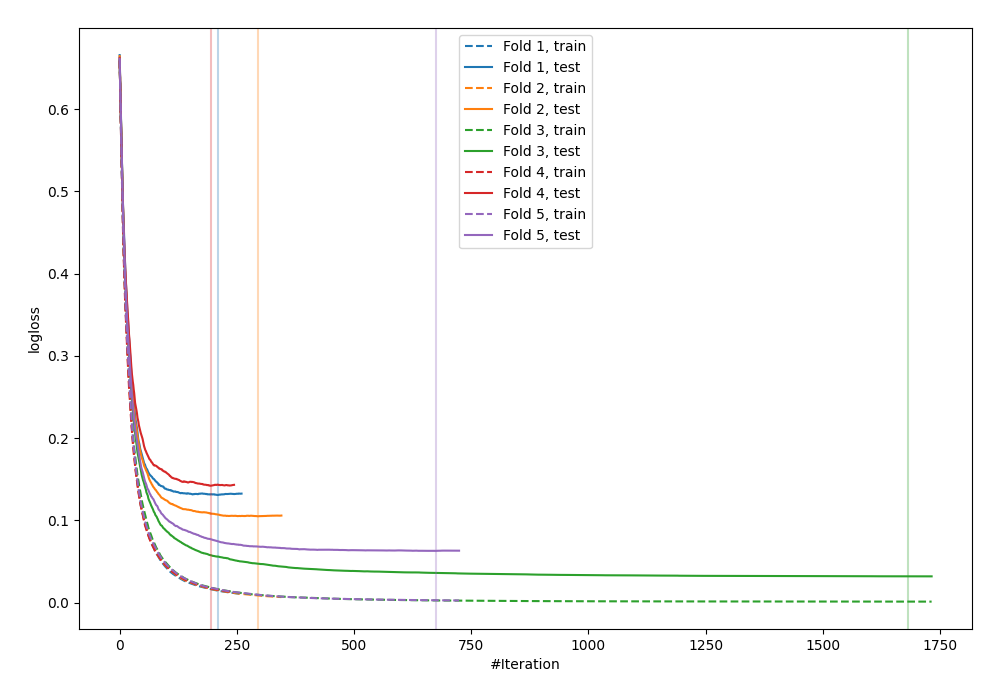
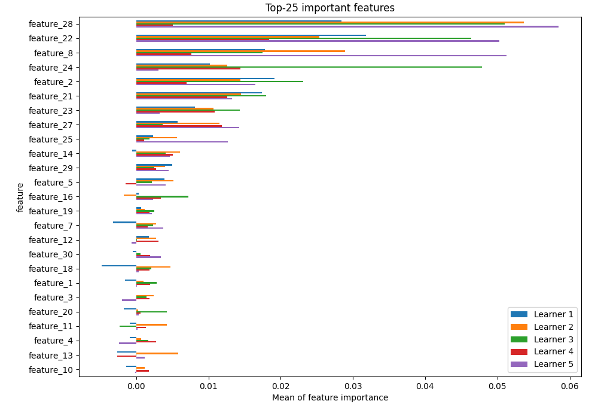
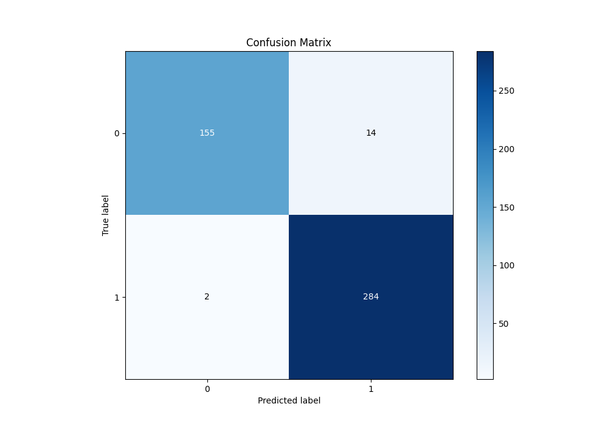
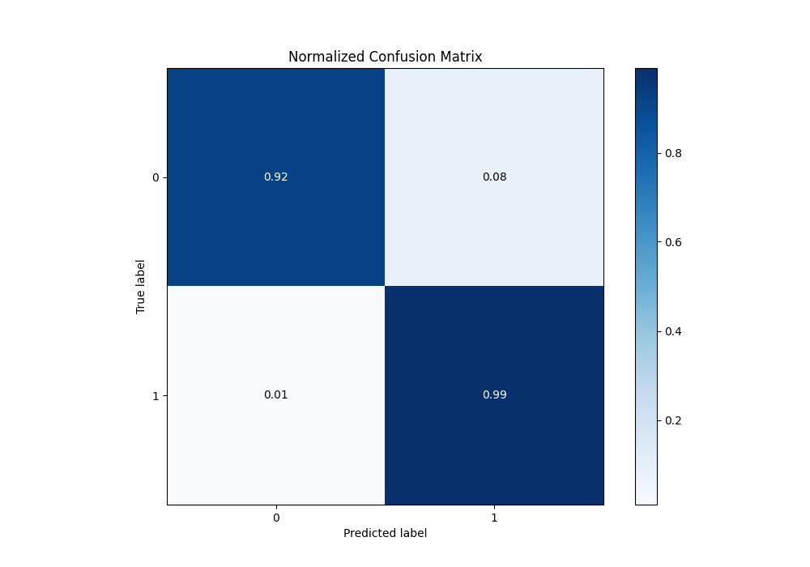
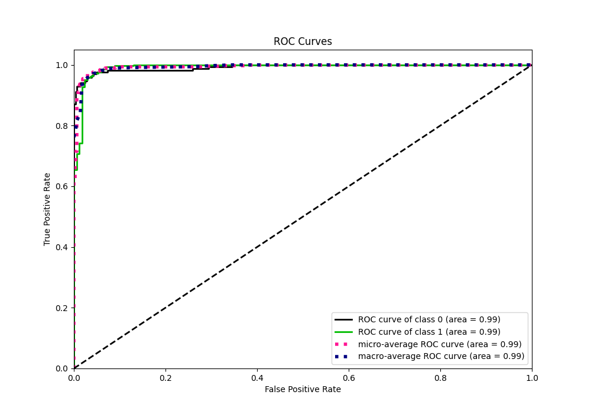
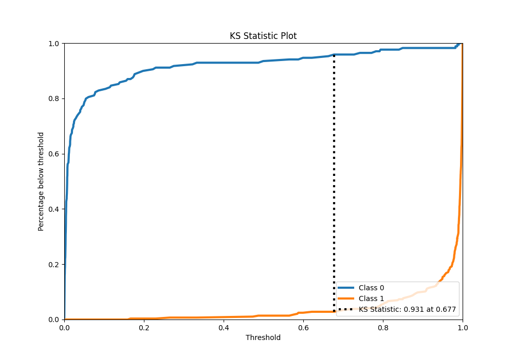
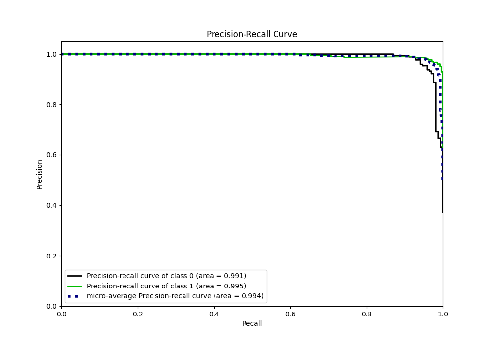
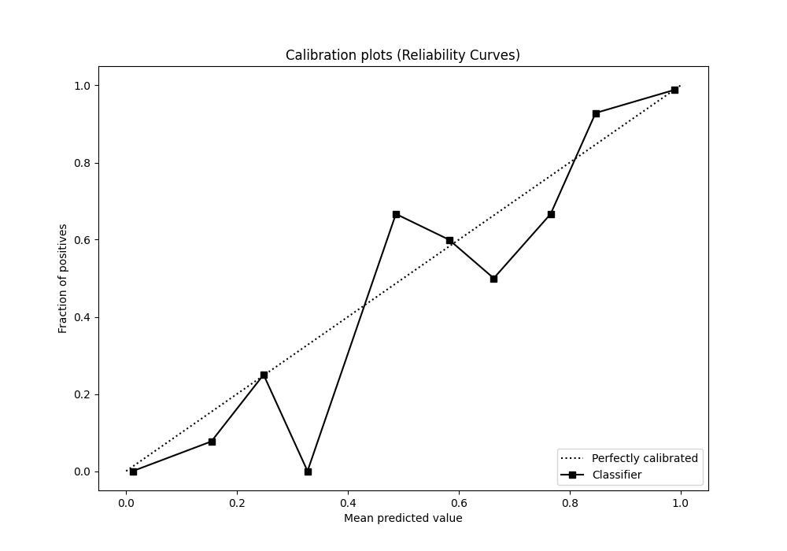
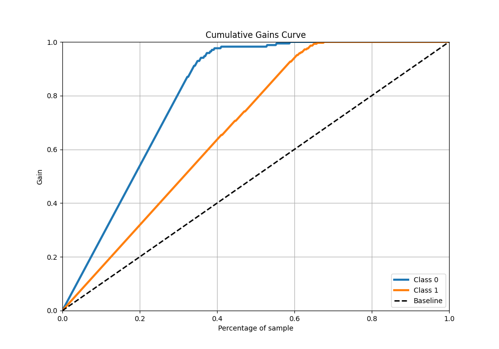
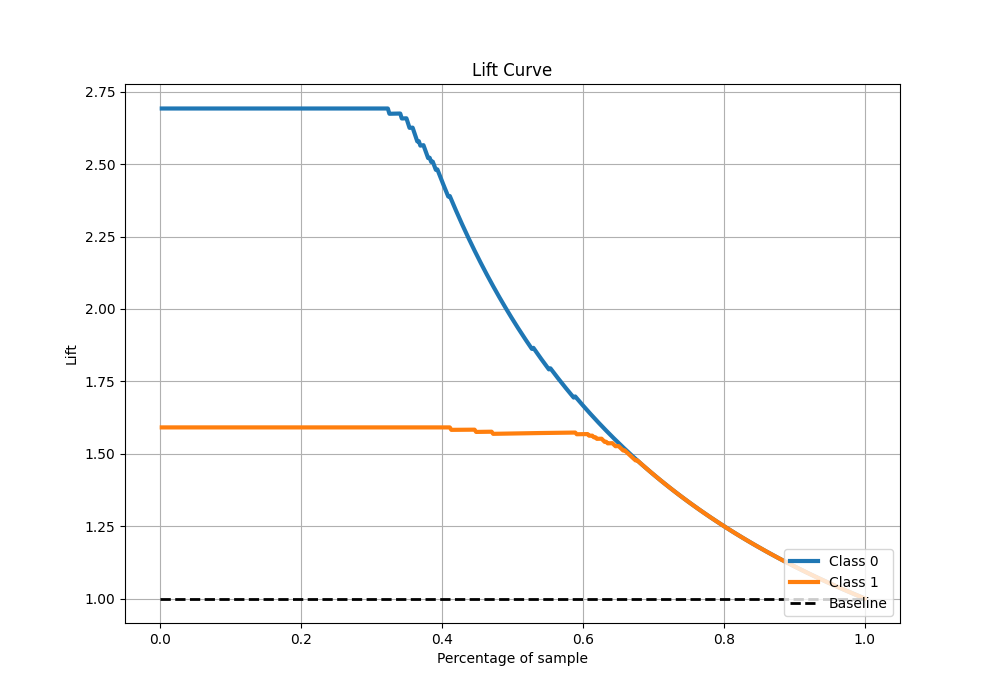

# Summary of 15_CatBoost

[<< Go back](../README.md)

## CatBoost
- **n_jobs**: -1
- **learning_rate**: 0.025
- **depth**: 9
- **rsm**: 0.9
- **loss_function**: Logloss
- **eval_metric**: Logloss
- **explain_level**: 1

## Validation
 - **validation_type**: kfold
 - **k_folds**: 5
 - **shuffle**: True
 - **stratify**: True

## Optimized metric
logloss

## Training time

26.2 seconds

## Metric details
|           |     score |     threshold |
|:----------|----------:|--------------:|
| logloss   | 0.0946765 | nan           |
| auc       | 0.992573  | nan           |
| f1        | 0.972603  |   0.298299    |
| accuracy  | 0.964835  |   0.298299    |
| precision | 1         |   0.99057     |
| recall    | 1         |   0.000120946 |
| mcc       | 0.925101  |   0.298299    |

## Metric details with threshold from accuracy metric
|           |     score |   threshold |
|:----------|----------:|------------:|
| logloss   | 0.0946765 |  nan        |
| auc       | 0.992573  |  nan        |
| f1        | 0.972603  |    0.298299 |
| accuracy  | 0.964835  |    0.298299 |
| precision | 0.95302   |    0.298299 |
| recall    | 0.993007  |    0.298299 |
| mcc       | 0.925101  |    0.298299 |

## Confusion matrix (at threshold=0.298299)
|              |   Predicted as 0 |   Predicted as 1 |
|:-------------|-----------------:|-----------------:|
| Labeled as 0 |              155 |               14 |
| Labeled as 1 |                2 |              284 |

## Learning curves

## Permutation-based Importance

## Confusion Matrix

## Normalized Confusion Matrix

## ROC Curve

## Kolmogorov-Smirnov Statistic

## Precision-Recall Curve

## Calibration Curve

## Cumulative Gains Curve

## Lift Curve

[<< Go back](../README.md)
