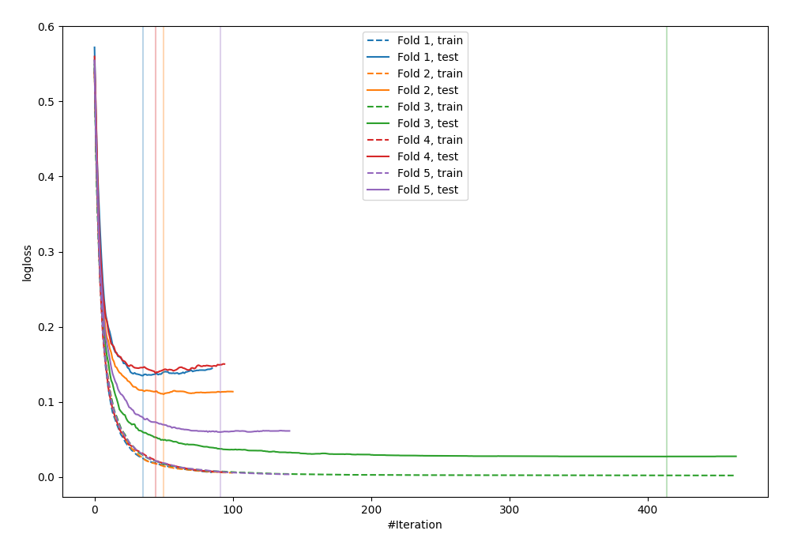
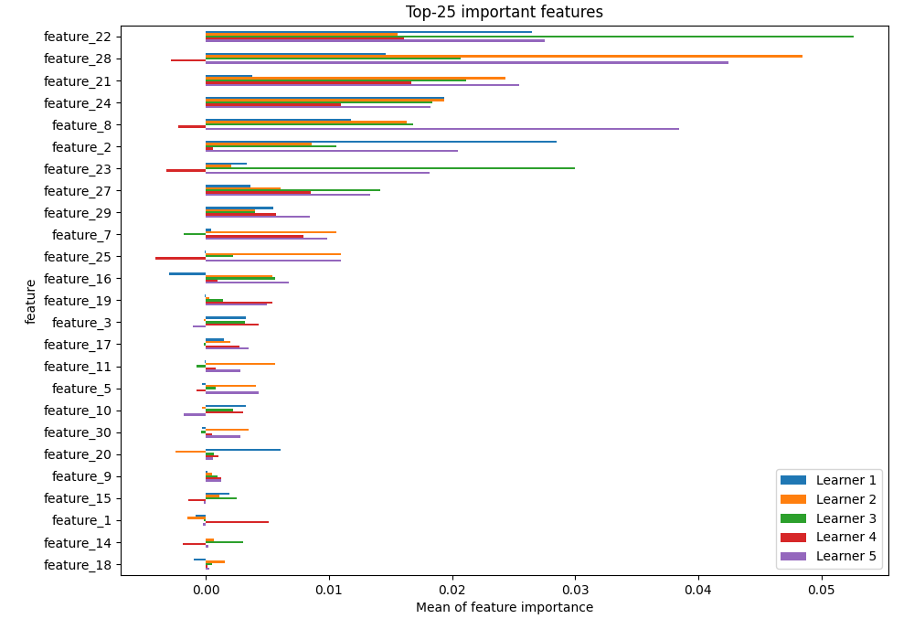
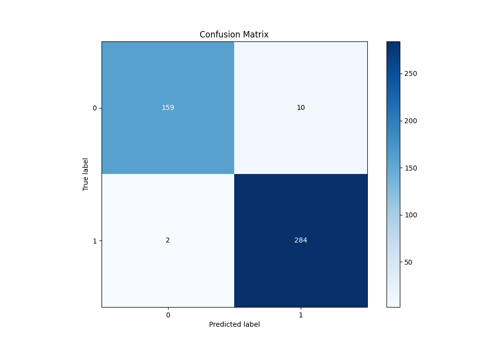
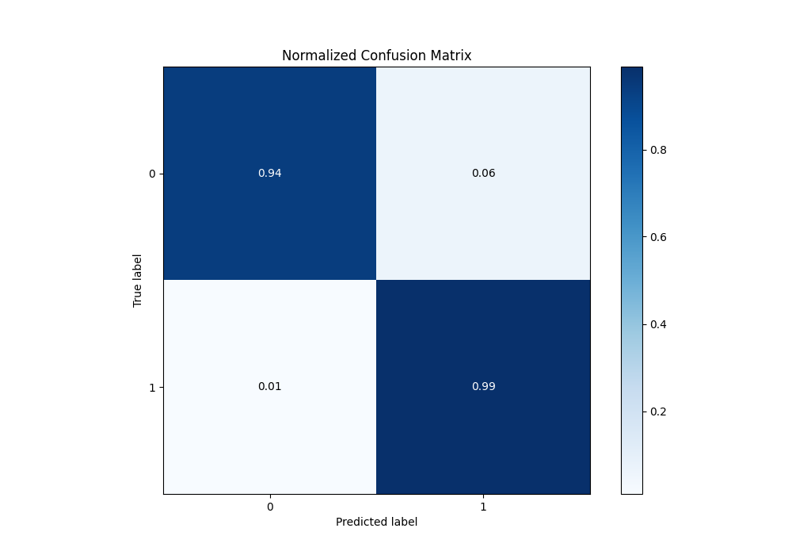
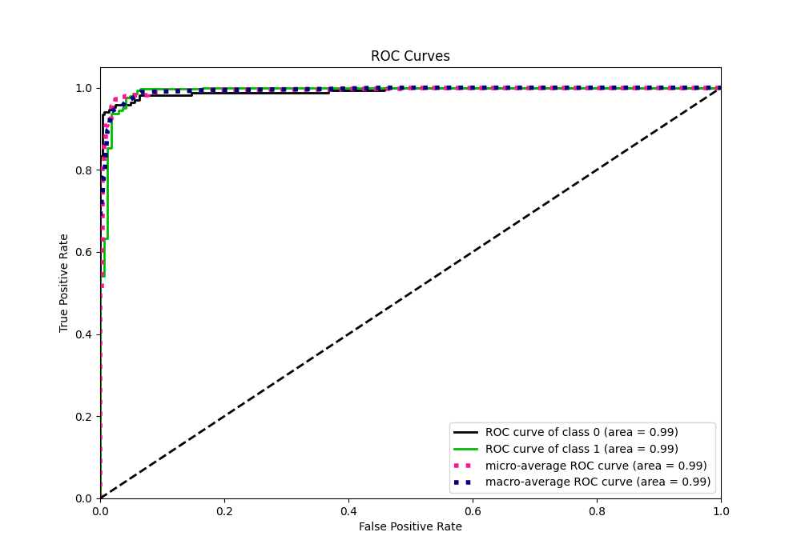
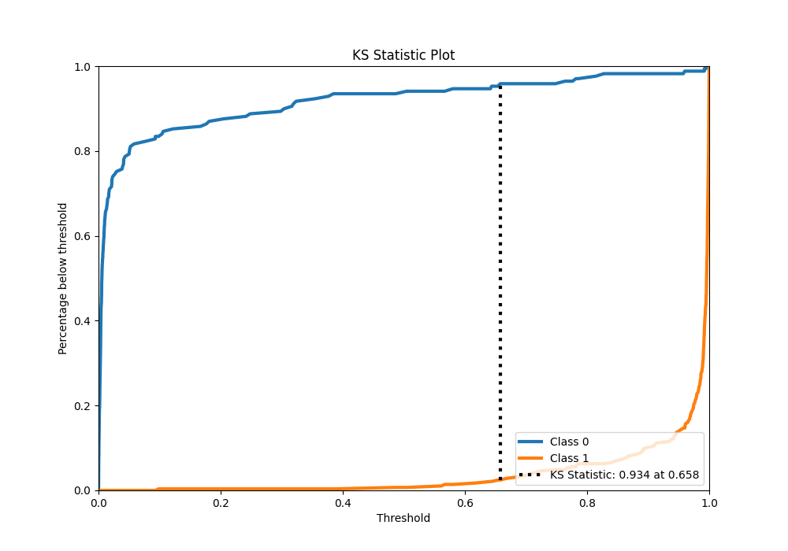
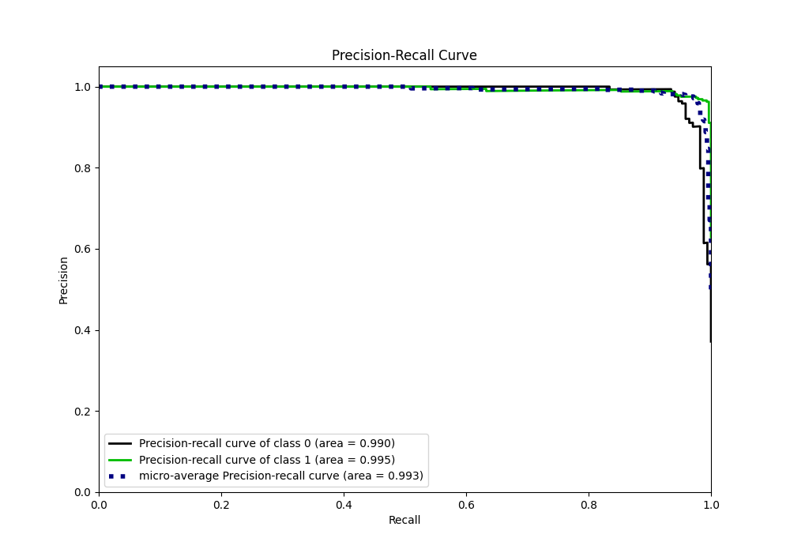
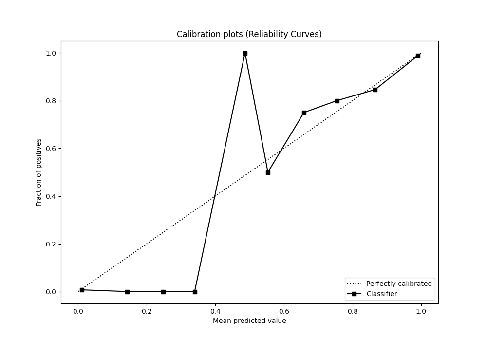
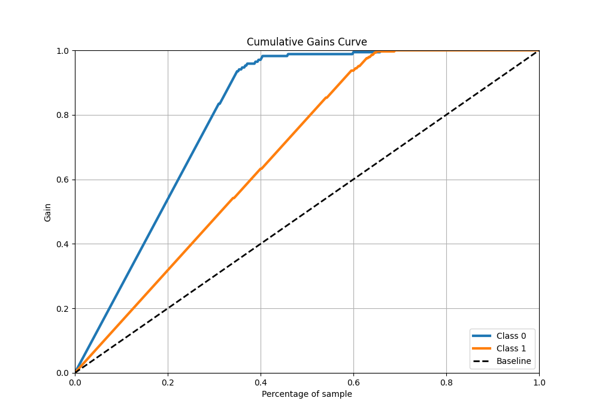
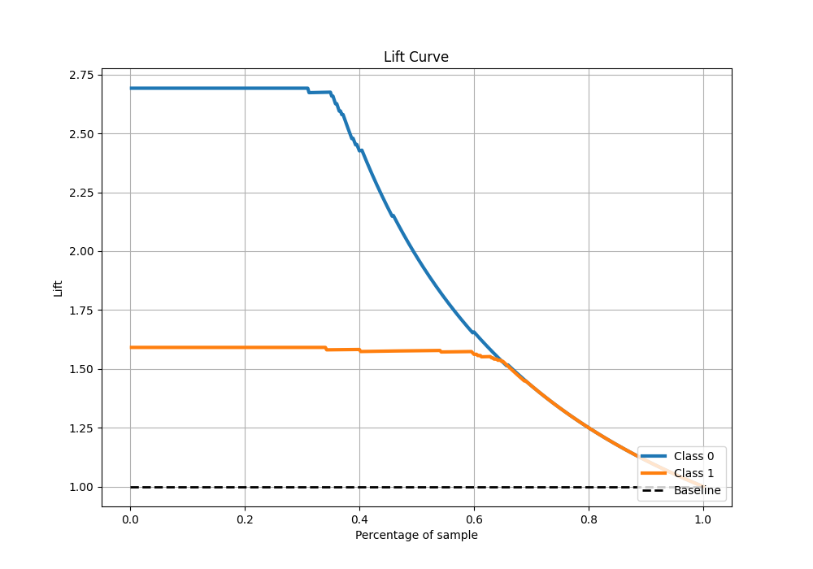

# Summary of 19_CatBoost

[<< Go back](../README.md)

## CatBoost
- **n_jobs**: -1
- **learning_rate**: 0.1
- **depth**: 6
- **rsm**: 0.8
- **loss_function**: Logloss
- **eval_metric**: Logloss
- **explain_level**: 1

## Validation
 - **validation_type**: kfold
 - **k_folds**: 5
 - **shuffle**: True
 - **stratify**: True

## Optimized metric
logloss

## Training time

3.3 seconds

## Metric details
|           |     score |     threshold |
|:----------|----------:|--------------:|
| logloss   | 0.0941944 | nan           |
| auc       | 0.992138  | nan           |
| f1        | 0.97931   |   0.533114    |
| accuracy  | 0.973626  |   0.533114    |
| precision | 1         |   0.995304    |
| recall    | 1         |   9.06515e-05 |
| mcc       | 0.943648  |   0.533114    |

## Metric details with threshold from accuracy metric
|           |     score |   threshold |
|:----------|----------:|------------:|
| logloss   | 0.0941944 |  nan        |
| auc       | 0.992138  |  nan        |
| f1        | 0.97931   |    0.533114 |
| accuracy  | 0.973626  |    0.533114 |
| precision | 0.965986  |    0.533114 |
| recall    | 0.993007  |    0.533114 |
| mcc       | 0.943648  |    0.533114 |

## Confusion matrix (at threshold=0.533114)
|              |   Predicted as 0 |   Predicted as 1 |
|:-------------|-----------------:|-----------------:|
| Labeled as 0 |              159 |               10 |
| Labeled as 1 |                2 |              284 |

## Learning curves

## Permutation-based Importance

## Confusion Matrix

## Normalized Confusion Matrix

## ROC Curve

## Kolmogorov-Smirnov Statistic

## Precision-Recall Curve

## Calibration Curve

## Cumulative Gains Curve

## Lift Curve

[<< Go back](../README.md)
