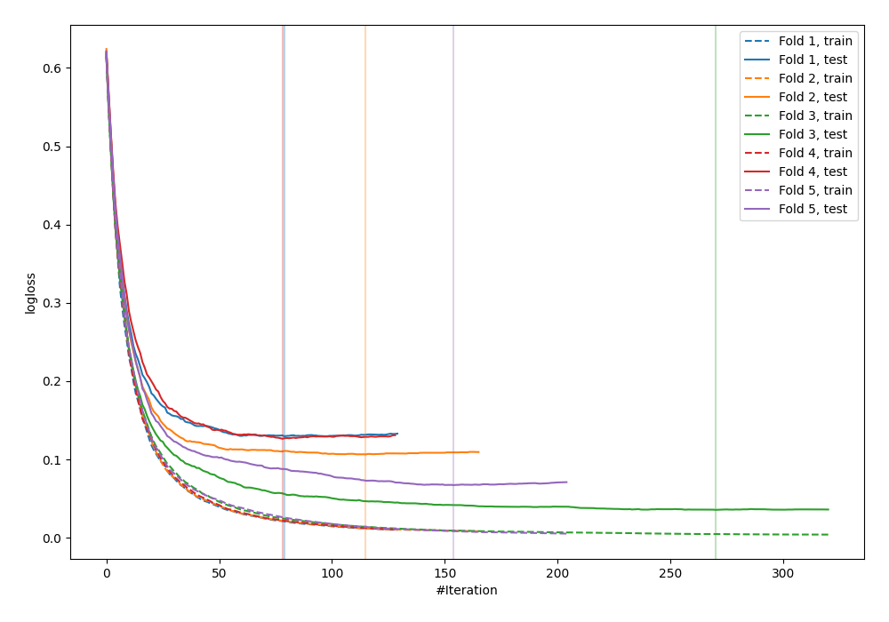
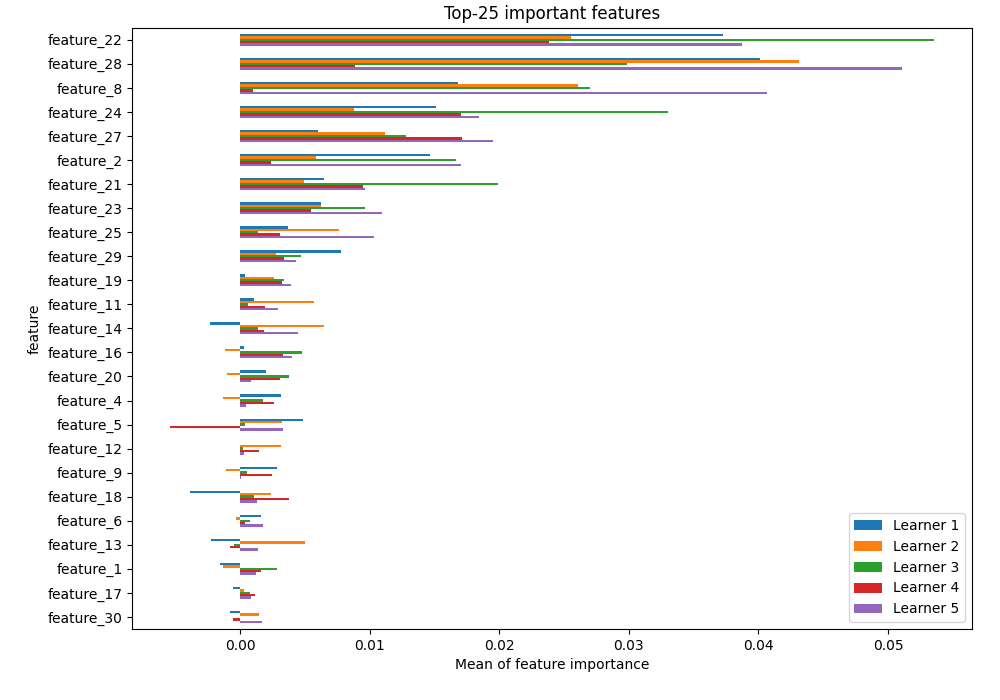
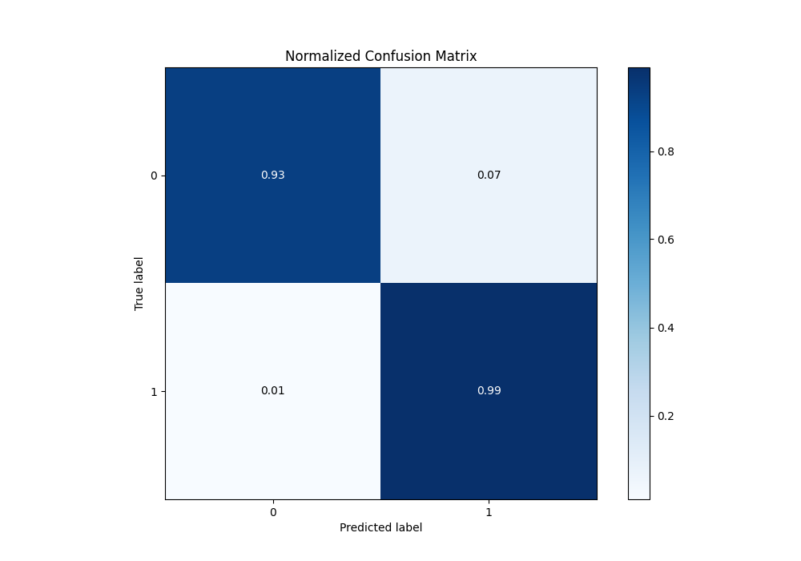
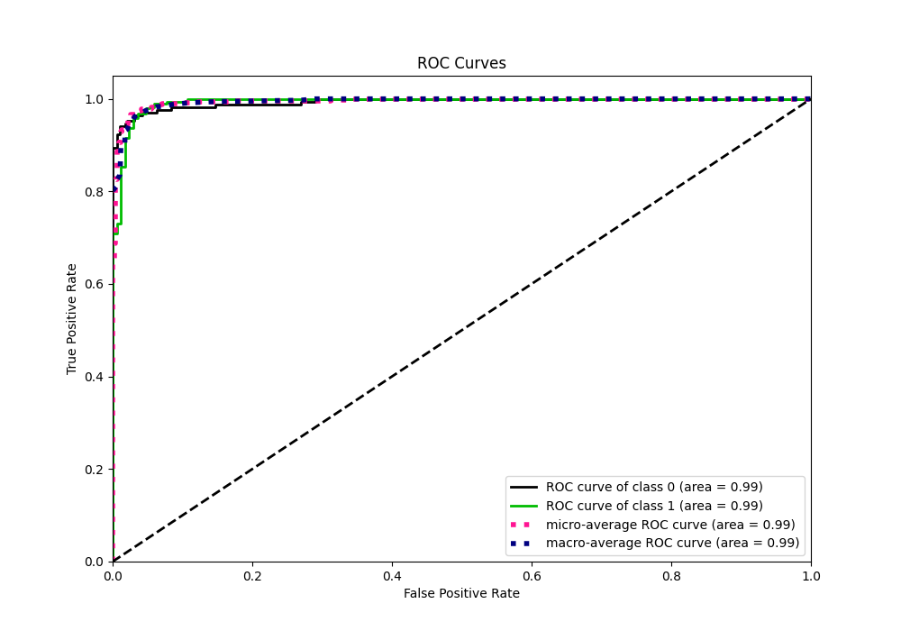
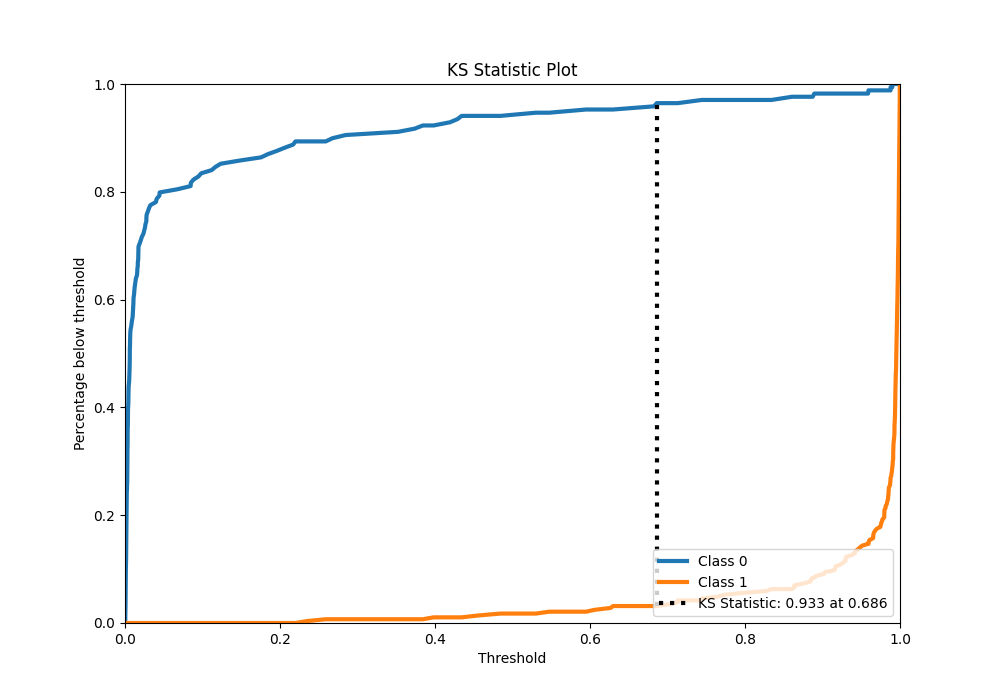
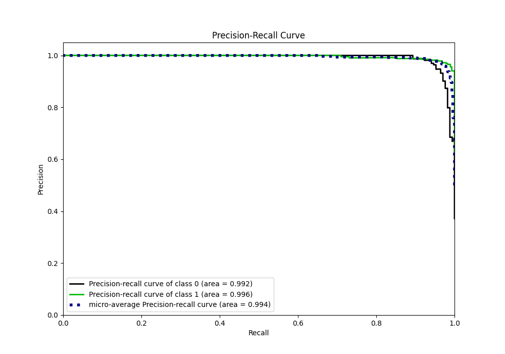
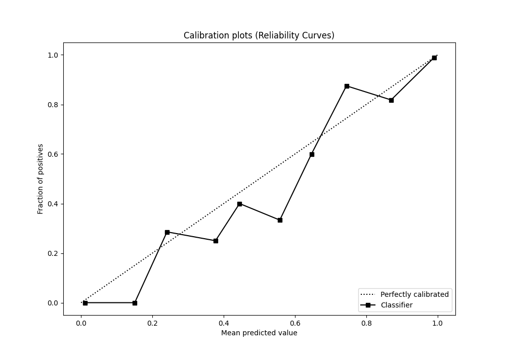
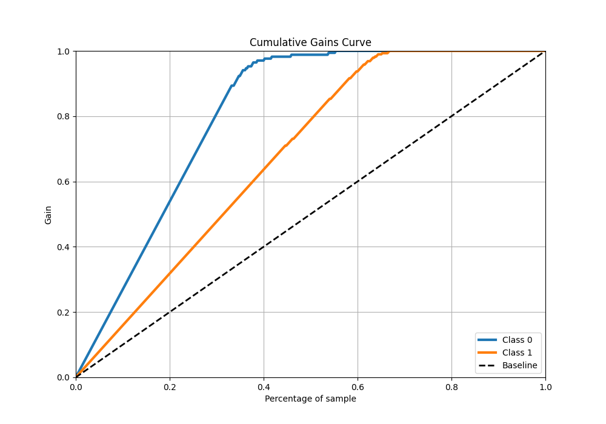
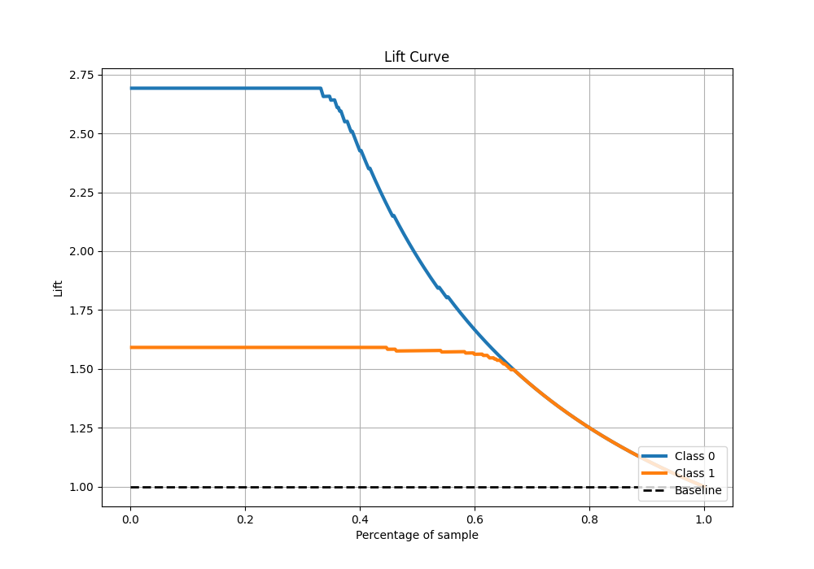

# Summary of 22_CatBoost

[<< Go back](../README.md)

## CatBoost
- **n_jobs**: -1
- **learning_rate**: 0.05
- **depth**: 6
- **rsm**: 1
- **loss_function**: Logloss
- **eval_metric**: Logloss
- **explain_level**: 1

## Validation
 - **validation_type**: kfold
 - **k_folds**: 5
 - **shuffle**: True
 - **stratify**: True

## Optimized metric
logloss

## Training time

3.3 seconds

## Metric details
|           |     score |     threshold |
|:----------|----------:|--------------:|
| logloss   | 0.0931032 | nan           |
| auc       | 0.99371   | nan           |
| f1        | 0.975862  |   0.43174     |
| accuracy  | 0.969231  |   0.43174     |
| precision | 1         |   0.990547    |
| recall    | 1         |   0.000335273 |
| mcc       | 0.934136  |   0.43174     |

## Metric details with threshold from accuracy metric
|           |     score |   threshold |
|:----------|----------:|------------:|
| logloss   | 0.0931032 |   nan       |
| auc       | 0.99371   |   nan       |
| f1        | 0.975862  |     0.43174 |
| accuracy  | 0.969231  |     0.43174 |
| precision | 0.962585  |     0.43174 |
| recall    | 0.98951   |     0.43174 |
| mcc       | 0.934136  |     0.43174 |

## Confusion matrix (at threshold=0.43174)
|              |   Predicted as 0 |   Predicted as 1 |
|:-------------|-----------------:|-----------------:|
| Labeled as 0 |              158 |               11 |
| Labeled as 1 |                3 |              283 |

## Learning curves

## Permutation-based Importance

## Confusion Matrix

## Normalized Confusion Matrix

## ROC Curve

## Kolmogorov-Smirnov Statistic

## Precision-Recall Curve

## Calibration Curve

## Cumulative Gains Curve

## Lift Curve

[<< Go back](../README.md)
