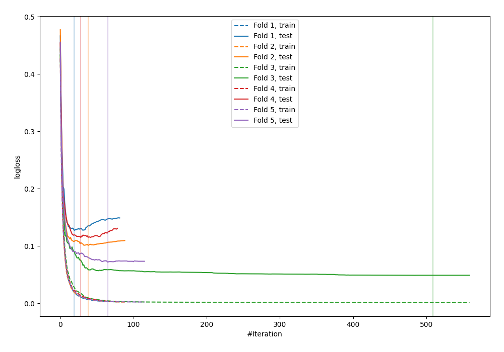
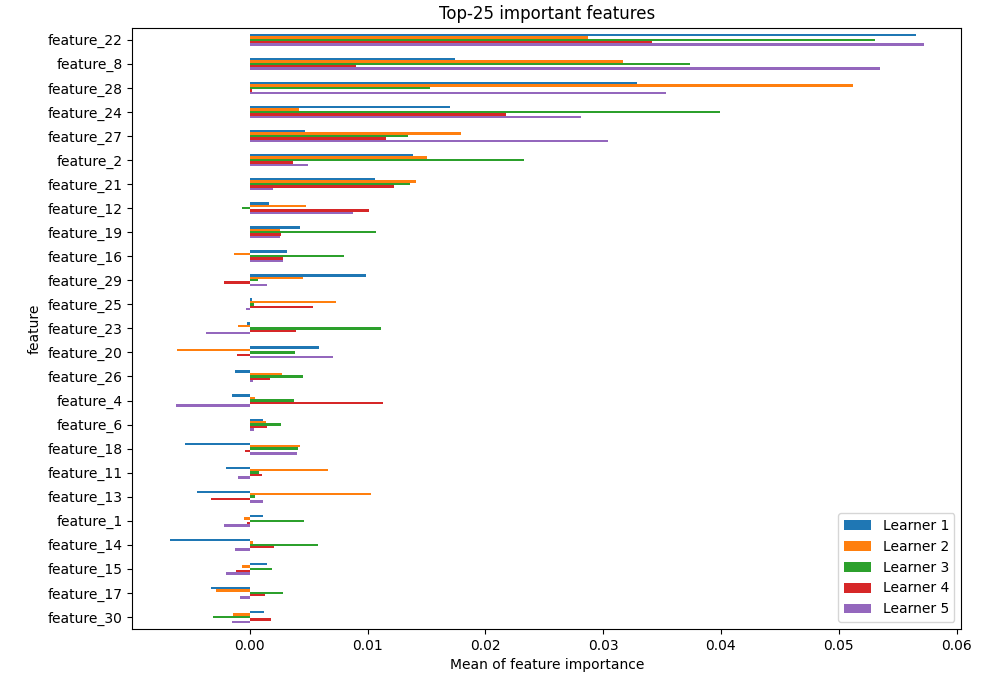
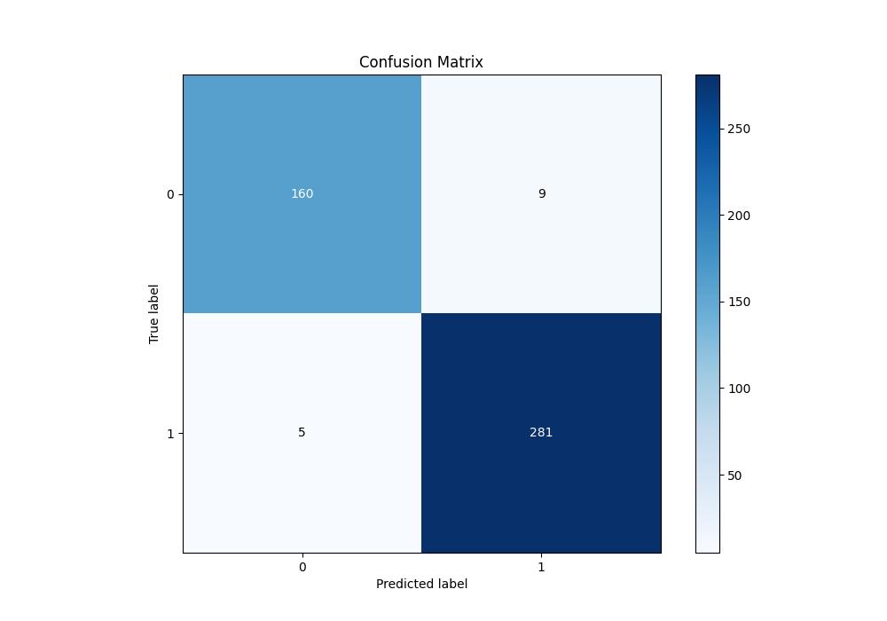
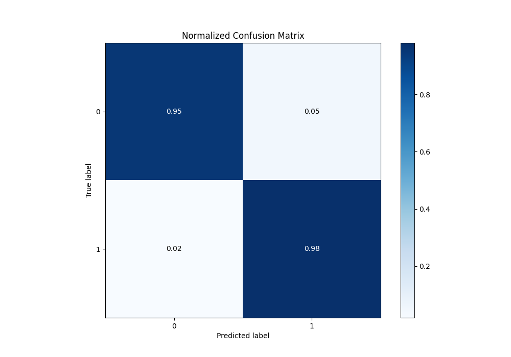
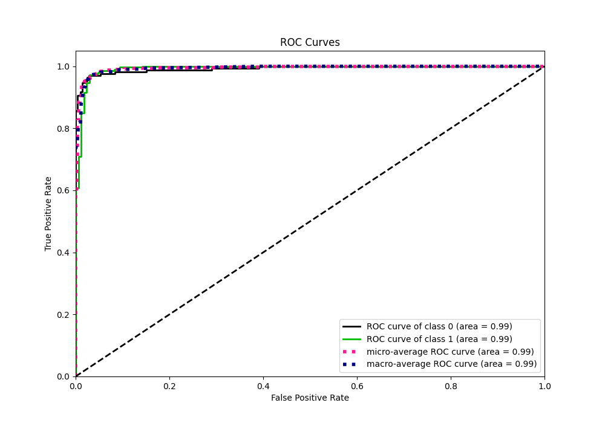
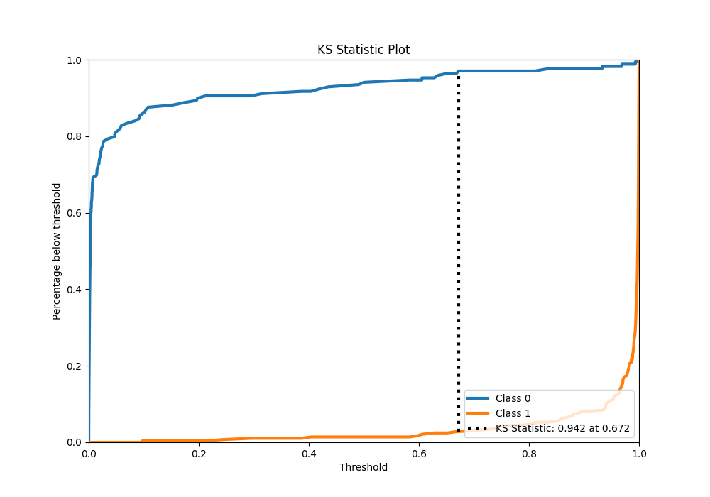
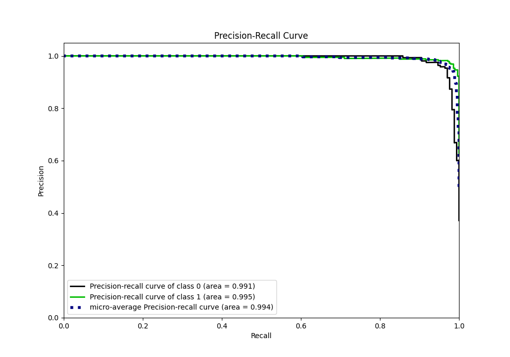
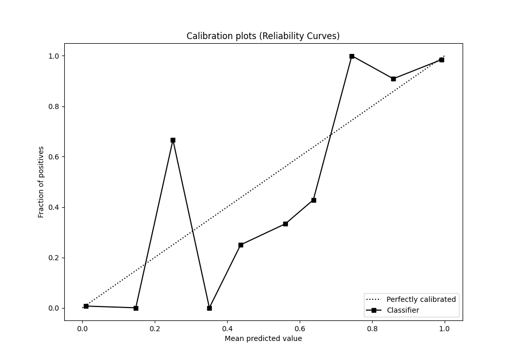
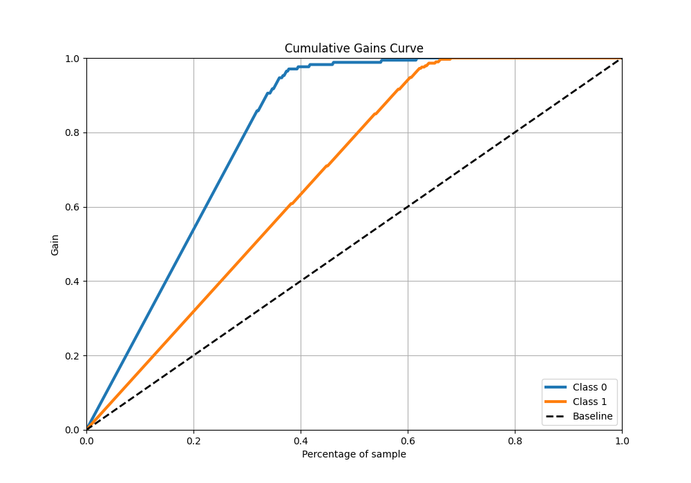
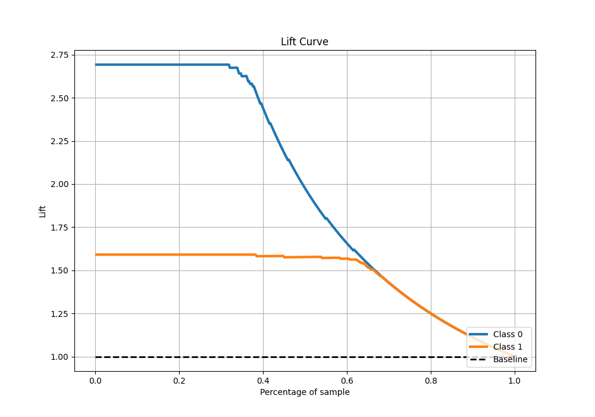

# Summary of 25_CatBoost

[<< Go back](../README.md)

## CatBoost
- **n_jobs**: -1
- **learning_rate**: 0.2
- **depth**: 7
- **rsm**: 1
- **loss_function**: Logloss
- **eval_metric**: Logloss
- **explain_level**: 1

## Validation
 - **validation_type**: kfold
 - **k_folds**: 5
 - **shuffle**: True
 - **stratify**: True

## Optimized metric
logloss

## Training time

4.1 seconds

## Metric details
|           |     score |     threshold |
|:----------|----------:|--------------:|
| logloss   | 0.0928593 | nan           |
| auc       | 0.992986  | nan           |
| f1        | 0.975694  |   0.602112    |
| accuracy  | 0.969231  |   0.602112    |
| precision | 1         |   0.996067    |
| recall    | 1         |   7.69985e-05 |
| mcc       | 0.934586  |   0.720393    |

## Metric details with threshold from accuracy metric
|           |     score |   threshold |
|:----------|----------:|------------:|
| logloss   | 0.0928593 |  nan        |
| auc       | 0.992986  |  nan        |
| f1        | 0.975694  |    0.602112 |
| accuracy  | 0.969231  |    0.602112 |
| precision | 0.968966  |    0.602112 |
| recall    | 0.982517  |    0.602112 |
| mcc       | 0.933951  |    0.602112 |

## Confusion matrix (at threshold=0.602112)
|              |   Predicted as 0 |   Predicted as 1 |
|:-------------|-----------------:|-----------------:|
| Labeled as 0 |              160 |                9 |
| Labeled as 1 |                5 |              281 |

## Learning curves

## Permutation-based Importance

## Confusion Matrix

## Normalized Confusion Matrix

## ROC Curve

## Kolmogorov-Smirnov Statistic

## Precision-Recall Curve

## Calibration Curve

## Cumulative Gains Curve

## Lift Curve

[<< Go back](../README.md)
