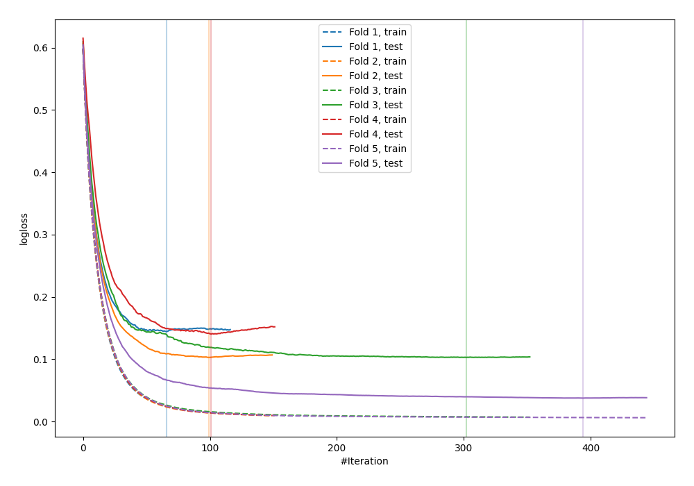
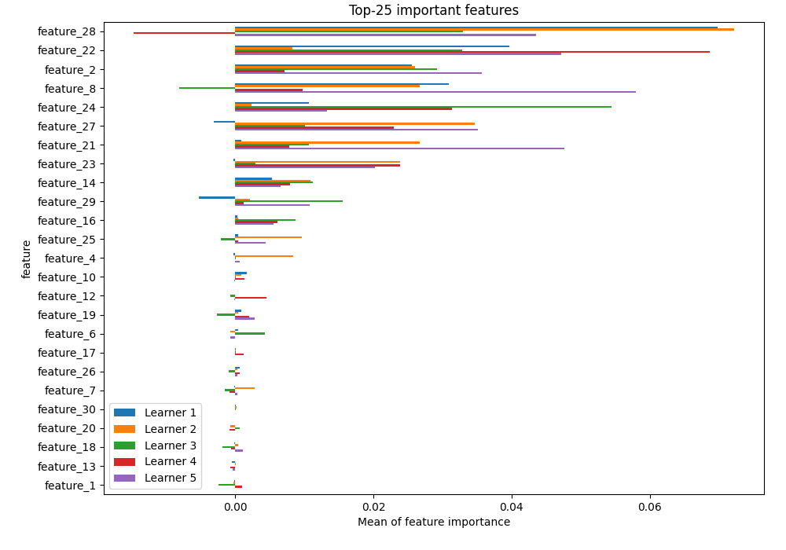
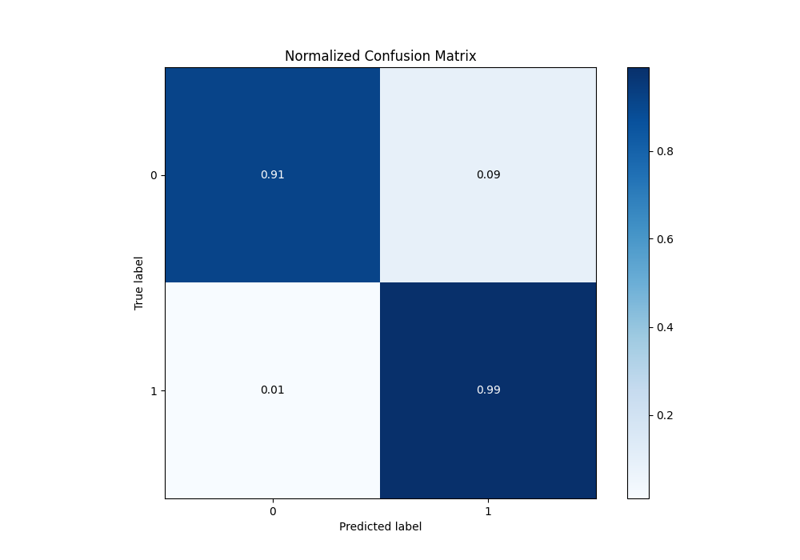
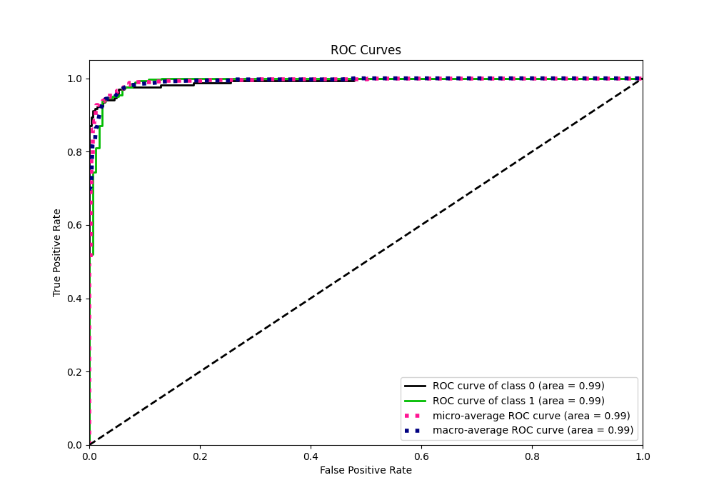
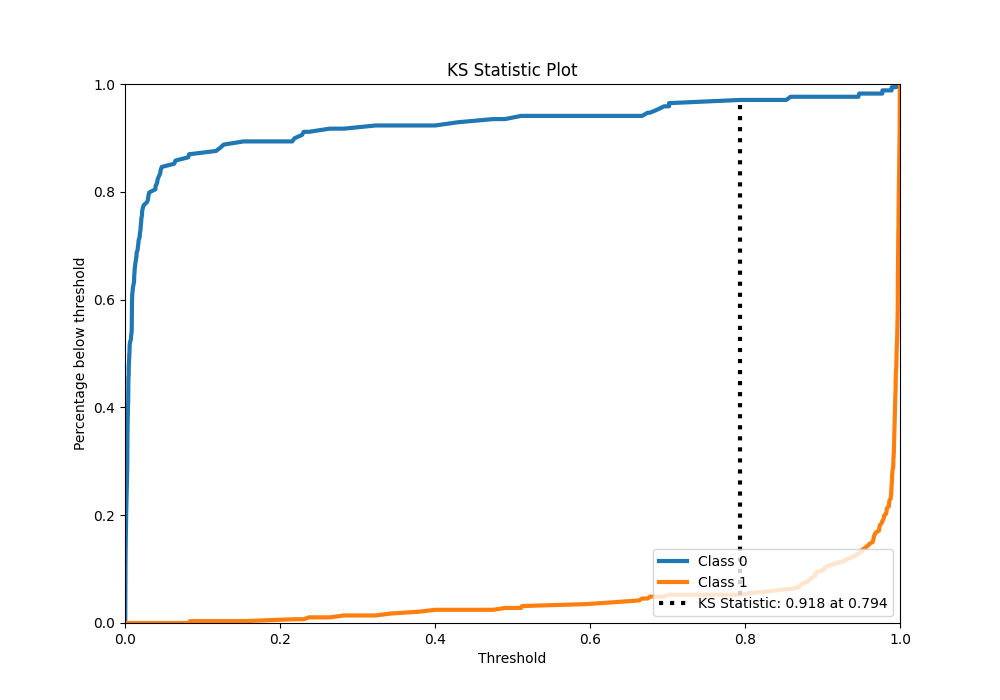
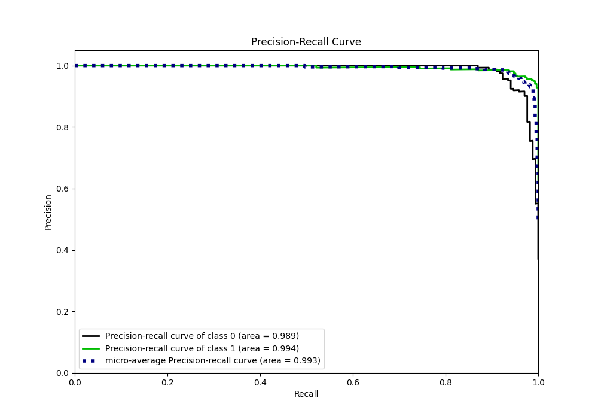
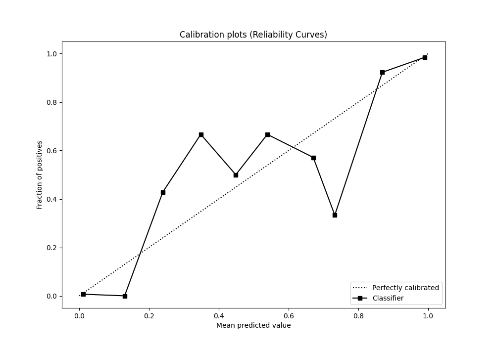
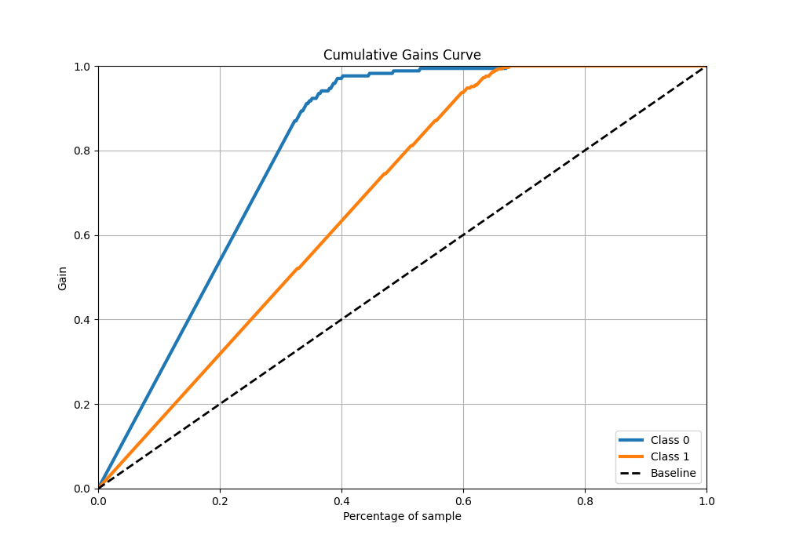
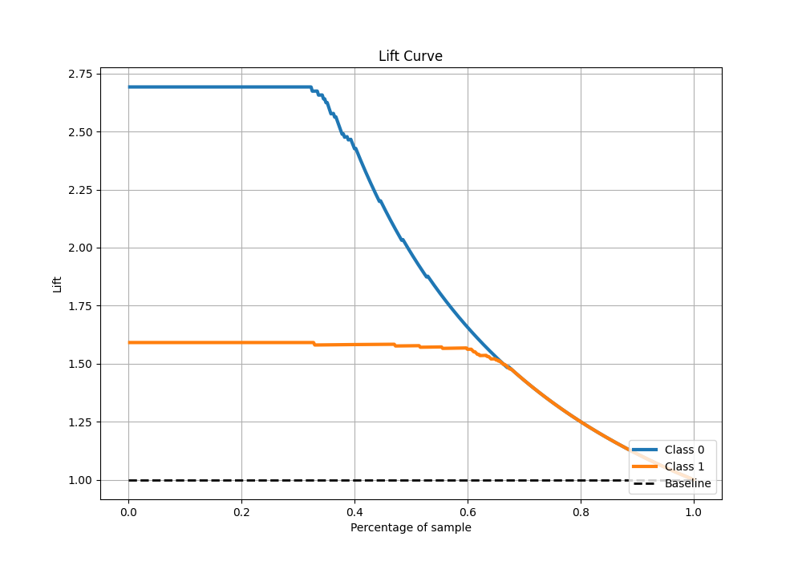

# Summary of 2_Default_Xgboost

[<< Go back](../README.md)

## Extreme Gradient Boosting (Xgboost)
- **n_jobs**: -1
- **objective**: binary:logistic
- **eta**: 0.075
- **max_depth**: 6
- **min_child_weight**: 1
- **subsample**: 1.0
- **colsample_bytree**: 1.0
- **eval_metric**: logloss
- **explain_level**: 1

## Validation
 - **validation_type**: kfold
 - **k_folds**: 5
 - **shuffle**: True
 - **stratify**: True

## Optimized metric
logloss

## Training time

3.4 seconds

## Metric details
|           |    score |     threshold |
|:----------|---------:|--------------:|
| logloss   | 0.105653 | nan           |
| auc       | 0.991124 | nan           |
| f1        | 0.969178 |   0.250746    |
| accuracy  | 0.96044  |   0.250746    |
| precision | 1        |   0.995502    |
| recall    | 1        |   0.000287282 |
| mcc       | 0.915533 |   0.250746    |

## Metric details with threshold from accuracy metric
|           |    score |   threshold |
|:----------|---------:|------------:|
| logloss   | 0.105653 |  nan        |
| auc       | 0.991124 |  nan        |
| f1        | 0.969178 |    0.250746 |
| accuracy  | 0.96044  |    0.250746 |
| precision | 0.949664 |    0.250746 |
| recall    | 0.98951  |    0.250746 |
| mcc       | 0.915533 |    0.250746 |

## Confusion matrix (at threshold=0.250746)
|              |   Predicted as 0 |   Predicted as 1 |
|:-------------|-----------------:|-----------------:|
| Labeled as 0 |              154 |               15 |
| Labeled as 1 |                3 |              283 |

## Learning curves

## Permutation-based Importance

## Confusion Matrix

## Normalized Confusion Matrix

## ROC Curve

## Kolmogorov-Smirnov Statistic

## Precision-Recall Curve

## Calibration Curve

## Cumulative Gains Curve

## Lift Curve

[<< Go back](../README.md)
