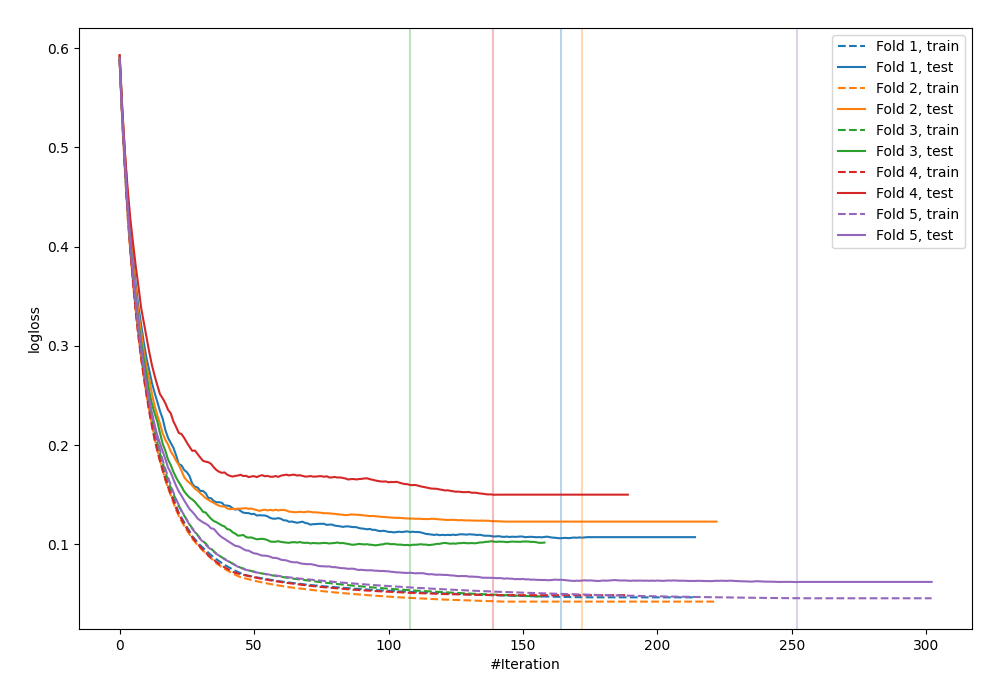
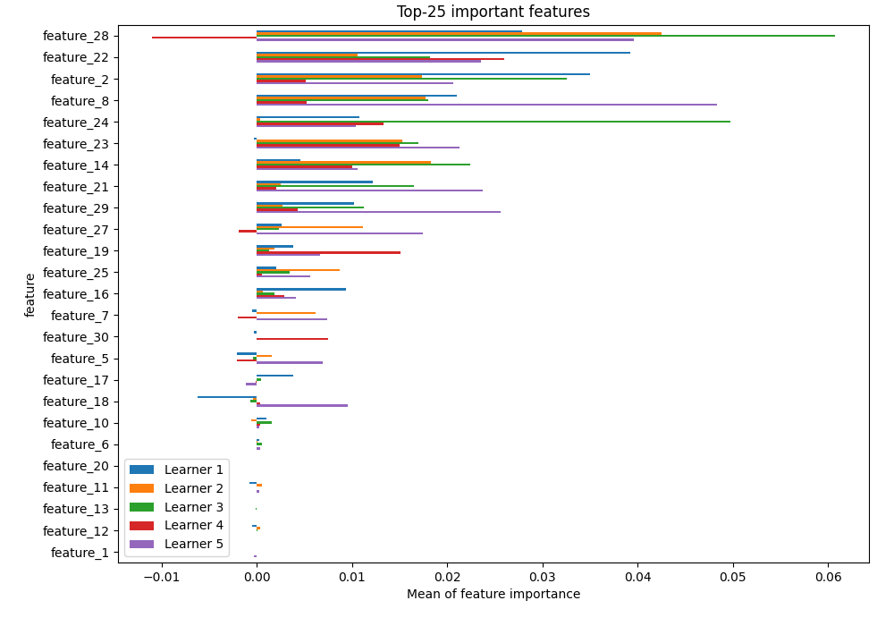
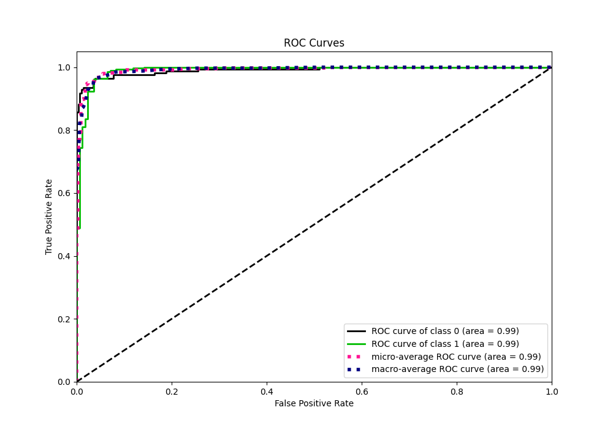
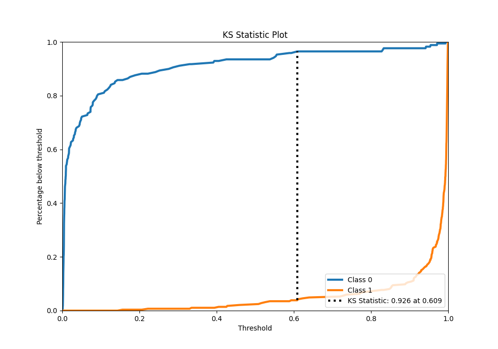
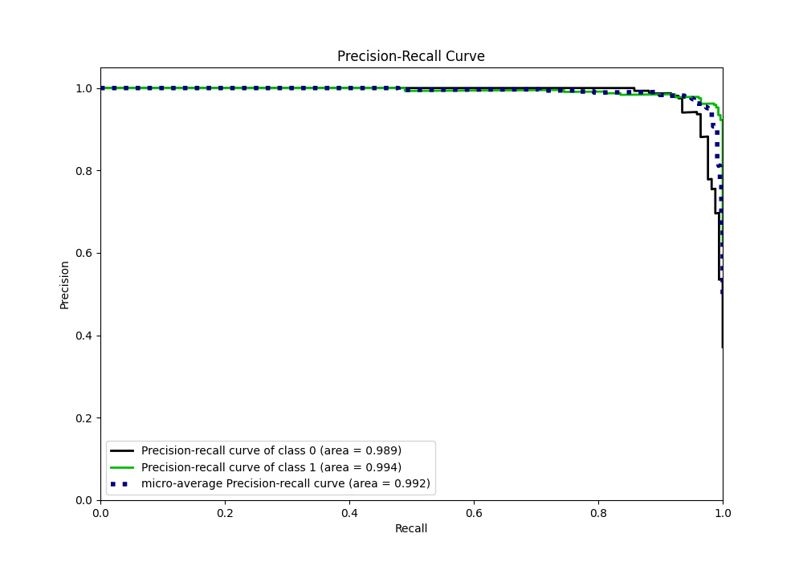
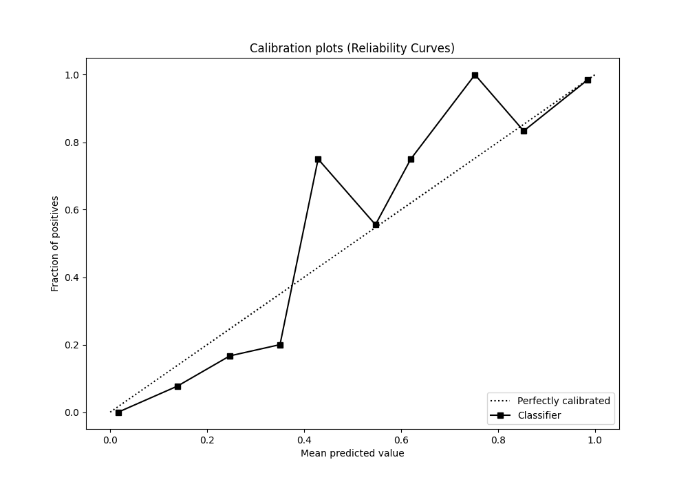
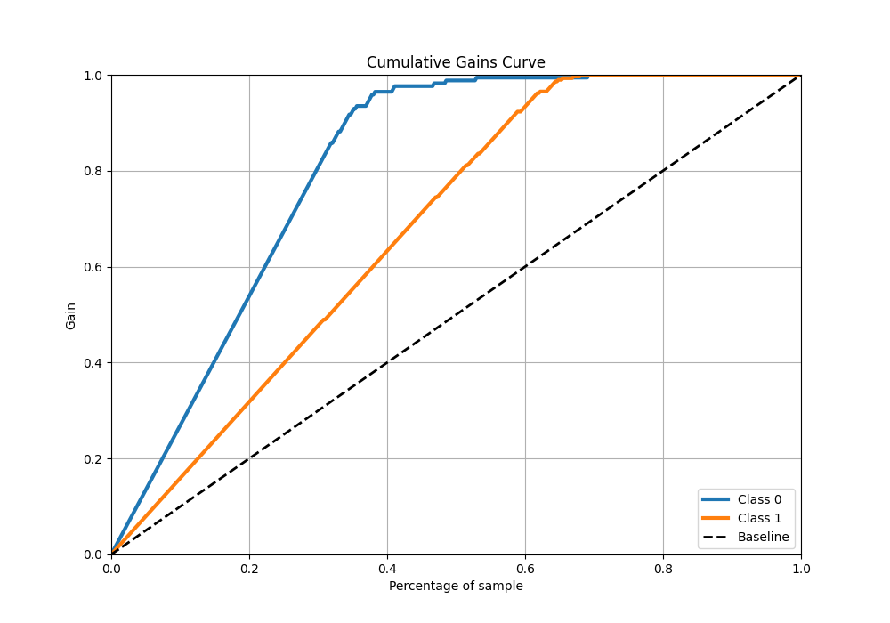
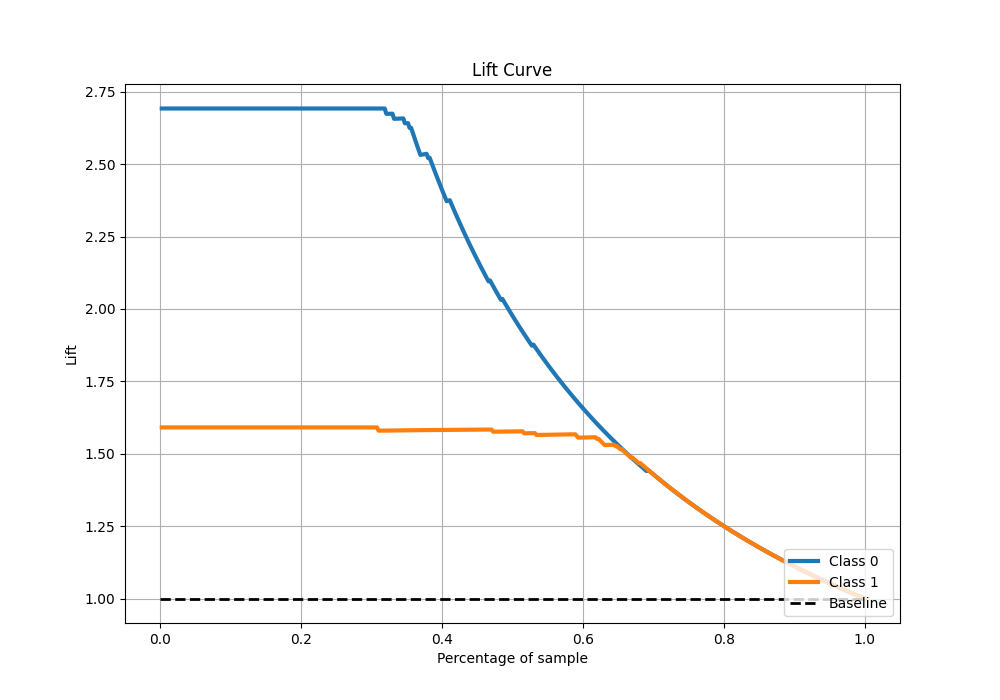

# Summary of 5_Xgboost

[<< Go back](../README.md)

## Extreme Gradient Boosting (Xgboost)
- **n_jobs**: -1
- **objective**: binary:logistic
- **eta**: 0.1
- **max_depth**: 7
- **min_child_weight**: 5
- **subsample**: 1.0
- **colsample_bytree**: 0.5
- **eval_metric**: logloss
- **explain_level**: 1

## Validation
 - **validation_type**: kfold
 - **k_folds**: 5
 - **shuffle**: True
 - **stratify**: True

## Optimized metric
logloss

## Training time

3.1 seconds

## Metric details
|           |    score |     threshold |
|:----------|---------:|--------------:|
| logloss   | 0.107878 | nan           |
| auc       | 0.990876 | nan           |
| f1        | 0.972603 |   0.332373    |
| accuracy  | 0.964835 |   0.332373    |
| precision | 1        |   0.993283    |
| recall    | 1        |   0.000981574 |
| mcc       | 0.925101 |   0.332373    |

## Metric details with threshold from accuracy metric
|           |    score |   threshold |
|:----------|---------:|------------:|
| logloss   | 0.107878 |  nan        |
| auc       | 0.990876 |  nan        |
| f1        | 0.972603 |    0.332373 |
| accuracy  | 0.964835 |    0.332373 |
| precision | 0.95302  |    0.332373 |
| recall    | 0.993007 |    0.332373 |
| mcc       | 0.925101 |    0.332373 |

## Confusion matrix (at threshold=0.332373)
|              |   Predicted as 0 |   Predicted as 1 |
|:-------------|-----------------:|-----------------:|
| Labeled as 0 |              155 |               14 |
| Labeled as 1 |                2 |              284 |

## Learning curves

## Permutation-based Importance

## Confusion Matrix

## Normalized Confusion Matrix

## ROC Curve

## Kolmogorov-Smirnov Statistic

## Precision-Recall Curve

## Calibration Curve

## Cumulative Gains Curve

## Lift Curve

[<< Go back](../README.md)
