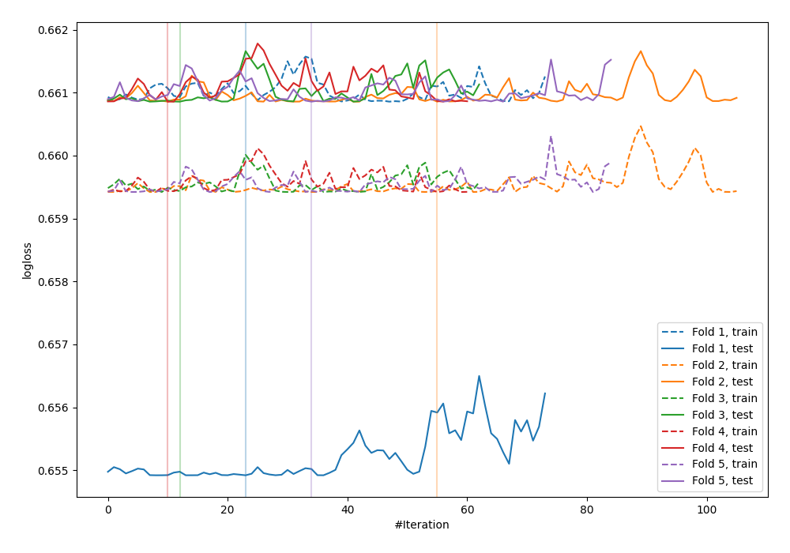
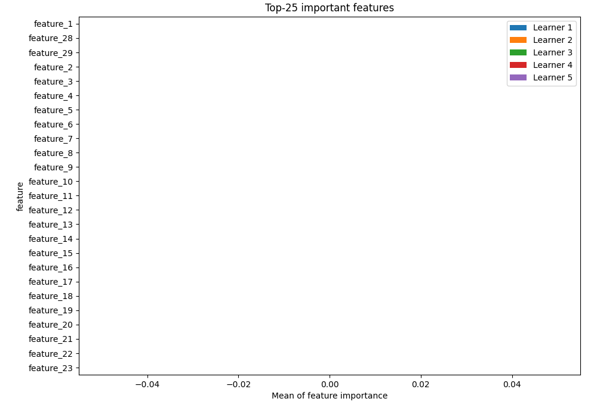
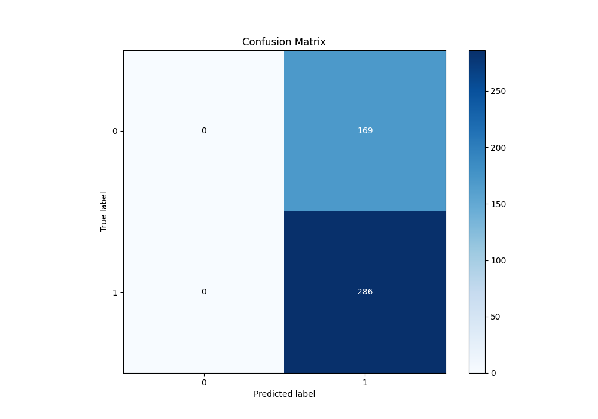
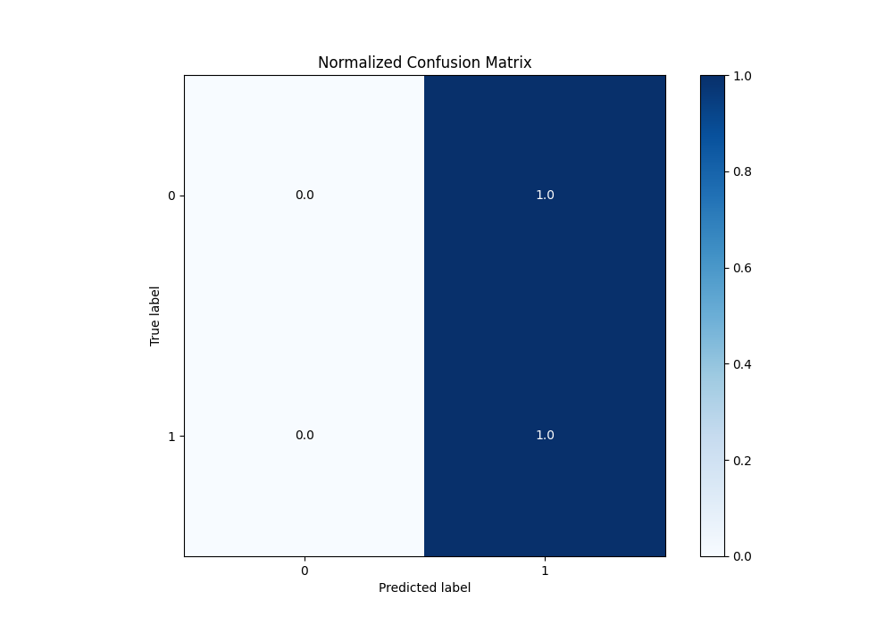
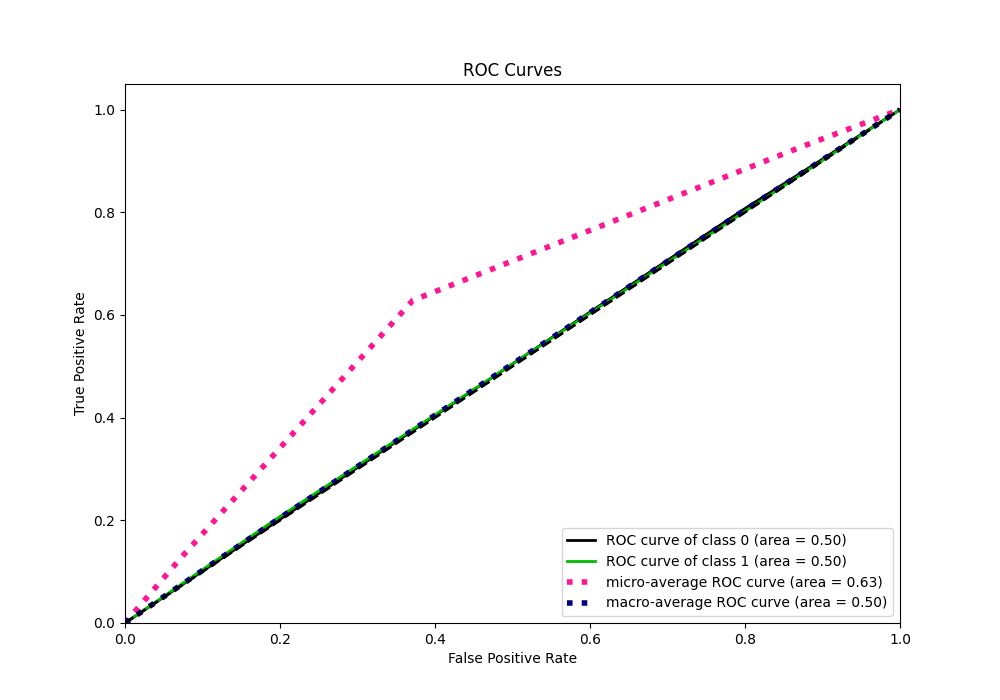
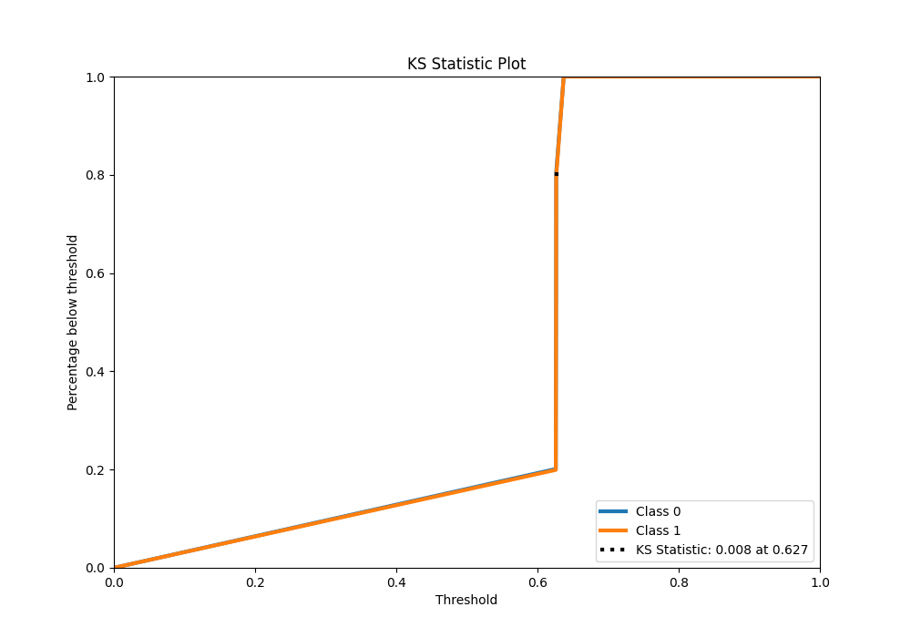
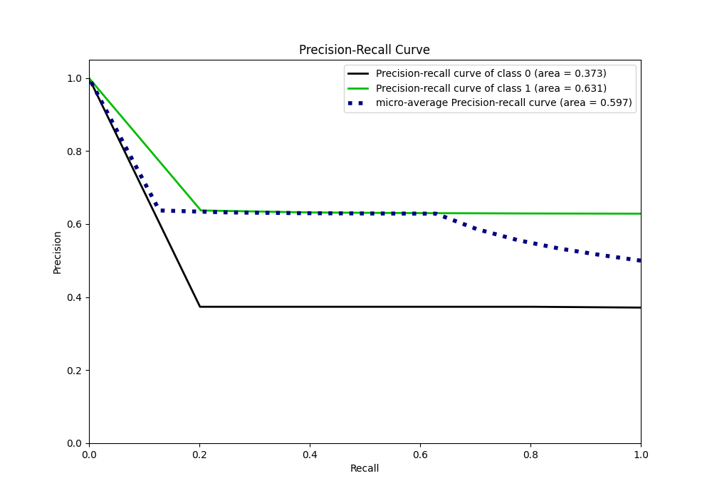
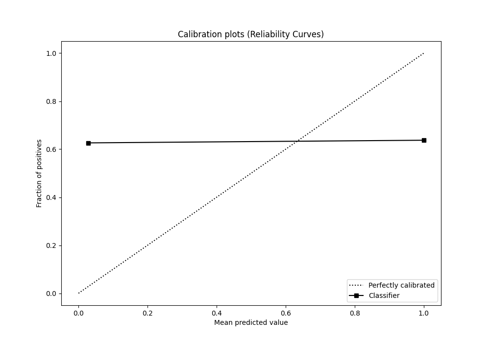
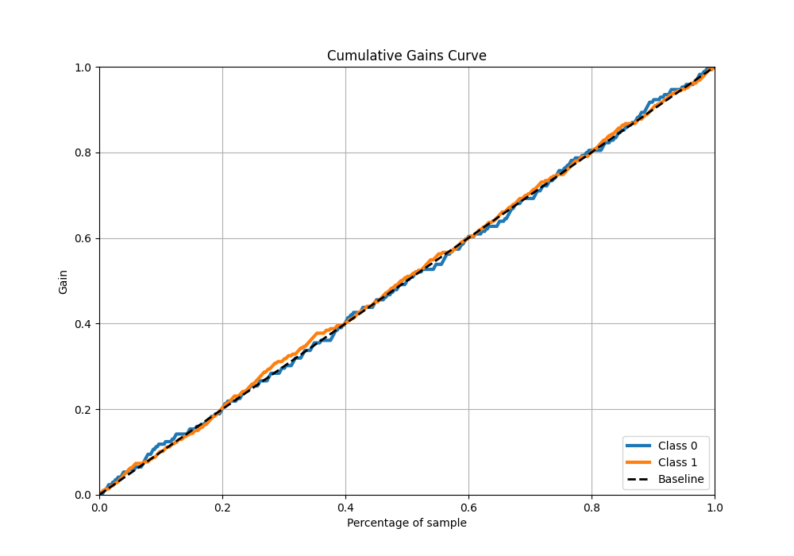
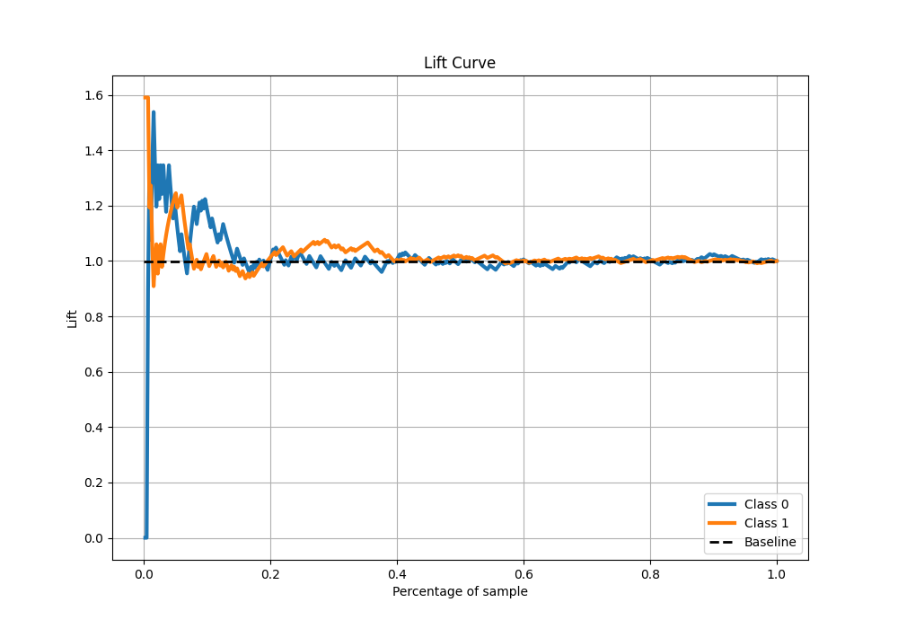

# Summary of 6_Xgboost

[<< Go back](../README.md)

## Extreme Gradient Boosting (Xgboost)
- **n_jobs**: -1
- **objective**: binary:logistic
- **eta**: 0.15
- **max_depth**: 6
- **min_child_weight**: 25
- **subsample**: 0.5
- **colsample_bytree**: 0.5
- **eval_metric**: logloss
- **explain_level**: 1

## Validation
 - **validation_type**: kfold
 - **k_folds**: 5
 - **shuffle**: True
 - **stratify**: True

## Optimized metric
logloss

## Training time

2.2 seconds

## Metric details
|           |      score |   threshold |
|:----------|-----------:|------------:|
| logloss   | 0.65967    |  nan        |
| auc       | 0.503765   |  nan        |
| f1        | 0.77193    |    0.563344 |
| accuracy  | 0.628571   |    0.563344 |
| precision | 0.637363   |    0.626505 |
| recall    | 1          |    0.563344 |
| mcc       | 0.00909711 |    0.626505 |

## Metric details with threshold from accuracy metric
|           |    score |   threshold |
|:----------|---------:|------------:|
| logloss   | 0.65967  |  nan        |
| auc       | 0.503765 |  nan        |
| f1        | 0.77193  |    0.563344 |
| accuracy  | 0.628571 |    0.563344 |
| precision | 0.628571 |    0.563344 |
| recall    | 1        |    0.563344 |
| mcc       | 0        |    0.563344 |

## Confusion matrix (at threshold=0.563344)
|              |   Predicted as 0 |   Predicted as 1 |
|:-------------|-----------------:|-----------------:|
| Labeled as 0 |                0 |              169 |
| Labeled as 1 |                0 |              286 |

## Learning curves

## Permutation-based Importance

## Confusion Matrix

## Normalized Confusion Matrix

## ROC Curve

## Kolmogorov-Smirnov Statistic

## Precision-Recall Curve

## Calibration Curve

## Cumulative Gains Curve

## Lift Curve

[<< Go back](../README.md)
