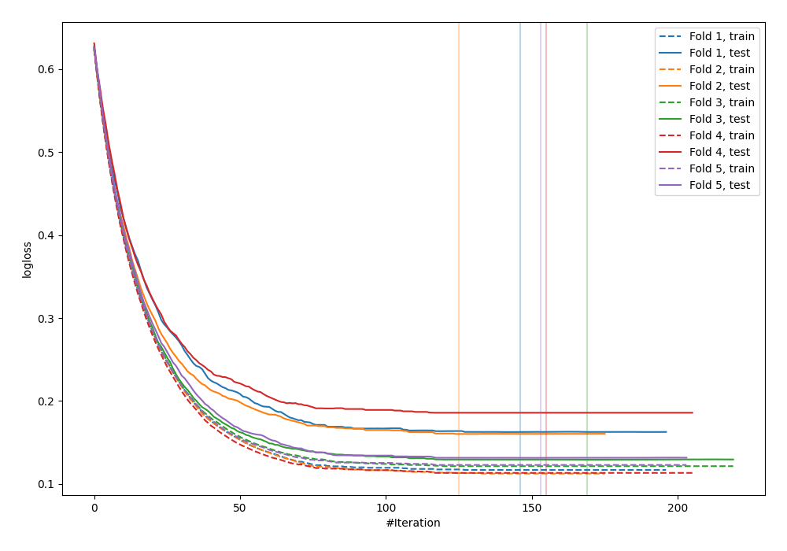
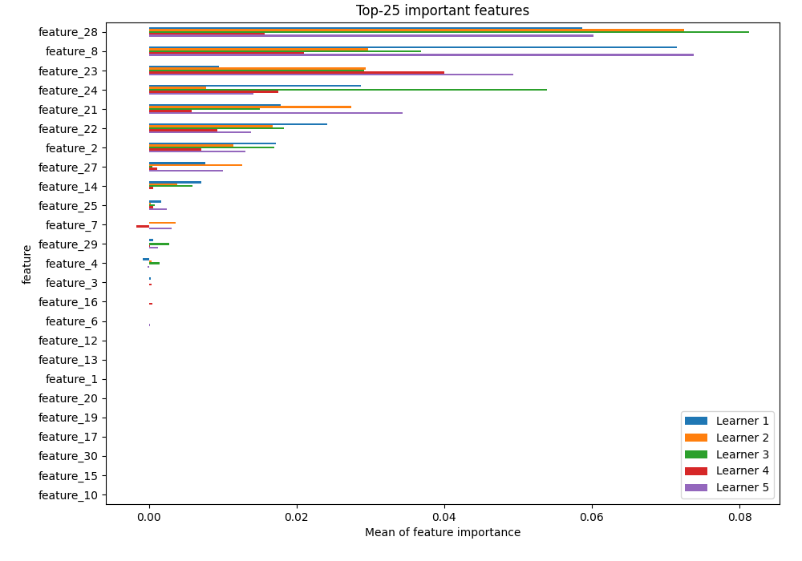
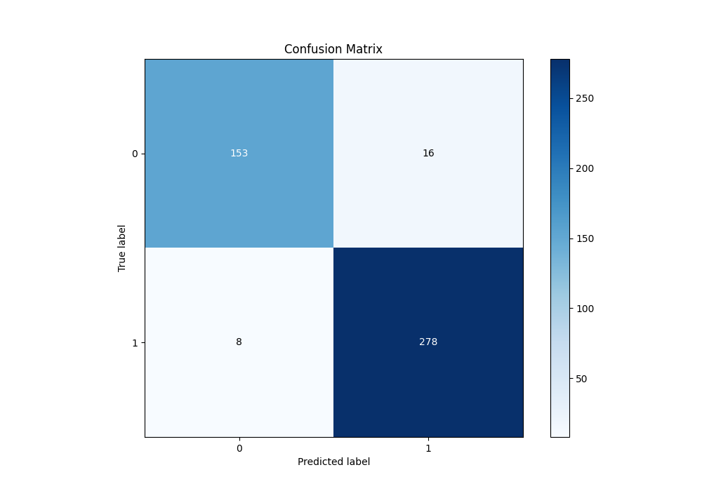
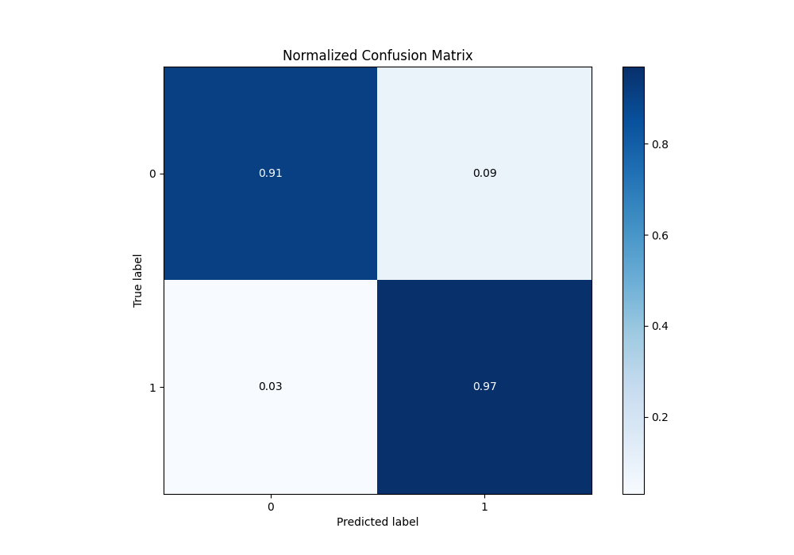
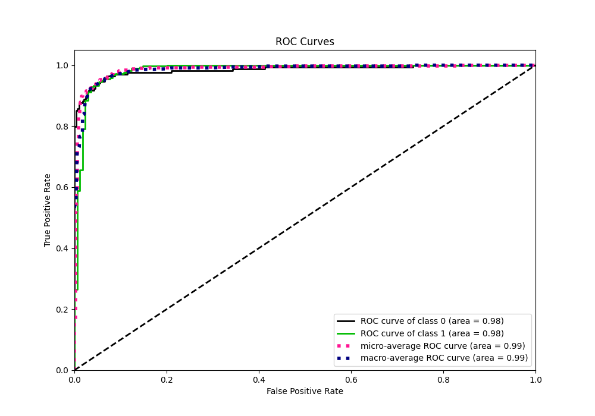
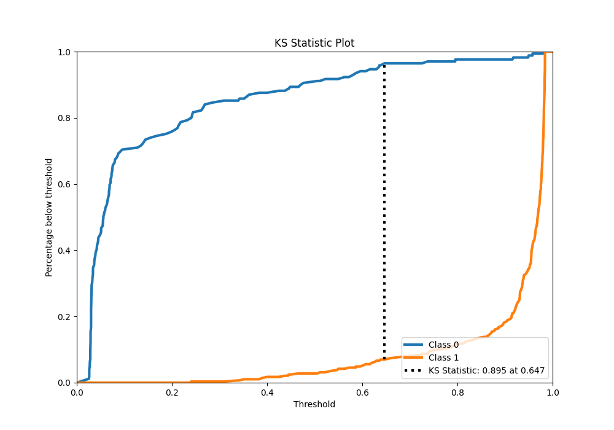
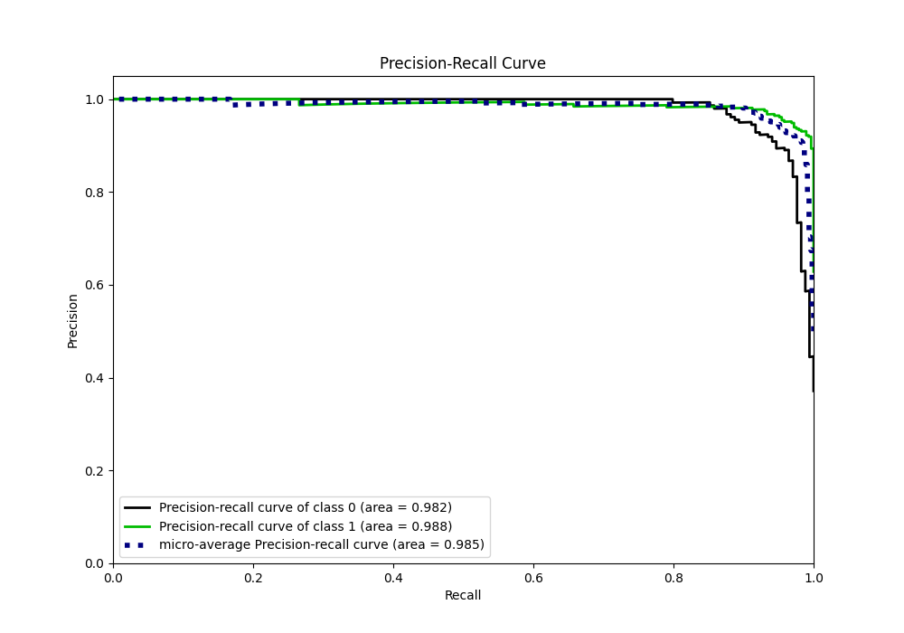
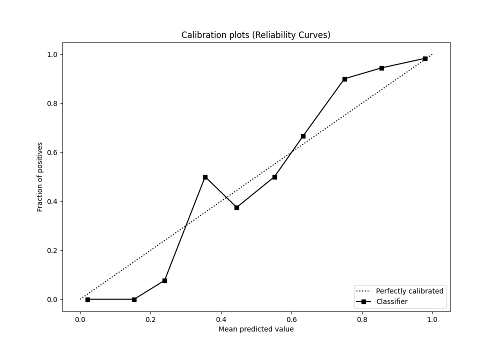
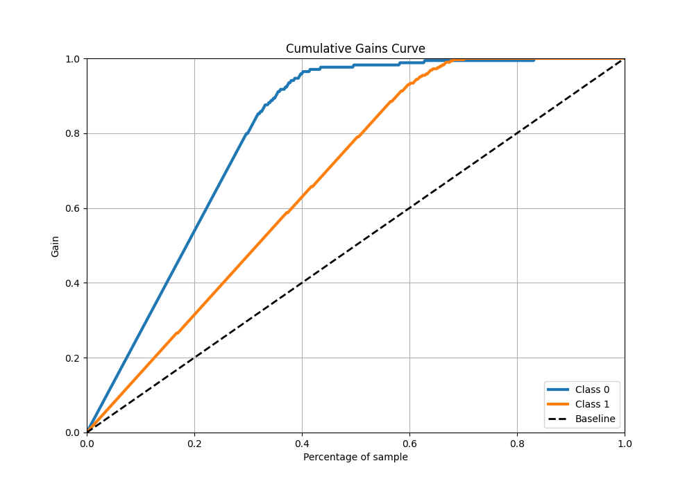
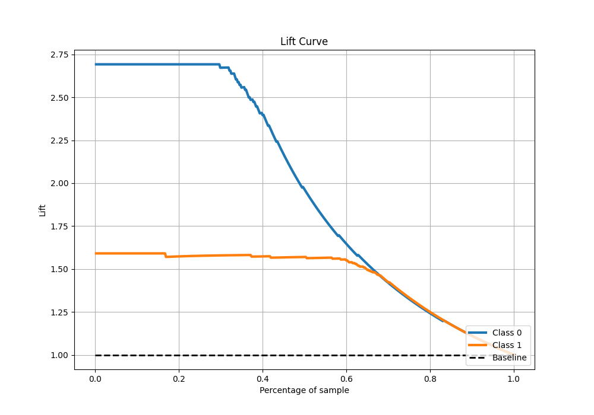

# Summary of 7_Xgboost

[<< Go back](../README.md)

## Extreme Gradient Boosting (Xgboost)
- **n_jobs**: -1
- **objective**: binary:logistic
- **eta**: 0.05
- **max_depth**: 9
- **min_child_weight**: 10
- **subsample**: 0.8
- **colsample_bytree**: 0.6
- **eval_metric**: logloss
- **explain_level**: 1

## Validation
 - **validation_type**: kfold
 - **k_folds**: 5
 - **shuffle**: True
 - **stratify**: True

## Optimized metric
logloss

## Training time

3.2 seconds

## Metric details
|           |    score |   threshold |
|:----------|---------:|------------:|
| logloss   | 0.153835 |  nan        |
| auc       | 0.984669 |  nan        |
| f1        | 0.958621 |    0.490844 |
| accuracy  | 0.947253 |    0.490844 |
| precision | 1        |    0.980536 |
| recall    | 1        |    0.022865 |
| mcc       | 0.887736 |    0.598983 |

## Metric details with threshold from accuracy metric
|           |    score |   threshold |
|:----------|---------:|------------:|
| logloss   | 0.153835 |  nan        |
| auc       | 0.984669 |  nan        |
| f1        | 0.958621 |    0.490844 |
| accuracy  | 0.947253 |    0.490844 |
| precision | 0.945578 |    0.490844 |
| recall    | 0.972028 |    0.490844 |
| mcc       | 0.886573 |    0.490844 |

## Confusion matrix (at threshold=0.490844)
|              |   Predicted as 0 |   Predicted as 1 |
|:-------------|-----------------:|-----------------:|
| Labeled as 0 |              153 |               16 |
| Labeled as 1 |                8 |              278 |

## Learning curves

## Permutation-based Importance

## Confusion Matrix

## Normalized Confusion Matrix

## ROC Curve

## Kolmogorov-Smirnov Statistic

## Precision-Recall Curve

## Calibration Curve

## Cumulative Gains Curve

## Lift Curve

[<< Go back](../README.md)
