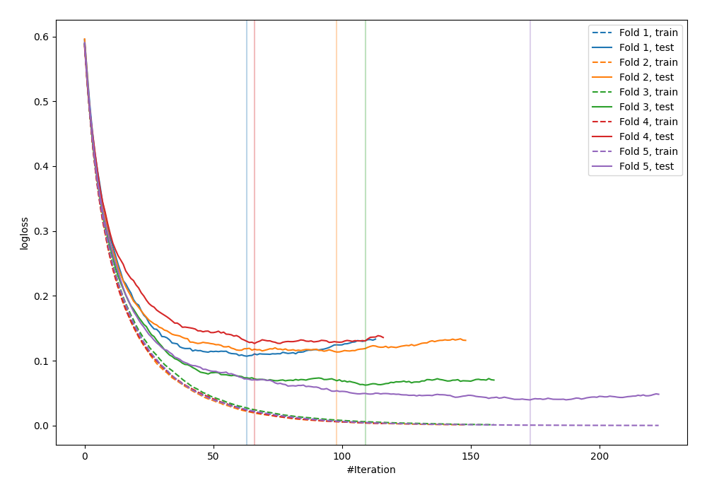
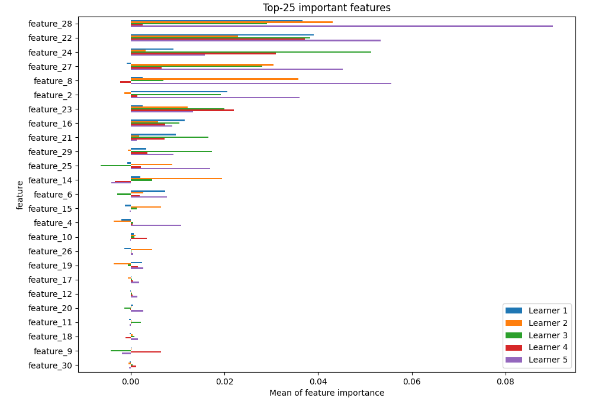
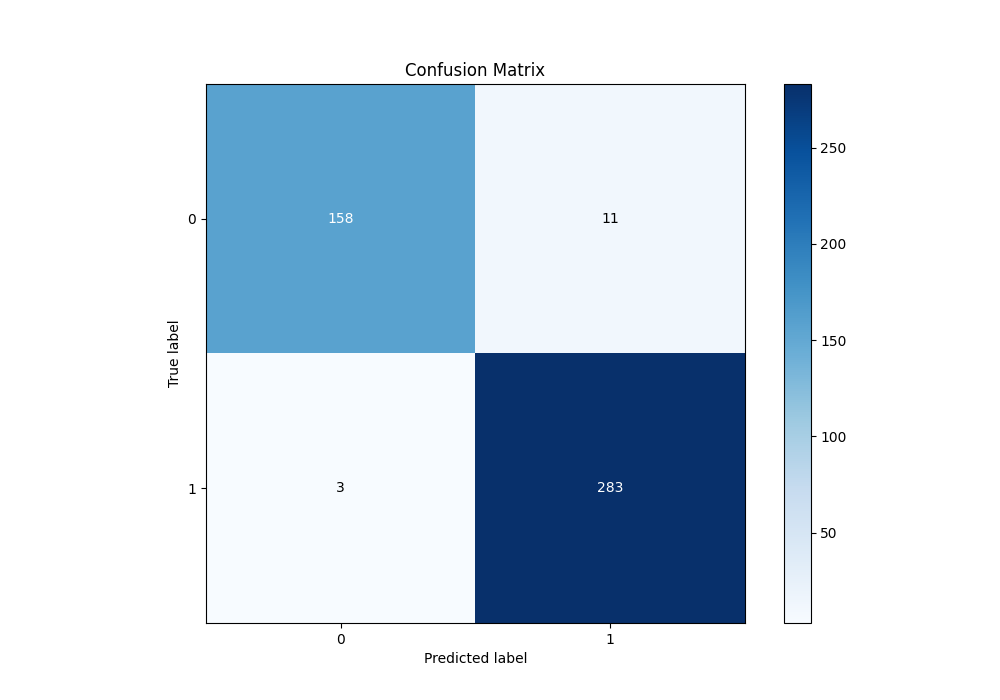
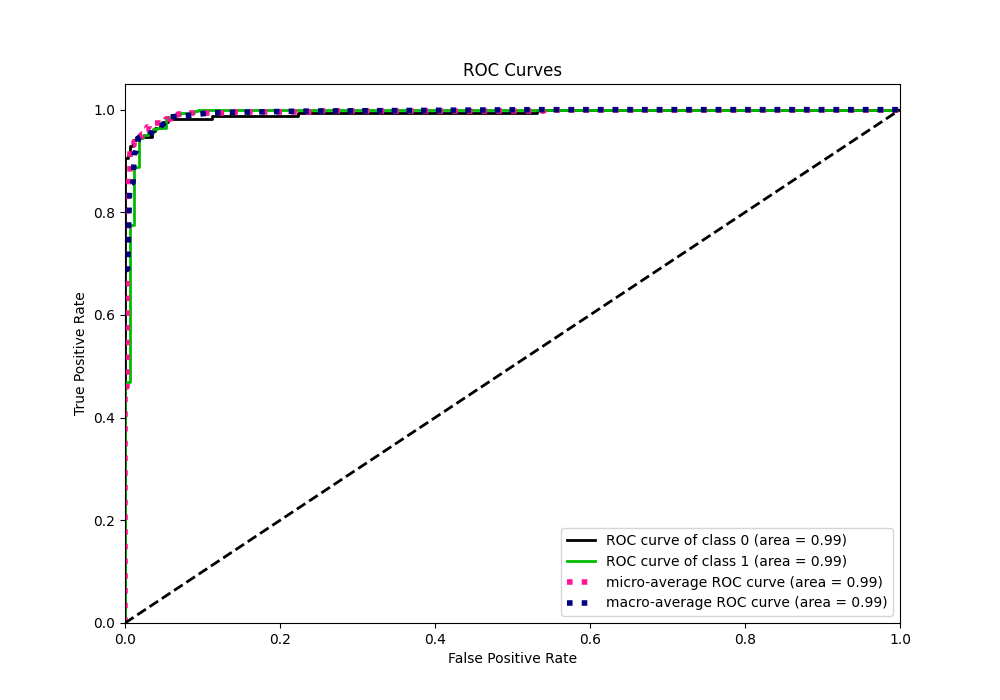
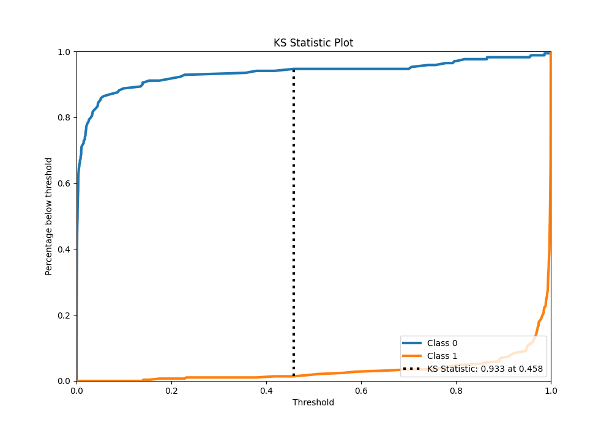
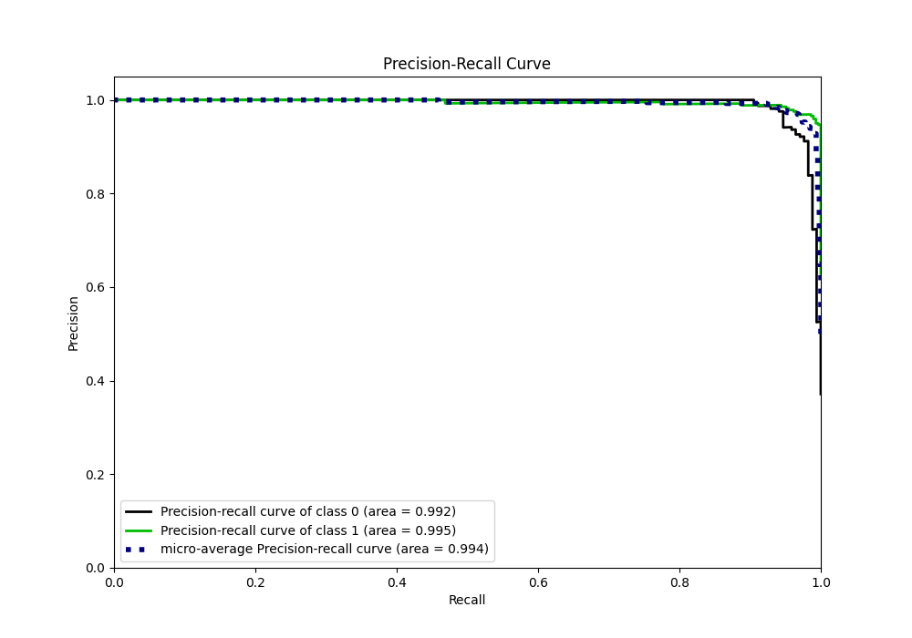
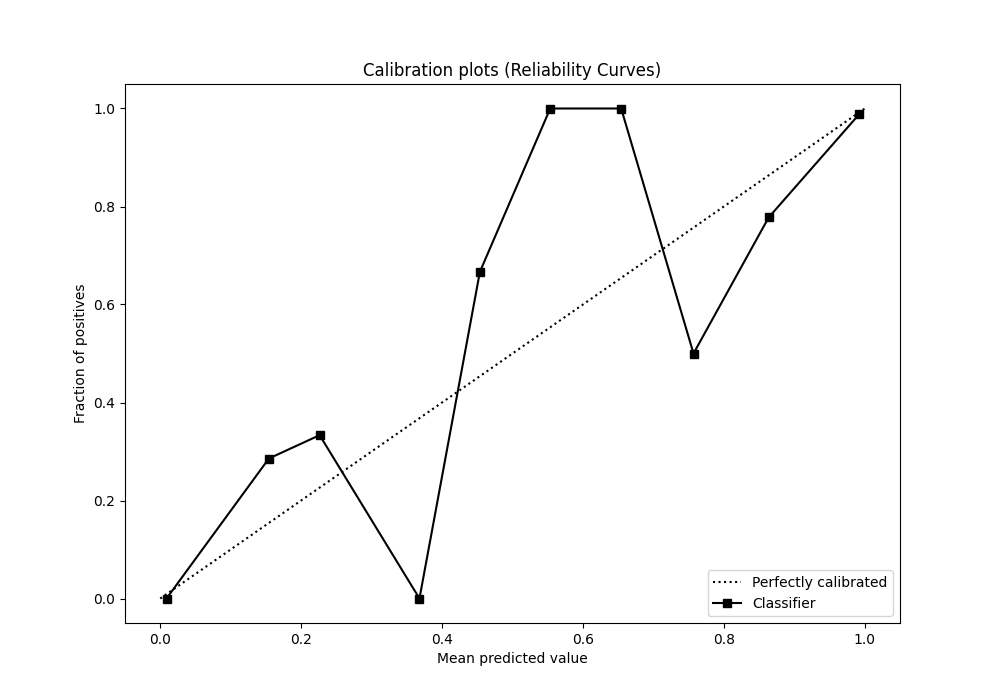
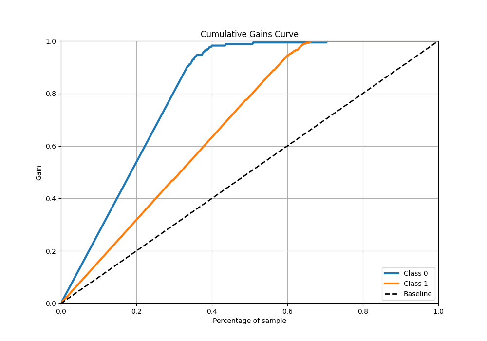
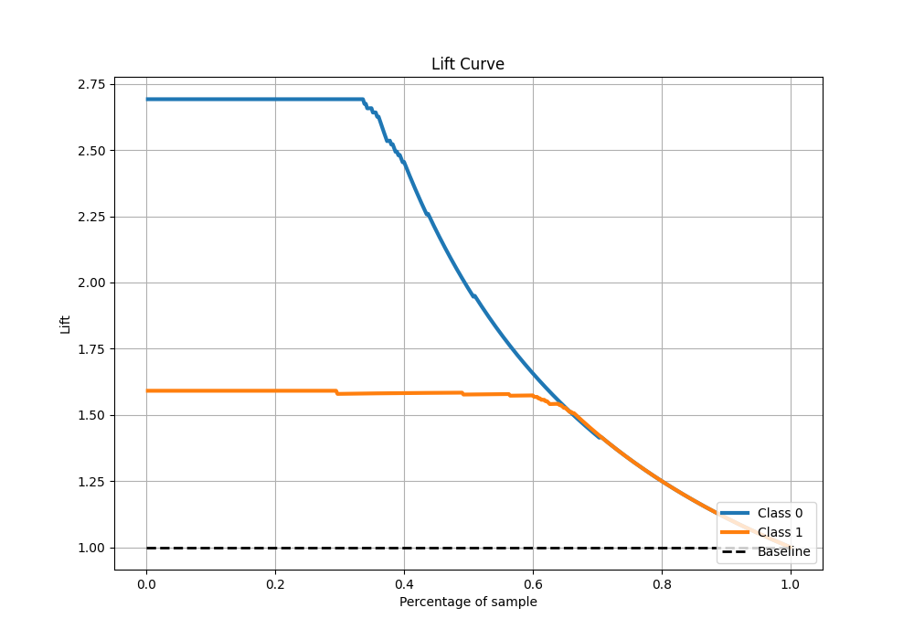

# Summary of 9_LightGBM

[<< Go back](../README.md)

## LightGBM
- **n_jobs**: -1
- **objective**: binary
- **num_leaves**: 95
- **learning_rate**: 0.1
- **feature_fraction**: 0.5
- **bagging_fraction**: 0.8
- **min_data_in_leaf**: 50
- **metric**: binary_logloss
- **custom_eval_metric_name**: None
- **explain_level**: 1

## Validation
 - **validation_type**: kfold
 - **k_folds**: 5
 - **shuffle**: True
 - **stratify**: True

## Optimized metric
logloss

## Training time

2.8 seconds

## Metric details
|           |     score |     threshold |
|:----------|----------:|--------------:|
| logloss   | 0.0897064 | nan           |
| auc       | 0.992986  | nan           |
| f1        | 0.975862  |   0.36795     |
| accuracy  | 0.969231  |   0.36795     |
| precision | 1         |   0.998635    |
| recall    | 1         |   3.13742e-07 |
| mcc       | 0.934136  |   0.36795     |

## Metric details with threshold from accuracy metric
|           |     score |   threshold |
|:----------|----------:|------------:|
| logloss   | 0.0897064 |   nan       |
| auc       | 0.992986  |   nan       |
| f1        | 0.975862  |     0.36795 |
| accuracy  | 0.969231  |     0.36795 |
| precision | 0.962585  |     0.36795 |
| recall    | 0.98951   |     0.36795 |
| mcc       | 0.934136  |     0.36795 |

## Confusion matrix (at threshold=0.36795)
|              |   Predicted as 0 |   Predicted as 1 |
|:-------------|-----------------:|-----------------:|
| Labeled as 0 |              158 |               11 |
| Labeled as 1 |                3 |              283 |

## Learning curves

## Permutation-based Importance

## Confusion Matrix

## Normalized Confusion Matrix

## ROC Curve

## Kolmogorov-Smirnov Statistic

## Precision-Recall Curve

## Calibration Curve

## Cumulative Gains Curve

## Lift Curve

[<< Go back](../README.md)
