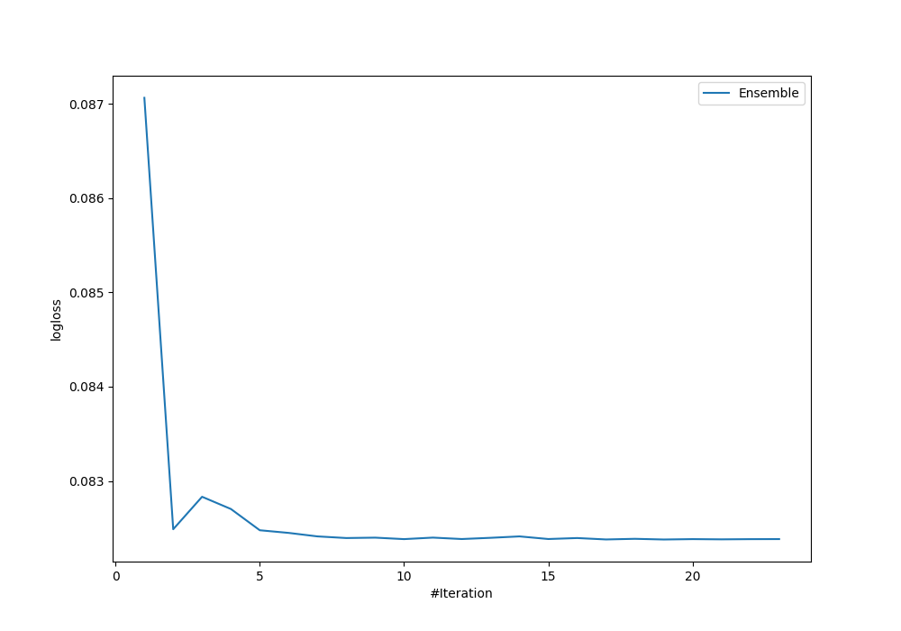
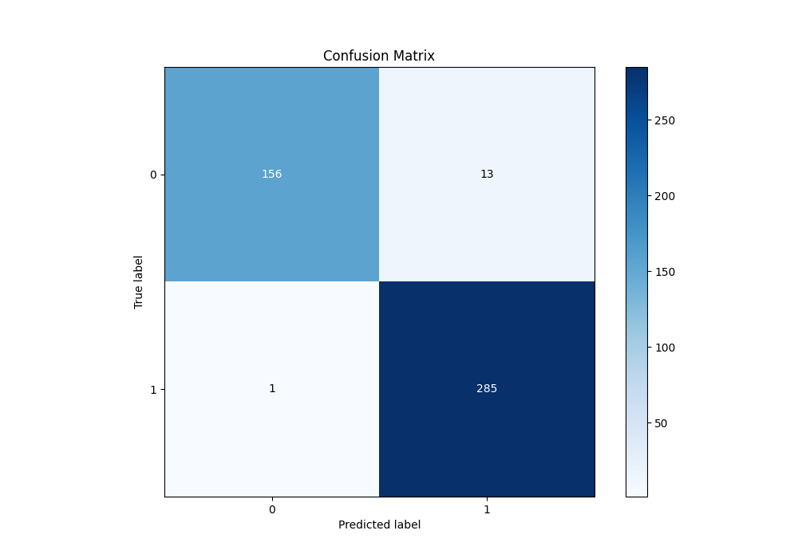
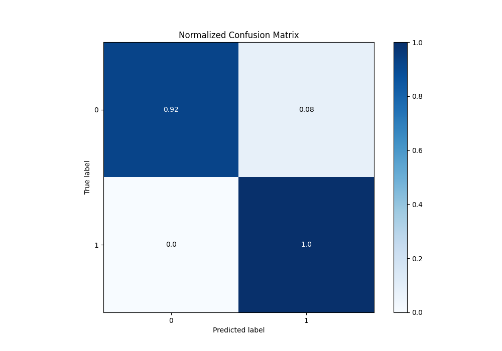
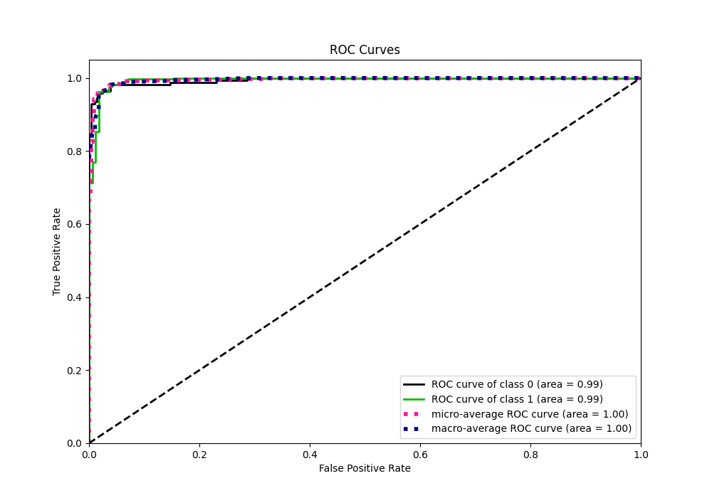
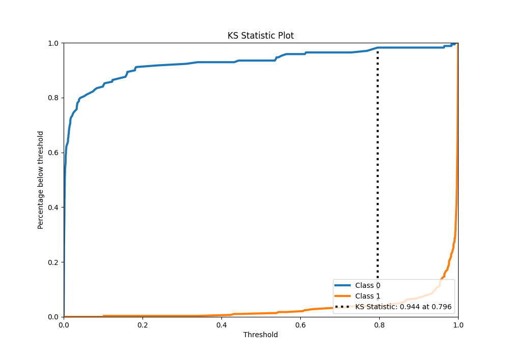
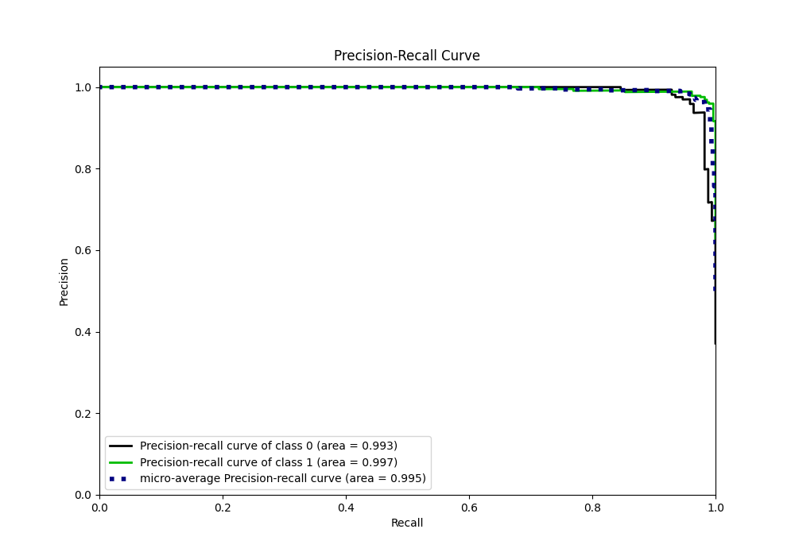
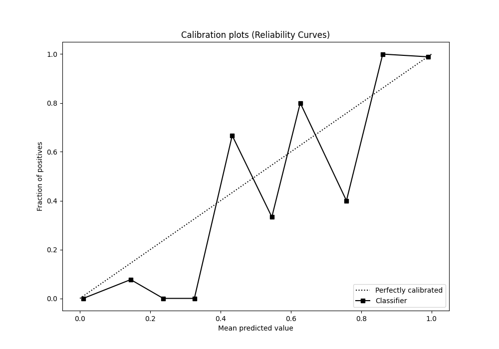
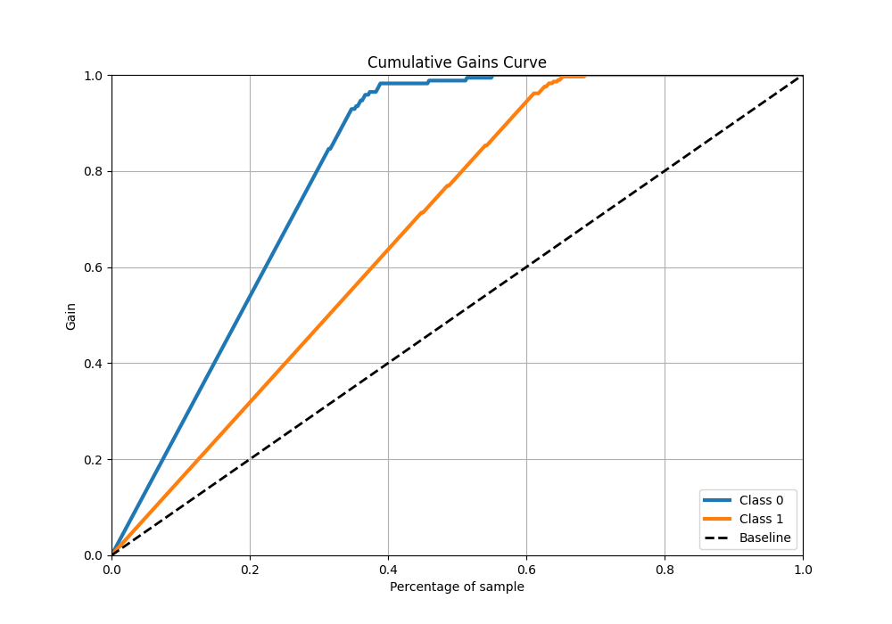
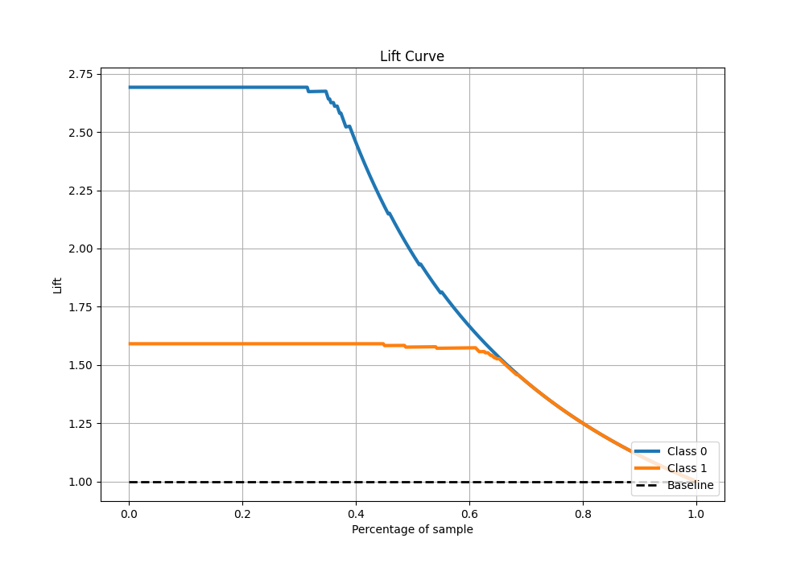

# Summary of Ensemble

[<< Go back](../README.md)

## Ensemble structure
| Model       |   Weight |
|:------------|---------:|
| 14_CatBoost |        2 |
| 23_CatBoost |        8 |
| 9_LightGBM  |        9 |

## Metric details
|           |     score |     threshold |
|:----------|----------:|--------------:|
| logloss   | 0.0823791 | nan           |
| auc       | 0.994517  | nan           |
| f1        | 0.976027  |   0.325462    |
| accuracy  | 0.969231  |   0.325462    |
| precision | 1         |   0.99258     |
| recall    | 1         |   6.48632e-05 |
| mcc       | 0.935387  |   0.81011     |

## Metric details with threshold from accuracy metric
|           |     score |   threshold |
|:----------|----------:|------------:|
| logloss   | 0.0823791 |  nan        |
| auc       | 0.994517  |  nan        |
| f1        | 0.976027  |    0.325462 |
| accuracy  | 0.969231  |    0.325462 |
| precision | 0.956376  |    0.325462 |
| recall    | 0.996503  |    0.325462 |
| mcc       | 0.93467   |    0.325462 |

## Confusion matrix (at threshold=0.325462)
|              |   Predicted as 0 |   Predicted as 1 |
|:-------------|-----------------:|-----------------:|
| Labeled as 0 |              156 |               13 |
| Labeled as 1 |                1 |              285 |

## Learning curves

## Confusion Matrix

## Normalized Confusion Matrix

## ROC Curve

## Kolmogorov-Smirnov Statistic

## Precision-Recall Curve

## Calibration Curve

## Cumulative Gains Curve

## Lift Curve

[<< Go back](../README.md)
