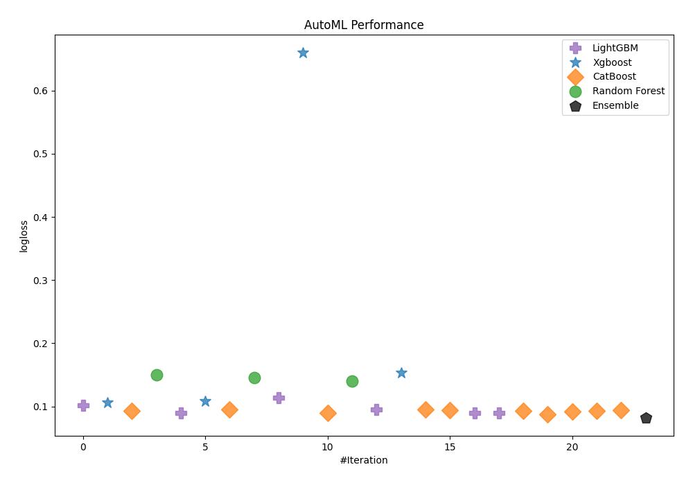
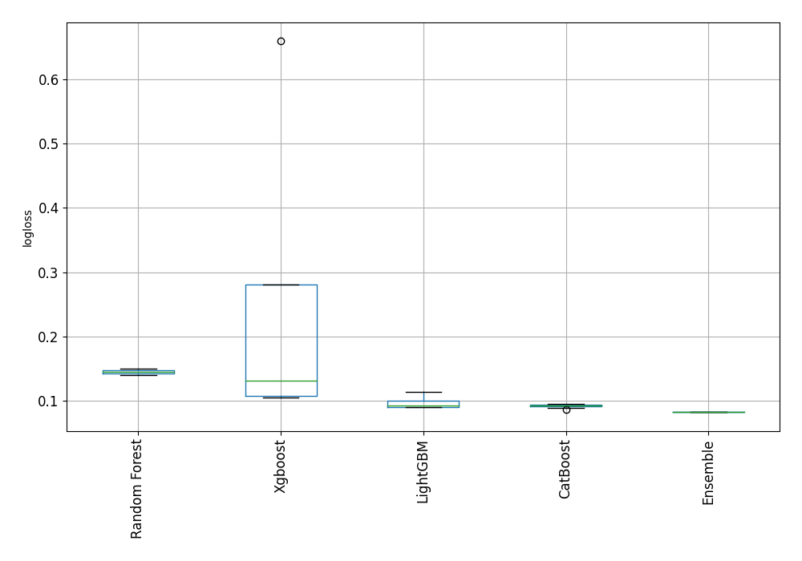
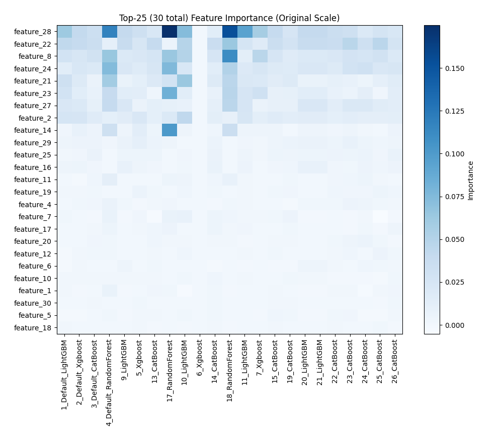
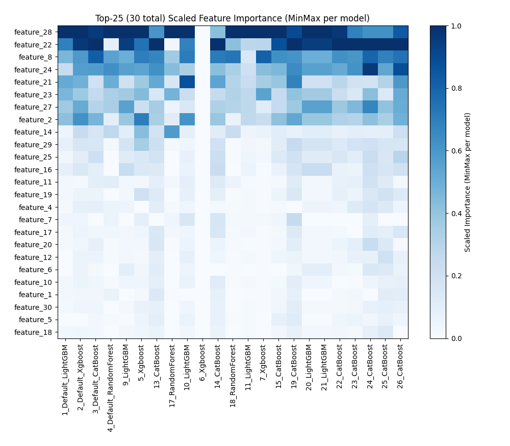
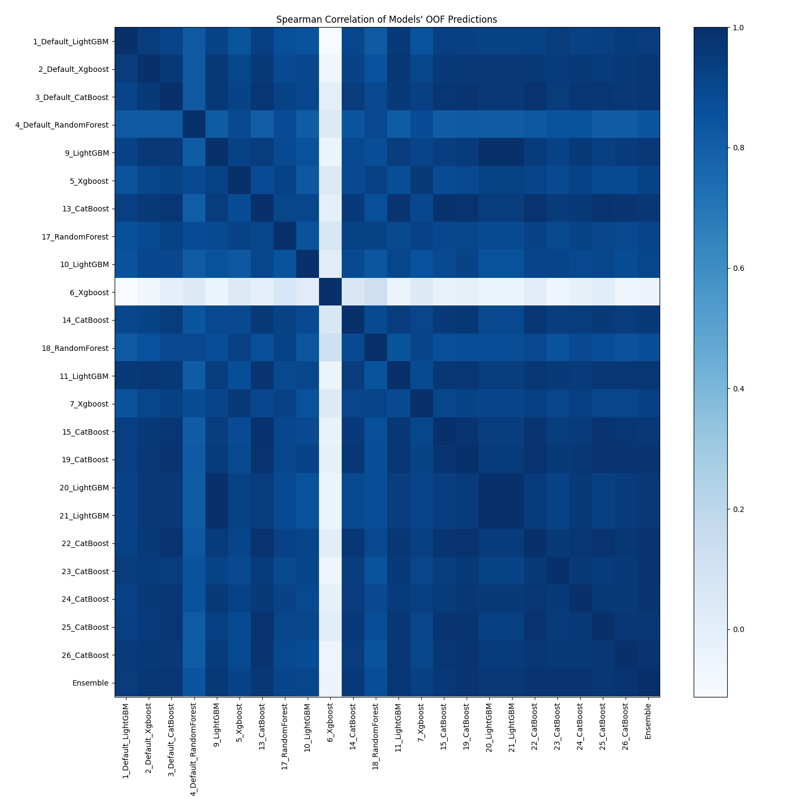

# AutoML Leaderboard

| Best model   | name                                                       | model_type    | metric_type   |   metric_value |   train_time |   single_prediction_time |
|:-------------|:-----------------------------------------------------------|:--------------|:--------------|---------------:|-------------:|-------------------------:|
|              | [1_Default_LightGBM](1_Default_LightGBM/README.md)         | LightGBM      | logloss       |      0.102223  |         6.84 |                   0.0117 |
|              | [2_Default_Xgboost](2_Default_Xgboost/README.md)           | Xgboost       | logloss       |      0.105653  |         3.92 |                   0.0124 |
|              | [3_Default_CatBoost](3_Default_CatBoost/README.md)         | CatBoost      | logloss       |      0.0929056 |         3.04 |                   0.0126 |
|              | [4_Default_RandomForest](4_Default_RandomForest/README.md) | Random Forest | logloss       |      0.150055  |         4.93 |                   0.0802 |
|              | [9_LightGBM](9_LightGBM/README.md)                         | LightGBM      | logloss       |      0.0897064 |         3.31 |                   0.0114 |
|              | [5_Xgboost](5_Xgboost/README.md)                           | Xgboost       | logloss       |      0.107878  |         3.56 |                   0.0135 |
|              | [13_CatBoost](13_CatBoost/README.md)                       | CatBoost      | logloss       |      0.0947418 |         5    |                   0.0136 |
|              | [17_RandomForest](17_RandomForest/README.md)               | Random Forest | logloss       |      0.145125  |         4.91 |                   0.0835 |
|              | [10_LightGBM](10_LightGBM/README.md)                       | LightGBM      | logloss       |      0.11365   |         3.6  |                   0.0106 |
|              | [6_Xgboost](6_Xgboost/README.md)                           | Xgboost       | logloss       |      0.65967   |         2.66 |                   0.0118 |
|              | [14_CatBoost](14_CatBoost/README.md)                       | CatBoost      | logloss       |      0.0892655 |         3.57 |                   0.0114 |
|              | [18_RandomForest](18_RandomForest/README.md)               | Random Forest | logloss       |      0.139588  |         5.52 |                   0.085  |
|              | [11_LightGBM](11_LightGBM/README.md)                       | LightGBM      | logloss       |      0.0954312 |         5.53 |                   0.011  |
|              | [7_Xgboost](7_Xgboost/README.md)                           | Xgboost       | logloss       |      0.153835  |         3.66 |                   0.0134 |
|              | [15_CatBoost](15_CatBoost/README.md)                       | CatBoost      | logloss       |      0.0946765 |        26.72 |                   0.0127 |
|              | [19_CatBoost](19_CatBoost/README.md)                       | CatBoost      | logloss       |      0.0941944 |         3.82 |                   0.0119 |
|              | [20_LightGBM](20_LightGBM/README.md)                       | LightGBM      | logloss       |      0.0897064 |         3.66 |                   0.0107 |
|              | [21_LightGBM](21_LightGBM/README.md)                       | LightGBM      | logloss       |      0.0897064 |         3.67 |                   0.0114 |
|              | [22_CatBoost](22_CatBoost/README.md)                       | CatBoost      | logloss       |      0.0931032 |         3.77 |                   0.0117 |
|              | [23_CatBoost](23_CatBoost/README.md)                       | CatBoost      | logloss       |      0.0870635 |         3.51 |                   0.012  |
|              | [24_CatBoost](24_CatBoost/README.md)                       | CatBoost      | logloss       |      0.0915629 |         3.5  |                   0.0117 |
|              | [25_CatBoost](25_CatBoost/README.md)                       | CatBoost      | logloss       |      0.0928593 |         4.64 |                   0.0114 |
|              | [26_CatBoost](26_CatBoost/README.md)                       | CatBoost      | logloss       |      0.0941825 |         3.67 |                   0.0123 |
| **the best** | [Ensemble](Ensemble/README.md)                             | Ensemble      | logloss       |      0.0823791 |         1.92 |                   0.0322 |

### AutoML Performance

### AutoML Performance Boxplot

### Features Importance (Original Scale)

### Scaled Features Importance (MinMax per Model)

### Spearman Correlation of Models

